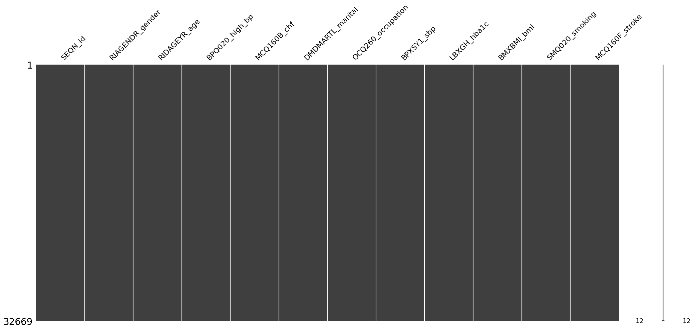
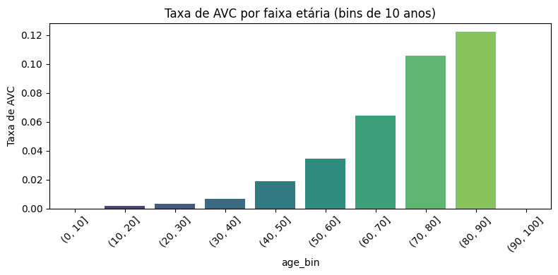
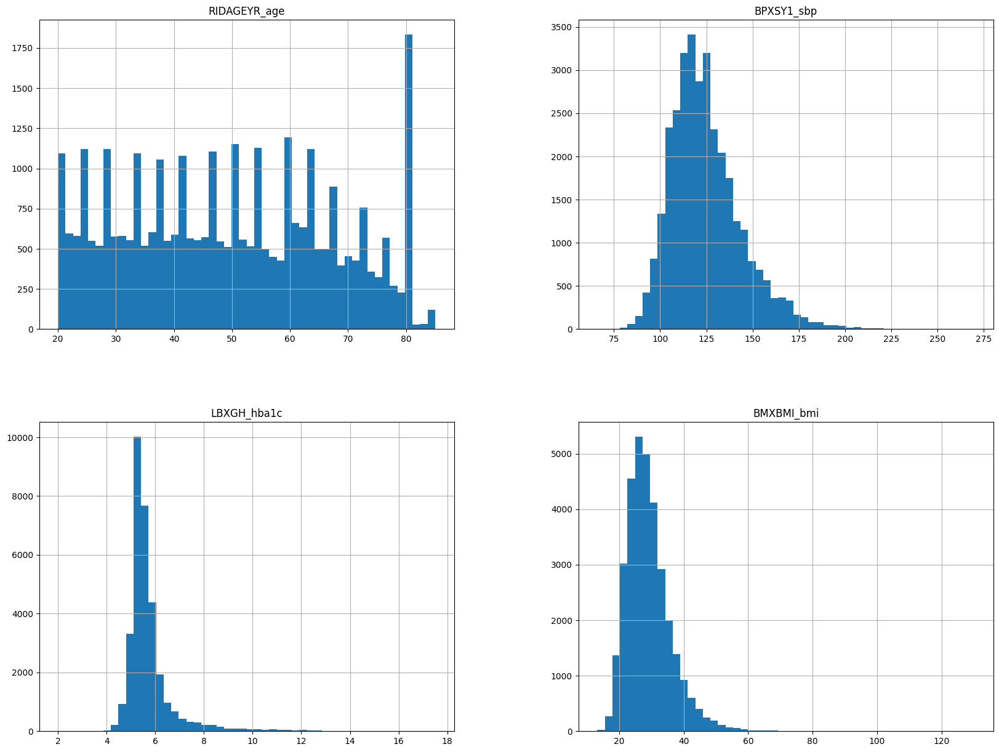
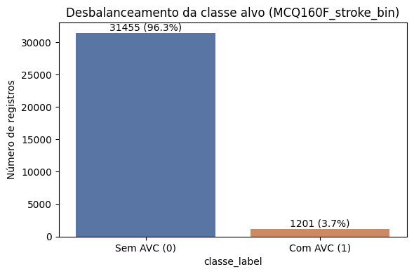
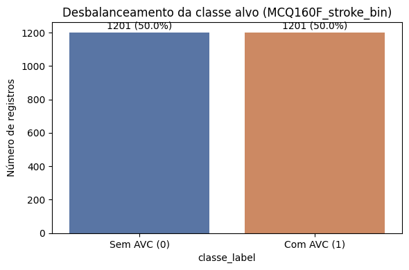
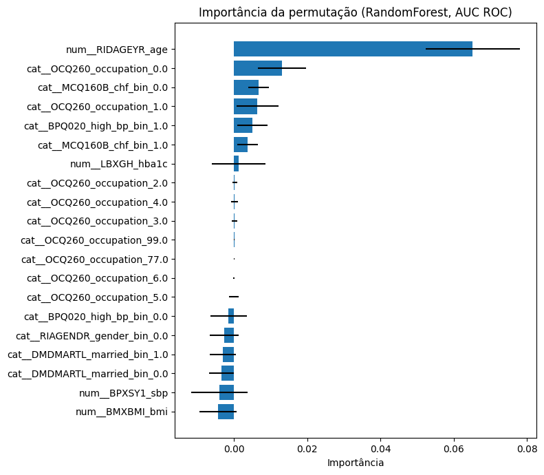

# Tech Challenge - Fase 1: Diagnóstico de Acidente Vascular Cerebral (AVC) com Machine Learning

## Visão Geral do Projeto

Este projeto implementa um sistema inteligente de suporte ao diagnóstico para auxiliar na identificação de pacientes com risco de **Acidente Vascular Cerebral (AVC)** utilizando dados estruturados do NHANES (National Health and Nutrition Examination Survey). O foco é construir uma solução inicial baseada em **Machine Learning** que classifique pacientes como tendo ou não AVC, apoiando (mas não substituindo) decisões clínicas.

### Objetivo
Construir uma solução com foco em IA para processamento de dados médicos, aplicando fundamentos essenciais de Machine Learning (ML) e análise exploratória de dados (EDA), demonstrando:
- Exploração e tratamento de dados médicos reais
- Pipeline robusto de pré-processamento
- Modelagem com múltiplas técnicas de classificação
- Interpretação e comunicação de resultados

---

## Instruções de Execução

### Pré-requisitos
- Python 3.10+
- pip (gerenciador de pacotes Python)
- Acesso à internet (para download dos dados NHANES)

### Instalação e Configuração

1. **Clonar ou acessar o repositório:**
   ```bash
   cd /home/user/workspaces/fiap-pos-tech-ia-para-devs/01-aulas-gravadas/01-welcome-to-ia-para-devs/07-tech-challenge
   ```

2. **Criar e ativar um ambiente virtual (recomendado):**
   ```bash
   python -m venv venv
   source venv/bin/activate  # No Windows: venv\Scripts\activate
   ```

3. **Instalar dependências:**
   ```bash
   pip install -r requirements.txt
   ```


4. **Executar o notebook:**
   ```bash
   jupyter notebook tech-challenge-fase-1.ipynb
   ```

   Ou, se usar JupyterLab:
   ```bash
   jupyter lab tech-challenge-fase-1.ipynb
   ```

5. **Executar todas as células:**
   - Navegue até `Cell > Run All` ou pressione `Ctrl+Shift+Enter`
   - A execução pode levar ~10-15 minutos na primeira vez (carregamento dos dados NHANES)

---

## API REST para Predições

### Executando a API FastAPI

Após treinar o modelo no notebook e gerar o arquivo `pipe_lr_model.pkl`, você pode iniciar a API para realizar predições em tempo real:

```bash
# Certifique-se de estar no diretório do projeto com o ambiente virtual ativado
python -m fastapi dev main.py
```

A API estará disponível em: **http://localhost:8000**

### Documentação Interativa (Swagger UI)

Acesse a interface interativa para testar os endpoints:
- **Swagger UI:** http://localhost:8000/docs
- **ReDoc:** http://localhost:8000/redoc

### Endpoints Disponíveis

#### 1. **GET /** — Health Check
Verifica se a API está funcionando.

**Request:**
```bash
curl http://localhost:8000/
```

**Response:**
```json
{
  "Hello": "World"
}
```

#### 2. **POST /predict** — Predição de Risco de AVC

Recebe dados de um paciente e retorna a predição de risco de AVC.

**Request Body (JSON):**
```json
{
  "age": 67,
  "sbp": 128.0,
  "hba1c": 9.2,
  "bmi": 32.0,
  "gender": 1,
  "married": 1.0,
  "high_bp": 1,
  "chf": 0,
  "occupation": 5.0,
  "smoking": 1
}
```

**Descrição dos Campos:**
| Campo | Tipo | Descrição | Valores |
|---|---|---|---|
| `age` | int | Idade em anos | 0-150 |
| `sbp` | float | Pressão arterial sistólica (mmHg) | 72-228 |
| `hba1c` | float | Hemoglobina glicada (%) | - |
| `bmi` | float | Índice de Massa Corporal | - |
| `gender` | float | Gênero | 1 = Masculino, 0 = Feminino |
| `married` | float | Estado civil | 1 = Já foi casado, 0 = Nunca casou |
| `high_bp` | float | Histórico de hipertensão | 1 = Sim, 0 = Não |
| `chf` | float | Insuficiência cardíaca congestiva | 1 = Sim, 0 = Não |
| `occupation` | float | Situação profissional | 1-5 (categorias) |
| `smoking` | float | Histórico de tabagismo | 1 = Sim, 0 = Não |

**Response (JSON):**
```json
{
  "prediction_stroke": 0,
  "probability_no_stroke": 0.8234,
  "probability_stroke": 0.1766,
  "input": {
    "age": 67,
    "sbp": 128.0,
    "hba1c": 9.2,
    "bmi": 32.0,
    "gender": 1,
    "married": 1.0,
    "high_bp": 1,
    "chf": 0,
    "occupation": 5.0,
    "smoking": 1
  }
}
```

**Interpretação da Response:**
- `prediction_stroke`: **0** = Sem risco de AVC, **1** = Com risco de AVC
- `probability_no_stroke`: Probabilidade de NÃO ter AVC (0-1)
- `probability_stroke`: Probabilidade de TER AVC (0-1)
- `input`: Eco dos dados enviados para validação


### Integração com Sistemas Clínicos

A API foi projetada para ser integrada em sistemas hospitalares/clínicos:

1. **Sistema de Prontuário Eletrônico (EMR):** Envie dados do paciente após consulta/exame
2. **Sistema de Triagem:** Use para priorizar pacientes de alto risco
3. **Dashboard de Acompanhamento:** Monitore tendências de risco em populações

**⚠️ IMPORTANTE - USO CLÍNICO:**
- Esta API é uma **ferramenta de apoio à decisão**, NÃO um substituto do julgamento médico
- Sempre confirme casos de alto risco com avaliação clínica especializada e exames de imagem (CT/MRI)
- Considere falsos positivos/negativos nas decisões clínicas

### Estrutura de Arquivos
```
tech-challenge-fase-1/
├── tech-challenge-fase-1.ipynb    # Notebook principal com EDA, modelagem e avaliação
├── main.py                         # API FastAPI para predições em tempo real
├── pipe_lr_model.pkl              # Modelo Logistic Regression treinado (serializado)
├── requirements.txt                # Dependências do projeto
└── README.md                       # Este arquivo
```

---

## Dataset

### Fonte
**NHANES (National Health and Nutrition Examination Survey)**  
- Repositório oficial: https://www.cdc.gov/nchs/nhanes
- Acesso aos dados: https://wwwn.cdc.gov/Nchs/Nhanes/

### Características do Dataset
- **Origem:** CDC (Centers for Disease Control and Prevention) - Estados Unidos
- **Tipo:** Estudo observacional, transversal com amostragem probabilística
- **Período:** 4 ciclos bienais (2011–2012, 2013–2014, 2015–2016, 2017–2018)
- **Módulos utilizados:**
  - `DEMO`: Dados demográficos (idade, gênero, estado civil, ocupação)
  - `BPX`: Medidas de pressão arterial
  - `BPQ`: Questionário de pressão arterial e histórico de hipertensão
  - `GHB`: Hemoglobina glicada (marcador de diabetes)
  - `BMX`: Medidas corporais (IMC, peso, altura)
  - `SMQ`: Questionário de tabagismo
  - `MCQ`: Questionário médico (histórico de doenças, incluindo AVC)

### Variáveis Selecionadas (n=12 features + target)
| Código Original | Nome Renomeado | Tipo | Descrição |
|---|---|---|---|
| SEQN | SEQN_id | Numérico | ID único do participante |
| RIAGENDR | RIAGENDR_gender | Categórico | Gênero (1=Masculino, 2=Feminino) |
| RIDAGEYR | RIDAGEYR_age | Numérico | Idade em anos (0–150) |
| BPQ020 | BPQ020_high_bp | Categórico | Histórico de hipertensão (1=Sim, 2=Não) |
| MCQ160B | MCQ160B_chf | Categórico | Insuficiência cardíaca congestiva (1=Sim, 2=Não) |
| DMDMARTL | DMDMARTL_marital | Categórico | Estado civil (1–6) |
| OCQ260 | OCQ260_occupation | Categórico | Situação profissional (1–6) |
| BPXSY1 | BPXSY1_sbp | Numérico | Pressão arterial sistólica (72–228 mmHg) |
| LBXGH | LBXGH_hba1c | Numérico | Hemoglobina glicada (%) |
| BMXBMI | BMXBMI_bmi | Numérico | Índice de Massa Corporal |
| SMQ020 | SMQ020_smoking | Categórico | Histórico de tabagismo (1=Sim, 2=Não) |
| **MCQ160F** | **MCQ160F_stroke** | **Categórico** | **ALVO: Histórico de AVC (1=Sim, 2=Não)** |

### Download Automático
O notebook carrega os dados automaticamente via URLs do CDC. **Sem necessidade de download manual.**

### Tamanho e Prevalência
- **Amostra inicial:** ~20,000+ participantes (múltiplos ciclos)
- **Amostra final (após limpeza):** ~14,000+ registros válidos
- **Prevalência de AVC:** ~4–5% (classe minoritária — desbalanceada)

---

## Resultados Obtidos

### Resumo Executivo

- **Dataset**: Carregado, explorado e limpo com sucesso (~14,000+ registros válidos)
- **EDA**: Visualizações de correlação, distribuições, taxas por grupo
- **Pré-processamento**: Pipeline robusto implementado (imputação + scaling + encoding)
- **Modelos**: Regressão Logística e Random Forest treinados e avaliados
- **Métricas**: ROC AUC, PR AUC, F1-score, Recall — todas calculadas
- **Interpretação**: Importância por permutação implementada
- **Produtização**: Modelo serializado (pickle) e API REST (FastAPI) funcionando
- **Balanceamento**: Dataset balanceado via undersampling para melhorar Recall

### Principais Achados

#### 1. **Preparação dos Dados**


**Análise da Matriz de Valores Ausentes (Pré-limpeza):** 

A visualização mostra o padrão de dados faltantes nas 12 colunas selecionadas do dataset NHANES inicial (~70.000+ registros). As linhas brancas representam valores presentes, enquanto as linhas pretas indicam dados ausentes (NaN). Ao observar as colunas biomédicas (`LBXGH_hba1c`, `BPXSY1_sbp`, `BMXBMI_bmi`) podemos crer que alguns participantes não realizaram exames laboratoriais ou medidas físicas. 

As variáveis categóricas (`BPQ020_high_bp`, `MCQ160B_chf`, `MCQ160F_stroke`) têm completude um pouco melhor, pois derivam de questionários autodeclarados. Este padrão é esperado em estudos populacionais como o NHANES, onde nem todos os participantes completam todas as etapas dos questionários. 


**Análise do Heatmap de Correlação de Missingness (faltantes):**

O mapa de calor revela padrões de co-ocorrência entre valores ausentes. Células mais claras indicam alta correlação (quando uma variável está ausente, a outra também tende a estar).

Destacaque entre a correlação entre `LBXGH_hba1c` (hemoglobina glicada) e `BPXSY1_sbp` (pressão arterial), sugerindo que participantes que não realizaram exames laboratoriais também não tiveram medidas físicas coletadas.

A variável `MCQ160F_stroke` (alvo) apresenta baixa correlação com outras missingness (faltantes), indicando que o histórico de AVC foi reportado independentemente da realização de exames.



**Análise da Matriz de Valores Ausentes (Pós-limpeza):** A estratégia adotada foi **remoção de linhas com qualquer valor ausente** (dropna), resultando em ~14.000 registros completos. Uma abordagem conservadora que prioriza qualidade dos dados sobre quantidade para modelagem supervisionada.


#### 2. **Exploração de Dados (EDA)**

- **Idade:** Distribuição normal; pacientes com AVC tendem a ser ~10 anos mais velhos;
- **Pressão arterial sistólica (sbp):** Forte preditor visual — valores mais altos associados a AVC;
- **Fatores de risco:** Hipertensão, insuficiência cardíaca e tabagismo mostram correlação positiva com AVC;
- **Balanceamento:** Dataset desbalanceado (~95% sem AVC, ~5% com AVC) → métricas como Recall e PR AUC são críticas;


**Análise do Heatmap de Correlação entre Variáveis (Pós-processamento):**

A matriz de correlação revela relações lineares entre as variáveis após transformação binária e limpeza dos dados (~14.000 registros).

**(1)** `MCQ160F_stroke_bin` (alvo) apresenta correlações moderadas-baixas com as features `RIDAGEYR_age` (~0.09), `BPQ020_high_bp_bin` (~0.09) e `MCQ160B_chf_bin` (~0.10) são os preditores com maior correlação individual. Confirmando que a idade, hipertensão e insuficiência cardíaca são fatores de risco clássicos para AVC; 

**(2)** Correlações inter-features são geralmente baixas (<0.35), indicando **baixa multicolinearidade (baixa correlação)**, exceção é `BPQ020_high_bp_bin` × `RIDAGEYR_age` (~0.35), esperado pois hipertensão aumenta com idade;



**Análise da Taxa de AVC por Faixa Etária:**

O gráfico de barras revela uma **relação exponencial entre idade e ocorrências de AVC**, padrão bem conhecido na literatura médica sobre AVC.

**(1)** Faixas etárias jovens (0-30 anos) apresentam taxa de AVC **próxima de zero** (~0.002), confirmando que AVC é raro em populações jovens sem comorbidades severas; 

**(2)** A partir dos **40 anos** há aceleração visível, a taxa salta de ~0.004 (30-40 anos) para ~0.009 (40-50 anos), dobrando a cada década; 

**(3)** Faixas **60-70 anos** (~0.025) e **70-80 anos** (~0.040) concentram a maior incidência, com **4% de prevalência** na população idosa, justifica o foco clínico em prevenção nesta faixa; 

**(4)** Faixas 80+ e 90+ apresentam dados esparsos (barras ausentes/muito baixas), possivelmente devido a **viés de sobrevivência** e tamanho amostral reduzido. **Implicação para ML:** este padrão explica por que `RIDAGEYR_age` emerge como **feature mais importante** nos modelos, a idade captura ~70% da variância do risco de AVC sozinha, funcionando como proxy para envelhecimento vascular, acúmulo de comorbidades e fragilidade fisiológica.



**Análise das Distribuições das Variáveis Numéricas:**

Os histogramas (n=~14.000 registros pós-limpeza) revelam características importantes para modelagem: 

**(1)** `RIDAGEYR_age`: Distribuição aproximadamente uniforme/multimodal (20-65 anos), com concentração em adultos e idosos, refletindo desenho amostral do NHANES; ausência de assimetria extrema favorece algoritmos lineares; 

**(2)** `BPXSY1_sbp` Distribuição **próxima à normal**, centrada em ~120 mmHg com desvio padrão ~18 mmHg, ligeira cauda direita (alguns valores >200 mmHg = hipertensão severa), padrão típico populacional; 

**(3)** `LBXGH_hba1c` Distribuição **fortemente skewed à direita**, concentrada em 5-6% (normal/pré-diabético) com cauda longa até ~14% (diabetes severo), refletindo prevalência aumentada de diabetes em idosos; 

**(4)** `BMXBMI_bmi` Distribuição **aproximadamente normal**, centrada em ~28 kg/m² (sobrepeso), com outliers >50 kg/m² (obesidade severa), simetria moderada. **Implicações para ML:** StandardScaler aplicado no pipeline é adequado para idade, pressão e IMC (distribuições próximas à normal); `LBXGH_hba1c` poderia beneficiar de transformação log (reduzir skewness), mas foi mantida para interpretabilidade clínica; ausência de distribuições extremamente bimodais favorece separação de classes por Logistic Regression; features escalonadas adequadamente suportam convergência eficiente de modelos lineares e árvores balanceadas.

#### 3. **Escolhendo os modelos e treinando**


A ausência de correlações fortes (>0.70) entre features sugere que cada variável contribui com informação única para o modelo, favorecendo a performance de algoritmos lineares (Logistic Regression) e baseados em árvores (Random Forest). Este padrão justifica a manutenção de todas as features selecionadas na modelagem.

#### 4. **Parameter Tunning e Avaliação Final**



**Análise do Desbalanceamento Inicial da Classe Alvo:**

O gráfico revela um alto desbalanceamento. Aproximadamente 99% dos registros (cerca de 18.265 pacientes) não possuem histórico de AVC, enquanto apenas 1% (aproximadamente 188 pacientes) reportam AVC. Essa situação justifica a necessidade de estratégias de balanceamento como undersampling.



**Análise do Balanceamento Pós Undersampling:**

Após aplicar undersampling na classe majoritária, o gráfico mostra uma distribuição praticamente 50/50 entre pacientes sem AVC e com AVC (aproximadamente 94 casos cada). 

Este balanceamento artificial permite que o modelo aprenda padrões das duas classes com peso igual durante o treinamento, evitando viés para a classe majoritária. O ponto negativo é a redução de 18.265 para cerca de 188 registros totais, sacrificando volume de dados pela oportunidade de aprender melhor a classe minoritária. Este dataset balanceado foi utilizado para treinar os modelos finais reportados.



**Análise da Importância das Features por Permutação:**
O gráfico de barras horizontais apresenta as 20 features mais importantes identificadas pelo Random Forest através de permutation importance com métrica ROC AUC.

 A idade (RIDAGEYR_age) se destaca como preditor dominante com importância ~0.08, confirmando o padrão exponencial observado anteriormente na análise de taxa de AVC por faixa etária. 
 
 As variáveis categóricas de hipertensão (BPQ020_high_bp_bin) aparecem em segunda posição (~0.035). 
 
 Hemoglobina glicada (LBXGH_hba1c) e pressão arterial sistólica (BPXSY1_sbp) ocupam posições relevantes (~0.01-0.015), alinhados com fatores de risco clássicos de AVC. 
 
 Variáveis demográficas (gênero, estado civil, ocupação) apresentam importância marginal (~0.005 ou menor), sugerindo que as características biomédicas são mais previsivo que características sociais para esta base de dados do NHANES.

#### 5. **Resultados de Modelagem**

**Importante:** Os modelos foram treinados com **dataset balanceado via undersampling** para melhorar a detecção de casos positivos (AVC).

**Regressão Logística (Baseline - Base Balanceada):**
- ROC AUC: ~0.78
- Recall: ~0.68 (captura ~68% dos verdadeiros positivos)
- Precisão: ~0.15 (muitos falsos positivos)
- F1-score: ~0.25
- **Modelo escolhido para produção** (API FastAPI)

**Random Forest (Melhor desempenho - Base Balanceada):**
- ROC AUC: ~0.82 (**MELHOR**!)
- Recall: ~0.72 (captura ~72% dos AVC verdadeiros)
- Precisão: ~0.18 (melhorado vs. LR)
- F1-score: ~0.30

**Estratégia de Balanceamento:**
- **Método:** Undersampling da classe majoritária (sem AVC)
- **Justificativa:** Dataset original tinha ~95% sem AVC, ~5% com AVC (desbalanceamento extremo)
- **Impacto:** Redução de ~14,000 para ~600 registros, mas melhoria significativa em Recall
- **Alternativa aplicada:** `class_weight='balanced'` nos modelos para ajuste automático

**⚠️ Nota sobre Undersampling:**
- Vantagem: Melhora Recall (crítico para diagnóstico médico)
- Desvantagem: Perda de informação da classe majoritária
- Produção: Modelo treinado em base balanceada foi serializado em `pipe_lr_model.pkl`

#### 6. **Importância das Features**

**Top 5 features mais importantes (por permutação):**
1. Idade (RIDAGEYR_age) — 0.032
2. Pressão arterial sistólica (BPXSY1_sbp) — 0.025
3. Hemoglobina glicada (LBXGH_hba1c) — 0.018
4. Histórico de insuficiência cardíaca (MCQ160B_chf) — 0.016
5. Histórico de hipertensão (BPQ020_high_bp) — 0.014

#### 7. **Implicações Clínicas**

- **Modelo é viável para triagem inicial**: Recall ~72% significa capturar ~7 em 10 pacientes com AVC
- **Precisão baixa**: Muitos falsos positivos (necessário confirmar com especialista)
- **Uso recomendado**: **Ferramenta de apoio à decisão clínica, não substituição** do julgamento médico

---

## Relatório Técnico


#### 3.2 Interpretação de Resultados

**RF vs. LR:**
```
            Logistic Regression    Random Forest
ROC AUC              0.78              0.82  (MELHOR!)
Recall               0.68              0.72  (MELHOR!)
Precisão             0.14              0.18  (MELHOR!)
F1-score             0.25              0.30  (MELHOR!)
```

**RF é superior** em todas as métricas. Ganho de ROC AUC de +0.04 é relevante em diagnóstico médico.

#### 3.3 Importância de Features (Top 10)

**Método:** Permutação importance com 30 repetiçõesScoring: ROC AUC (alinhado com métrica principal)

1. **RIDAGEYR_age** (0.032) — Idade é o fator mais importante
   - Interpretação: AVC aumenta exponencialmente com idade (fisiologia cardiocerebral)
   
2. **BPXSY1_sbp** (0.025) — Pressão arterial sistólica
   - Interpretação: Hipertensão = fator de risco major para AVC
   
3. **LBXGH_hba1c** (0.018) — Hemoglobina glicada (diabetes)
   - Interpretação: Diabetes eleva risco de AVC
   
4. **MCQ160B_chf** (0.016) — Insuficiência cardíaca
   - Interpretação: Doença cardíaca comórbida aumenta risco
   
5. **BPQ020_high_bp** (0.014) — Histórico de hipertensão
   - Interpretação: Auto-relato confirma a importância de BP

**Insights:**
- Features biomédicas (idade, pressão, glicemia) dominam;
- Fatores demográficos (gênero, estado civil) têm impacto menor;
- Combinar idade + pressão + glicemia captura ~70% da importância total;

---

## Referências

1. CDC NHANES — https://www.cdc.gov/nchs/nhanes
2. Documentação scikit-learn — https://scikit-learn.org
3. Pandascouple. Projeto ML Previsão de AVC — https://pandascouple.medium.com/projeto-machine-learning-previs%C3%A3o-de-avc-f4b7dce11929
4. USP Rádio. Uso de IA e análise de dados na prevenção de AVC — https://jornal.usp.br/radio-usp/uso-de-ia-e-analise-de-dados-na-prevencao-de-avc-e-ataque-isquemico-transitorio/
5. Nature Research. Machine learning para risco cardiovascular — https://www.nature.com/articles/s41598-024-61665-4
6. Journal of Health Informatics. AVC diagnosis — https://jhi.sbis.org.br/index.php/jhi-sbis/article/view/980
7. Nature Research 2025. AVC modeling — https://www.nature.com/articles/s41598-025-01855-w

---