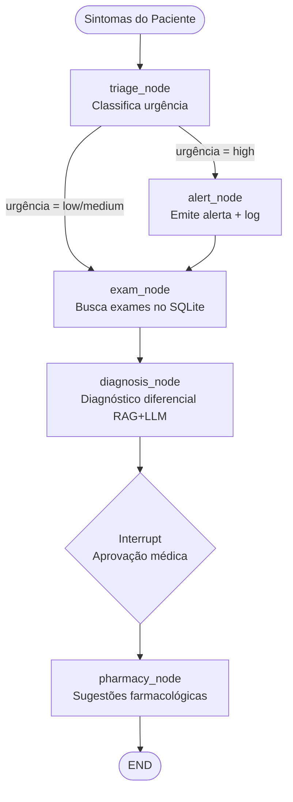
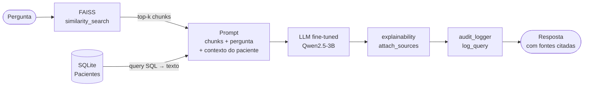

# Tech Challenge - Fase 3: Assistente Médico IA

* Curso: Pós Tech IA para Devs
* Turma: 8IADT
* Funcional: RM369853

#### Fase 3

* [Fase 3 — Vídeo de apresentação do projeto](TBD)

* [Fase 3 — Código Python](TBD "Código Python");

#### Geral

* [Repositório do GitHub](https://github.com/paulosobral/fiap-pos-tech-ia-para-devs "Repositório do GitHub");

## Visão Geral do Projeto

Assistente virtual médico com LLM fine-tuned, RAG sobre protocolos hospitalares e fluxo multi-agente via LangGraph.

---

## Quick Start

```bash
# 1. Instalar dependências (GPU local recomendada)
pip install -r requirements.txt
python -m spacy download pt_core_news_sm

# 2. Preparar dataset de treinamento
python fine_tuning/prepare_dataset.py

# 3. Fine-tuning (GPU recomendada; CPU/RAM usada como overflow automático)
python fine_tuning/train.py

# 4. Avaliar o modelo
python fine_tuning/eval_model.py

# 5. Iniciar o assistente
streamlit run app.py
```

---

## Pré-requisitos

| Componente | Versão mínima |
|---|---|
| Python | 3.10+ |
| CUDA | 11.8+ (para fine-tuning) |
| VRAM dedicada | ≥ 6 GB (modelo 3B 4-bit); ≥ 12 GB (modelo 8B 4-bit) |
| RAM do sistema | ≥ 16 GB recomendado (usado como overflow de VRAM) |
| GPU | NVIDIA (Unsloth é CUDA-only) |

> O app funciona sem fine-tuning: define `use_adapter=False` em `assistant/llm_loader.py` para usar o modelo base como fallback.
>
> Com o gerenciamento de memória automático, camadas que não cabem na VRAM dedicada são descarregadas para a RAM do sistema. GPUs com menor VRAM conseguem treinar usando essa memória compartilhada como extensão.

---

## Estrutura do Projeto

```
07-tech-challenge/
├── fine_tuning/
│   ├── prepare_dataset.py   # Baixa PubMedQA + MedQuAD, gera dados sintéticos, formata Alpaca
│   ├── train.py             # Fine-tuning: Unsloth + LoRA + SFTTrainer + CPU memory offload
│   ├── eval_model.py        # ROUGE-L, BLEU, exemplos qualitativos
│   └── output/              # Adapter LoRA salvo aqui após treino
├── assistant/
│   ├── llm_loader.py        # Carrega modelo (adapter ou fallback)
│   ├── vector_store.py      # FAISS sobre protocolos hospitalares
│   ├── patient_db.py        # SQLite com 20 pacientes sintéticos
│   └── rag_chain.py         # ConversationalRetrievalChain (LangChain)
├── langgraph_flow/
│   ├── state.py             # PatientState (TypedDict compartilhado)
│   ├── graph.py             # StateGraph + roteamento condicional
│   └── agents/
│       ├── triage_agent.py    # Classifica urgência (low/medium/high)
│       ├── exam_agent.py      # Busca exames pendentes/concluídos
│       ├── diagnosis_agent.py # Diagnóstico diferencial via RAG
│       ├── pharmacy_agent.py  # Sugestões farmacológicas (com guardrail)
│       └── alert_agent.py     # Emite alertas de urgência alta
├── security/
│   ├── guardrails.py        # Valida input, bloqueia injection, enforcement de disclaimer
│   ├── audit_logger.py      # Log JSON estruturado (data/logs/audit.jsonl)
│   └── explainability.py    # Citação de fontes + footer de rastreabilidade
├── data/
│   ├── raw/                 # PubMedQA bruto
│   ├── synthetic/           # Protocolos/laudos/FAQs gerados
│   ├── processed/           # medical_train.jsonl, medical_test.jsonl
│   ├── faiss_index/         # Índice vetorial persistido
│   ├── patient_records.db   # SQLite de pacientes sintéticos
│   └── logs/audit.jsonl     # Log de auditoria
├── app.py                   # Interface Streamlit
└── requirements.txt
```

---

## Arquitetura

### Fluxo LangGraph



### Pipeline RAG (LangChain)

O RAG (Retrieval-Augmented Generation) é utilizado para os **protocolos hospitalares** armazenados no índice FAISS (`data/faiss_index/`). A cada consulta, os trechos mais relevantes dos protocolos são recuperados por similaridade semântica e injetados no prompt como contexto antes de a LLM gerar a resposta.



> **O que está no FAISS**: protocolos e FAQs sintéticos gerados em `prepare_dataset.py` + `data/synthetic/`.  
> **O que NÃO é RAG**: dados do paciente (SQLite) — esses são consultados diretamente via SQL e injetados como texto estruturado no prompt pelo `diagnosis_agent.py`.

| Fonte de dados | Mecanismo | Onde |
|---|---|---|
| Protocolos hospitalares | **RAG** (FAISS + busca semântica) | `assistant/vector_store.py`, `rag_chain.py` |
| Dados do paciente (ficha, exames, medicações) | Prompt injection (query SQL → texto) | `assistant/patient_db.py`, `diagnosis_agent.py` |

### Ajustes de Robustez (RAG e Diagnóstico)

Para reduzir respostas extrapoladas e inconsistências entre pacientes, o pipeline foi endurecido com os seguintes ajustes:

1. **Embedding multilíngue no FAISS**
  - `assistant/vector_store.py` usa `BAAI/bge-m3`.
  - O índice FAISS é reconstruído automaticamente quando o embedding muda (arquivo de assinatura do modelo em `data/faiss_index/`).

2. **Gate de confiança no retrieval**
  - `assistant/rag_chain.py` aplica `similarity_search_with_score` e filtra por distância máxima.
  - Se não houver chunks com relevância suficiente, a resposta retorna em modo seguro: evidência insuficiente (sem inventar conteúdo).

3. **Isolamento de histórico entre casos clínicos**
  - O histórico interno do chain é limpo a cada nova pergunta clínica.
  - Ao trocar paciente na sidebar, o histórico e o chat da sessão também são reinicializados para evitar contaminação de contexto.

4. **Diagnóstico conservador com fallback seguro**
  - `diagnosis_agent.py` força formato de hipóteses conservadoras e sem prescrição.
  - Saídas inválidas/espúrias são substituídas por fallback de baixa evidência.

5. **Bloqueio farmacológico por baixa evidência**
  - `pharmacy_agent.py` não gera sugestão farmacológica quando o diagnóstico está com baixa confiança documental.
  - O fluxo registra o bloqueio e exige revisão médica antes de conduta.

6. **Stop token e truncagem de artefatos Alpaca**
  - `assistant/llm_loader.py` passa `stop_strings` ao `HuggingFacePipeline` para encerrar a geração nos marcadores `### Input:` / `### Instruction:` (artefatos do formato de treino Alpaca que faziam o modelo continuar gerando um próximo "exemplo" fictício após a resposta).
  - `assistant/rag_chain.py` aplica `_strip_alpaca_artifacts()` em toda saída do LLM como camada adicional de defesa.

7. **Atualização do modelo base para Qwen2.5-3B-Instruct**
  - Substituído `unsloth/llama-3.2-3b-bnb-4bit` por `unsloth/Qwen2.5-3B-Instruct-bnb-4bit` em treino e inferência.
  - Mesmo custo de VRAM (~1,9 GB a 4-bit), mas com notável melhoria em PT-BR e instruction-following para domínio médico.
  - Trocar para `unsloth/Qwen2.5-7B-Instruct-bnb-4bit` em `fine_tuning/train.py` se tiver ≥ 12 GB VRAM.

---

## Dados

| Dataset | Origem | Registros | Uso |
|---|---|---|---|
| PubMedQA `pqa_labeled` | HuggingFace | ~1.000 | Treino/teste |
| MedQuAD | HuggingFace (`lavita/MedQuAD`) | ~47.000 | Treino/teste |
| Protocolos sintéticos | Gerado em `prepare_dataset.py` | 15 | Treino |
| FAQs sintéticos | Gerado em `prepare_dataset.py` | 5 | Treino |
| Pacientes sintéticos | `patient_db.py` | 20 | Runtime (SQLite) |

Todos os dados são **públicos ou sintéticos** — nenhum dado real de paciente é utilizado. Os dados sintéticos passam por anonimização com regex antes do treinamento.

> **MedQuAD** (Medical Question Answer Dataset) contém ~47k pares Q&A de fontes como NIH, CDC e MedlinePlus, cobrindo tipos de pergunta como *treatment*, *symptoms*, *causes*, *diagnosis* e *prevention*. Complementa o PubMedQA, que é focado em evidências de ensaios clínicos, ampliando a cobertura para perguntas clínicas gerais.
>
> Para hardware limitado, passe `max_records=10000` em `load_medquad()` dentro de `prepare_dataset.py`.

---

## Fine-tuning

| Parâmetro | Valor |
|---|---|
| Modelo base | `unsloth/Qwen2.5-3B-Instruct-bnb-4bit` |
| Método | LoRA (`r=8`, `alpha=16`) |
| Épocas | 3 |
| Batch size | 4 (+ grad. accum. 2 = efetivo 8) |
| Learning rate | 2e-4 (cosine decay) |
| Max seq length | 1024 tokens |
| Formato | Alpaca (`### Instruction / ### Input / ### Response`) |
| Output | `fine_tuning/output/lora_model/` |
| Packing | `packing=True` — empacota exemplos curtos no mesmo contexto (~2× throughput) |
| Gerenciamento de memória | `PYTORCH_CUDA_ALLOC_CONF=expandable_segments:True,max_split_size_mb:512` |
| Memória compartilhada | `device_map="auto"` + `max_memory` dinâmico (90% VRAM + 50% RAM livre) |
| Pin memory | Desabilitado (`dataloader_pin_memory=False`) para liberar RAM ao offload |

### Módulos LoRA (`LORA_TARGET_MODULES`)

Por padrão apenas as **camadas de atenção** são adaptadas, priorizando velocidade (~1h30–2h de treino):

```python
LORA_TARGET_MODULES = ["q_proj", "k_proj", "v_proj", "o_proj"]
```

Se as respostas ficarem genéricas ou rasas em terminologia médica, adicione os módulos MLP:

```python
LORA_TARGET_MODULES = [
    "q_proj", "k_proj", "v_proj", "o_proj",  # atenção
    "gate_proj", "up_proj", "down_proj",       # MLP — melhora retenção de fatos clínicos
]
```

> Os módulos MLP são onde o modelo "armazena fatos" — adaptá-los é especialmente útil para domínios com terminologia específica como o médico, ao custo de ~40% a mais de tempo de treino.

---

## Segurança

- **Sem prescrição direta**: toda resposta com conteúdo farmacológico inclui disclaimer obrigatório.
- **Guardrails de input**: bloqueio de prompt injection (regex), limite de 2.000 chars.
- **Auditoria**: cada query, step de agente e alerta é gravado em `data/logs/audit.jsonl`.
- **Explainability**: fontes dos protocolos consultados são exibidas em toda resposta.
- **Human-in-the-loop**: o fluxo LangGraph tem um ponto de interrupção antes das sugestões farmacológicas.

---

## Interface Streamlit

Acesse em `http://localhost:8501` após rodar `streamlit run app.py`.

| Aba | Função |
|---|---|
| 💬 Assistente | Seleção de paciente, chat com LangGraph ou RAG direto |
| 📋 Auditoria | Visualização dos últimos N registros do log JSON |
| 📚 Glossário & Testes | Glossário de siglas médicas + casos clínicos prontos com respostas de referência |

### Sidebar — Seleção de Paciente

A barra lateral exibe um selectbox com **"Consulta Geral (sem paciente)"** como primeira opção, seguida dos 20 pacientes sintéticos armazenados no SQLite.

| Seleção | Comportamento |
|---|---|
| **Consulta Geral (sem paciente)** | Nenhum contexto clínico é injetado; respostas baseadas apenas nos protocolos e no modelo |
| **Paciente A–T** | Ficha resumida exibida na sidebar; dados injetados como contexto em toda consulta |

Ao selecionar um paciente, a ficha resumida é exibida: nome, idade, sexo, tipo sanguíneo, alergias e condições crônicas.

### Modo: Fluxo completo (LangGraph)

Executa o pipeline multi-agente completo antes de responder:

```
Sintomas digitados
  → triage_agent   — classifica urgência (low / medium / high)
  → alert_agent    — se urgência = high, emite alerta vermelho imediato
  → exam_agent     — busca exames do paciente no SQLite
  → diagnosis_agent — diagnóstico diferencial via RAG + LLM fine-tuned
  → [INTERRUPT]    — pausa para "aprovação médica" (human-in-the-loop)
  → pharmacy_agent — sugestões farmacológicas com disclaimer obrigatório
```

Durante a execução, um painel `st.status()` exibe cada step do agente **em tempo real**.  
O resultado final apresenta:

- **Diagnóstico Diferencial** com fontes dos protocolos consultados
- **Sugestões Farmacológicas**
- **Footer de rastreabilidade**: lista de steps, nível de urgência e flag de aprovação humana

### Modo: Pergunta rápida (RAG direto)

Pula todos os agentes e vai direto à cadeia de recuperação:

```
Pergunta + contexto do paciente (alergias, condições)
  → ConversationalRetrievalChain
       ├─ FAISS — recupera protocolos hospitalares relevantes
       └─ HuggingFacePipeline — LLM fine-tuned gera a resposta
  → resposta + fontes citadas
```

Mais rápido que o fluxo completo; indicado para perguntas pontuais (ex.: "qual a dose de metformina?").

### Aba 📋 Auditoria

- Slider para selecionar quantas entradas recentes exibir (5–100)
- Cada entrada é mostrada em `st.expander` com timestamp, evento e ID do paciente
- Expandir mostra o JSON completo: query, resposta, sources, latência em ms e nível de urgência

### Guardrails no frontend

Antes de qualquer chamada ao modelo, o `validate_input()` é aplicado:

- Bloqueia padrões de **prompt injection** via regex
- Rejeita inputs com mais de **2.000 caracteres**
- Em caso de violação, exibe `st.error()` e aborta sem invocar o modelo

---

## Avaliação do Modelo

Após o fine-tuning, execute:

```bash
python fine_tuning/eval_model.py
```

Resultados salvos em `fine_tuning/output/eval_results.json`.

Métricas: ROUGE-1, ROUGE-2, ROUGE-L, BLEU (calculados sobre o split de teste combinado de PubMedQA + MedQuAD).

---

## Licença

Este projeto foi desenvolvido para fins acadêmicos no curso FIAP Pós Tech — IA para Devs, Fase 3.
Dados de treinamento: PubMedQA (MIT License), MedQuAD (CC BY 4.0 — National Library of Medicine). Modelo base: LLaMA 3 (Meta Llama 3 Community License).
