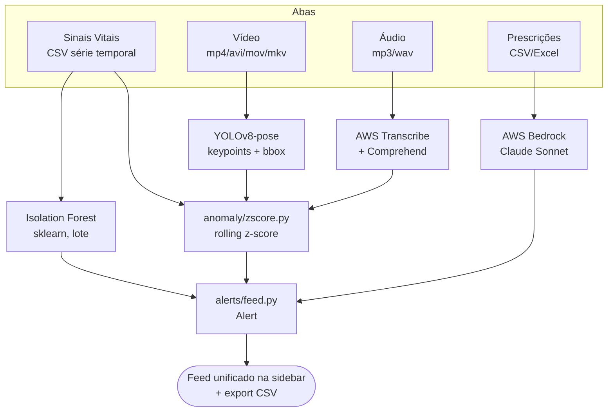

# Tech Challenge - Fase 4: Monitoramento Multimodal de Pacientes

* Curso: Pós Tech IA para Devs
* Turma: 8IADT
* Funcional: RM369853

#### Fase 4

* [Fase 4 — Vídeo de apresentação do projeto](adicionar-link)

* [Fase 4 — Código Python](https://github.com/paulosobral/fiap-pos-tech-ia-para-devs/tree/main/01-aulas-gravadas/04-analise-de-dados/05-tech-challenge "Código Python");

#### Geral

* [Repositório do GitHub](https://github.com/paulosobral/fiap-pos-tech-ia-para-devs "Repositório do GitHub");

## Visão Geral do Projeto

Aplicação Streamlit única para monitoramento contínuo de pacientes a partir de dados **multimodais** — vídeo, áudio, sinais vitais e prescrições — com detecção de anomalias em tempo real, integração a serviços gerenciados na nuvem (AWS) e um feed unificado de alertas simulando notificação à equipe médica.

Projeto individual, entrega via upload de arquivo em 4 abas (sem captura real-time de câmera/microfone — ver "Limitações conhecidas" no `RELATORIO_TECNICO.md`). Três das quatro modalidades (Vídeo, Áudio, Sinais Vitais) compartilham a mesma detecção estatística de anomalia por **rolling z-score**; a quarta (Prescrições) usa raciocínio de LLM via **AWS Bedrock**.

---

## Quick Start

```bash
# 1. Criar o venv e instalar dependências
python -m venv venv
source venv/bin/activate            # no Windows: venv\Scripts\activate
pip install -r requirements.txt

# 2. (Opcional) antecipar o download do modelo YOLOv8-pose
venv/bin/python -c "from ultralytics import YOLO; YOLO('yolov8n-pose.pt')"

# 3. Subir tudo (provisiona o bucket S3 via Terraform + Streamlit)
./start.sh

# 4. Encerrar (mata o Streamlit + destrói o bucket S3)
./stop.sh
```

> `start.sh`/`stop.sh` cuidam da infraestrutura AWS (bucket S3 do Transcribe) e do processo Streamlit de ponta a ponta. Para rodar manualmente sem Terraform, ver a seção **Como executar**.

---

## Pré-requisitos

| Componente | Versão / requisito |
|---|---|
| Python | 3.11+ |
| Conta AWS | Acesso a **Transcribe**, **Comprehend** e **Bedrock** (Claude Sonnet habilitado) |
| Terraform | ≥ 1.5.0 (usado por `start.sh`/`stop.sh` para o bucket S3) |
| Internet | Necessária no 1º uso da aba Vídeo (download do `yolov8n-pose.pt`) |
| Disco | `ultralytics` traz torch/torchvision — instalação grande na 1ª vez |

### Credenciais AWS

Configuradas em `~/.aws/credentials` / `~/.aws/config`. O projeto usa dois perfis:

| Perfil | Uso | Região |
|---|---|---|
| `default` | Fallback geral; Sinais Vitais e Vídeo **não** fazem chamada AWS | — |
| `bedrock` | Aba Prescrições (`prescriptions/bedrock_review.py`) | `us-east-2` |

- A aba **Áudio** (`audio/aws_speech.py`) usa `region_name="us-east-1"` fixo para Transcribe e Comprehend.
- **Bedrock**: nesta implementação só funcionou com o perfil `bedrock` em **`us-east-2`**, inference profile `us.anthropic.claude-sonnet-5`. `us-east-1` retornou `ResourceNotFoundException` ("Model use case details have not been submitted for this account") para a conta usada. Contas diferentes podem exigir ajuste de `AWS_REGION`/`BEDROCK_MODEL_ID` em `prescriptions/bedrock_review.py`.

> O app funciona parcialmente sem AWS: as abas **Sinais Vitais** e **Vídeo** rodam 100% offline. Só **Áudio** e **Prescrições** dependem da nuvem.

---

## Estrutura do Projeto

```
05-tech-challenge/
├── app.py                    # Interface Streamlit — 4 abas + sidebar de alertas
├── start.sh                  # terraform apply (bucket S3) + streamlit run (nohup)
├── stop.sh                   # mata o Streamlit + terraform destroy
├── requirements.txt          # deps (pyarrow<25 fixado — ver nota de segfault)
├── anomaly/
│   └── zscore.py             # detecção compartilhada: rolling z-score (Vídeo/Áudio/Sinais Vitais)
├── video/
│   ├── pose.py               # extração de keypoints (YOLOv8-pose)
│   ├── analysis.py           # ângulos por articulação + velocidade → z-score → eventos + zona
│   └── draw.py               # esqueleto COCO anotado na galeria
├── audio/
│   ├── aws_speech.py         # AWS Transcribe (fala→texto) + Comprehend (sentimento/entidades)
│   └── analysis.py           # taxa de fala / duração de pausa → z-score
├── vital_signs/
│   ├── analysis.py           # orquestra z-score + Isolation Forest, rótulos amigáveis
│   └── isolation_forest.py   # IsolationForest (sklearn, fit em lote)
├── prescriptions/
│   └── bedrock_review.py     # revisão via AWS Bedrock (Claude Sonnet), sem fine-tuning
├── alerts/
│   └── feed.py               # Alert (dataclass) + feed em session_state + export CSV
├── scripts/
│   ├── gen_vital_signs_demo.py    # gera CSVs de demo (normal + anomalias) do MIMIC-III
│   └── gen_prescriptions_demo.py  # gera CSV de prescrições sem anomalias
├── infra/                    # Terraform — bucket S3 do Transcribe (s3.tf, variables.tf, outputs.tf)
├── data/                     # datasets/mídia de demonstração
├── tests/                    # suíte pytest (199 testes)
└── openspec/                 # specs/design/tarefas (fluxo spec-driven do projeto)
```

---

## Arquitetura

### Fluxo multimodal



Cada aba recebe upload de um arquivo e delega o processamento a um módulo próprio (organização por *capability*). Toda anomalia/inconsistência vira um `Alert` (origem, timestamp, descrição + campos estruturados `alert_id`/`category`/`level`) empurrado para um feed compartilhado em `st.session_state`, renderizado na sidebar do mais recente para o mais antigo.

### Como cada modalidade funciona

| Modalidade | Técnica | Modelo/serviço | Treino? |
|---|---|---|---|
| **Sinais Vitais** | Rolling z-score (linha a linha) + Isolation Forest (lote) | `sklearn.ensemble.IsolationForest` | **Fit em lote** sobre o CSV carregado (não é fine-tuning) |
| **Vídeo** | Estimativa de pose → ângulos por articulação + velocidade → z-score → eventos + zona | `yolov8n-pose.pt` (ultralytics), COCO-keypoints | **Pré-treinado** — sem treino local |
| **Áudio** | Fala→texto + sentimento/entidades → taxa de fala/pausa → z-score | AWS Transcribe + AWS Comprehend | **Serviços gerenciados** — sem treino |
| **Prescrições** | Raciocínio semântico sobre histórico via prompt estruturado (JSON) | AWS Bedrock — `us.anthropic.claude-sonnet-5` | **LLM instruído por prompt** — sem fine-tuning |

#### Sinais Vitais — z-score + Isolation Forest

Duas camadas complementares sobre o CSV de série temporal (FC, SpO2, pressão, frequência respiratória):

1. **Rolling z-score** (`anomaly/zscore.py`, camada "tempo real"/explicável): média e desvio-padrão populacional (ddof=0) móveis sobre uma janela que inclui o próprio ponto; `|z| > threshold` marca anomalia. Como a janela inclui o ponto, `|z|` máximo é `sqrt(janela-1)` — por isso a **janela padrão é 13** (`sqrt(12) ≈ 3.46 > threshold 3.0`); a UI avisa quando uma combinação manual `threshold ≥ sqrt(janela-1)` tornaria a detecção inerte.
2. **Isolation Forest** (`vital_signs/isolation_forest.py`, `contamination=0.05`, `random_state=42`): ajustado (`fit`) em lote sobre o dataset completo carregado, como validação cruzada estatística multivariada.

O relatório combinado classifica cada leitura anômala em **níveis de confiança**: 🔴 alta confiança (as duas camadas concordam), 🟠 só tempo real (z-score), 🟡 só histórico (Isolation Forest). Saída em linguagem não-técnica com tabela traduzida, tooltips e IDs de vínculo (`#S01`).

#### Vídeo — YOLOv8-pose

Um único forward pass do `yolov8n-pose.pt` fornece **keypoints humanos** (ângulos de cotovelos, joelhos, quadris/tronco, pescoço/cabeça — ambos os lados — + velocidade do centro de massa) **e** bounding boxes de pessoa (regra de zona crítica opcional). Cada série de ângulo/velocidade passa pelo mesmo rolling z-score; frames irregulares consecutivos são agrupados em **eventos** (1 alerta por evento, id `#V01`, categoria da região do corpo). Saída: relatório visual com seções colapsáveis por articulação e galeria de esqueletos anotados (top-N por gravidade). Escolha de YOLOv8-pose no lugar de OpenPose documentada em `RELATORIO_TECNICO.md` §2.2.

#### Áudio — AWS Transcribe + Comprehend

AWS Transcribe converte o áudio em texto com timestamps por palavra (job assíncrono via bucket S3); AWS Comprehend classifica sentimento e extrai entidades. Termos críticos configuráveis ("dor", "não consigo respirar") são buscados no texto. Taxa de fala e duração de pausa, derivadas dos timestamps, passam pelo rolling z-score para sinalizar fadiga/disartria. IDs de vínculo `#A01`. Escolha de AWS no lugar de Azure documentada em `RELATORIO_TECNICO.md` §2.1.

#### Prescrições — AWS Bedrock (Claude Sonnet)

O histórico por paciente é enviado num prompt estruturado (PT-BR) ao Bedrock, que responde em JSON apontando inconsistências: mudança abrupta de dose, interação medicamentosa ou dose sem justificativa clínica. Sem modelo estatístico nem fine-tuning — a tarefa é interpretação semântica sobre poucos dados, melhor servida por um LLM instruído. IDs de vínculo `#P01`.

### Feed de alertas + export

`alerts/feed.py` mantém o `Alert` (dataclass com `origin`, `description`, `timestamp` + `alert_id`/`category`/`level` opcionais) acumulado em `st.session_state`. A sidebar mostra o feed cronológico, um resumo por aba e por nível, e um botão **"Baixar relatório (CSV)"** que exporta todos os alertas da sessão (colunas `id, origem, timestamp, categoria, nivel, nivel_label, descricao`, UTF-8-SIG para o Excel).

---

## Dados

Todos os dados são **públicos, reais de-identificados ou sintéticos** — nenhum dado real de paciente identificável.

| Dataset | Origem | Conteúdo | Uso |
|---|---|---|---|
| `vital_signs_sample.csv` | **MIMIC-III Demo v1.4** (PhysioNet) | 480 leituras horárias de UTI real de-identificada (`icustay_id=250305`) | Sinais Vitais |
| `vital_signs_sample_normal.csv` | Derivado do MIMIC-III | Trecho sem nenhuma anomalia nas 2 camadas | Demo "sem alertas" |
| `vital_signs_sample_anomalias.csv` | Derivado do MIMIC-III | Mesmo trecho + 3 picos clínicos injetados (taquicardia, hipoxemia, pico hipertensivo) | Demo "com alertas" |
| `demo_pose_walk.mp4` | Recorte de `vtest.avi` (OpenCV, uso livre) | 6s, 480×360, pedestres caminhando | Vídeo |
| `demo_consulta_audio.mp3` | TTS `gTTS` (sintético) | ~10s pt-BR com termos críticos | Áudio |
| `prescricoes_sinteticas.csv` | Sintético (manual) | 3 pacientes com anomalias (mudança de dose, interação) | Prescrições (com anomalias) |
| `prescricoes_sinteticas_normal.csv` | Sintético (`gen_prescriptions_demo.py`) | 3 pacientes, dose estável, sem interação | Prescrições (sem anomalias) |

Os pares "normal" de sinais vitais são reproduzíveis por `scripts/gen_vital_signs_demo.py` (que roda `analyze` ao final e falha se o normal tiver anomalia ou o anômalo não tiver alta confiança) e `scripts/gen_prescriptions_demo.py`.

---

## Treino e métricas

Este projeto **não faz fine-tuning de modelo**. As duas abordagens de IA demonstradas são:

1. **Estatística / ML clássico** (sem treino pesado):
   - **Rolling z-score** — sem treino, interpretável, threshold explícito. Reaproveitado nas 3 modalidades numéricas.
   - **Isolation Forest** — `fit` em lote sobre o CSV de sinais vitais carregado (não é fine-tuning de rede neural; é o ajuste do estimador `sklearn` ao dataset em runtime).
2. **Raciocínio via LLM** — AWS Bedrock (Claude Sonnet) instruído por prompt, sem treino customizado.

### Resultados reais obtidos (validação durante a implementação)

| Modalidade | Resultado real medido |
|---|---|
| **Sinais Vitais** (MIMIC-III, `window=13`, `threshold=3.0`) | 19 leituras marcadas pelo z-score; **5 de alta confiança** (z-score ∩ Isolation Forest, `contamination=0.05`); 14 só pelo Isolation Forest — evidenciando a divergência entre as camadas |
| **Vídeo** (`demo_pose_walk.mp4`, 60 frames, YOLOv8-pose real) | pose em 47/60 frames; **10 eventos irregulares**; articulação mais afetada: Joelho direito; 6 seções no relatório; ~12% do vídeo estimado como irregular |
| **Áudio** (`demo_consulta_audio.mp3`, chamadas reais) | transcrição exata (18 palavras c/ timestamp); sentimento `NEGATIVE` (99,75%); 3 entidades; 4 termos críticos localizados |
| **Prescrições** (Bedrock real, Paciente B) | 2 achados reais: `mudanca_dose_abrupta` + `dose_sem_justificativa`; Paciente A retornou `[]` (sem inconsistência) |

Detalhamento completo e limitações honestas (ex.: validação de anomalia de fala feita majoritariamente por testes unitários) em `RELATORIO_TECNICO.md` §4.

---

## Interface Streamlit

Acesse em `http://localhost:8501` após `./start.sh` (ou `streamlit run app.py`).

| Aba | Função |
|---|---|
| **Sinais Vitais** | Upload de CSV; z-score + Isolation Forest; tabela amigável com níveis de confiança e IDs `#S01` |
| **Vídeo** | Upload de vídeo; YOLOv8-pose; relatório visual por articulação + galeria de esqueletos; IDs `#V01` |
| **Áudio** | Upload de áudio; Transcribe + Comprehend; termos críticos + anomalia de fala; IDs `#A01` |
| **Prescrições** | Upload de histórico; revisão via Bedrock; cards de inconsistência; IDs `#P01` |
| **Sidebar — Feed de Alertas** | Feed unificado cronológico de todas as abas + resumo por aba/nível + export CSV |

---

## Como executar (manual, sem Terraform)

```bash
source venv/bin/activate
export AUDIO_TRANSCRIBE_BUCKET=meu-bucket-transcribe   # necessário só para a aba Áudio
streamlit run app.py
```

Sem `AUDIO_TRANSCRIBE_BUCKET`, a aba Áudio exibe um erro e bloqueia o processamento (não tenta a chamada AWS). Crie o bucket manualmente com `aws s3 mb s3://meu-bucket-transcribe --region us-east-1`, ou deixe o `start.sh` provisioná-lo via Terraform.

> **Nota `pyarrow<25`**: `requirements.txt` fixa `pyarrow<25`. A série 25.x segfaulta (`libarrow.so`) ao renderizar `st.dataframe`/`st.table` quando `scikit-learn` está importado no processo (o que o app sempre faz) e a renderização ocorre num rerun posterior ao primeiro. Ver `openspec/changes/fix-pyarrow-segfault/design.md`.

---

## Rodando os testes

```bash
venv/bin/python -m pytest tests/ -q
```

A suíte tem **199 testes** e passa integralmente. Os testes cobrem a lógica de cada módulo isoladamente (com mocks para as chamadas AWS); não exercitam a UI do Streamlit ponta a ponta. Não é necessário `PYTHONPATH=.` — o pytest resolve os imports a partir da raiz do projeto.

---

## Licença

Projeto desenvolvido para fins acadêmicos no curso FIAP Pós Tech — IA para Devs, Fase 4.
Dados: MIMIC-III Clinical Database Demo (PhysioNet Open Data License), amostra `vtest.avi` (OpenCV, uso livre), demais dados sintéticos. Modelos: YOLOv8-pose (AGPL-3.0, ultralytics), AWS Transcribe/Comprehend/Bedrock (serviços gerenciados AWS).
