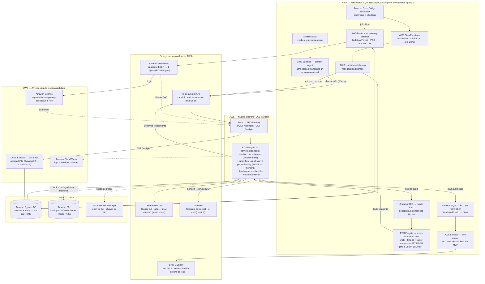

# Agente SDR Imobiliário B2B — Levitt.AI

Prova de Conceito (POC) de um Agente SDR Imobiliário com IA Generativa especializado em espaços corporativos B2B para a W Levitt Negócios Imobiliários.

## Visão Geral

Este projeto implementa um SDR digital que atende e qualifica leads B2B em conversa humanizada via Telegram, com RAG sobre base de imóveis, memória conversacional, follow-up automático, agendamento de reuniões, dashboard de KPIs e detecção de anomalias. Toda a solução é 100% serverless na AWS, com infraestrutura como código (Terraform).

### Diferenciais Competitivos

- **Foco B2B corporativo:** lajes, andares, salas comerciais (diferente de Lais/Maya que focam residencial)
- **Canal Telegram:** custo zero (roadmap: WhatsApp)
- **Qualificação proprietária:** RAG + score explicável
- **Segurança:** LGPD + detecção de anomalias desde o design
- **Custo:** ~R$ 15-25/mês em POC

## Estrutura de Pastas

```
agente-sdr-imobiliario/
├── start.sh                    # Pipeline de deploy: build → testes → terraform apply
├── stop.sh                     # Teardown completo: terraform destroy
├── secrets.local.env           # Credenciais locais (gitignored)
├── pyproject.toml              # Configuração do projeto Python
├── requirements-dev.txt        # Dependências de desenvolvimento
├── apps/                       # Aplicações (1 por componente)
│   ├── conversation-router/    # Núcleo síncrono: sessão + fluxo + RAG + roleta + scheduler
│   │   ├── handler.py          # Entrypoint (adapter)
│   │   ├── server.py           # Servidor FastAPI (para ECS)
│   │   ├── service/            # Casos de uso: sales-flow, security-layer, properties-rag, lead-router, scheduler
│   │   ├── infra/              # Adapters: DynamoDB, S3/FAISS, OpenRouter (LiteLLM), SQS
│   │   ├── tests/              # Testes unitários e de qualidade
│   │   ├── data/               # Dados sintéticos (properties.json, clients.json)
│   │   ├── requirements.txt    # Dependências da aplicação
│   │   └── Dockerfile          # Imagem container para ECS
│   ├── voice-adapter/           # Worker ECS Fargate: transcrição de áudio (faster-whisper)
│   ├── crm-adapter/            # Camada MCP para sincronização com CRM (HubSpot/Kenlo/Facilita)
│   ├── contact-ingest/         # Ingestão de contatos de e-mail/portais
│   ├── anomaly-detector/       # Detecção de anomalias (Isolation Forest + PCA)
│   ├── followup/               # Follow-up automático via EventBridge + Step Functions
│   ├── dashboard-api/          # API Lambda para KPIs do dashboard
│   └── dashboard-ui/           # Streamlit dashboard (deploy em ECS Fargate)
├── infra/                      # Terraform — infraestrutura como código
│   ├── providers.tf            # Provedores AWS
│   ├── variables.tf            # Variáveis de entrada
│   ├── kms.tf                  # Chave KMS para criptografia de PII
│   ├── s3.tf                   # Bucket S3 (catálogos + índices FAISS)
│   ├── dynamodb.tf             # Tabelas DynamoDB (sessões, leads, properties)
│   ├── sqs.tf                  # Filas SQS (áudio, CRM)
│   ├── ses.tf                  # SES para ingestão de e-mail
│   ├── secrets.tf              # Secrets Manager (tokens, chaves API)
│   ├── iam.tf                  # Roles e políticas IAM
│   ├── ecs.tf                  # ECS Fargate (conversation-router, dashboard-ui, voice-adapter)
│   ├── apigateway.tf           # API Gateway HTTP
│   ├── cognito.tf              # Cognito User Pool (login do dashboard)
│   ├── cloudwatch-logs.tf      # CloudWatch Logs e grupos
│   ├── lambda-*.tf             # Lambdas assíncronas (anomaly-detector, contact-ingest, etc.)
│   ├── step_functions.tf       # Step Functions para follow-up
│   └── outputs.tf              # Saídas do Terraform
├── scripts/                    # Scripts utilitários
│   ├── seed_properties.py      # Gera catálogo sintético de imóveis
│   ├── seed_clients.py         # Gera catálogo sintético de clientes
│   └── load_properties_dynamodb.py  # Popula tabela DynamoDB
├── docs/                       # Documentação
│   └── POSTECH - Hacka PRD Agente_SDR_Imobiliario - Fase 5.md
├── .aidlc/                     # Framework AI-DLC (metodologia de desenvolvimento)
├── documentos/                 # Documentos do projeto (PRD, enunciados)
└── Designer.png                # Diagrama da arquitetura
```

## Como Subir Localmente

### Pré-requisitos

- **Python 3.11+**
- **AWS CLI** configurado com credenciais
- **Terraform** (>= 1.0)
- **Podman** ou Docker (para build de imagens container)
- **Conta AWS** com permissões para criar recursos

### 1. Criar Bot no Telegram

Antes de configurar as credenciais, você precisa criar o bot no Telegram:

1. **Abra o Telegram** e procure pelo bot **@BotFather**
2. Envie o comando `/newbot`
3. Siga as instruções:
   - Escolha um nome para o bot (ex: "Levitt SDR Bot")
   - Escolha um username único (ex: `levitt_sdr_bot`)
4. O BotFather retornará o **token do bot** (formato: `123456789:ABCdefGHIjklMNOpqrsTUVwxyz`)
5. **Guarde este token** — ele será usado no `secrets.local.env`

**Configurações adicionais do bot (opcional):**

- `/setdescription` - Adiciona descrição do bot
- `/setabouttext` - Adiciona texto "sobre"
- `/setuserpic` - Define foto do perfil
- `/setcommands` - Define comandos personalizados (ex: `/start`, `/help`)

### 2. Configurar Credenciais Locais

Crie o arquivo `secrets.local.env` (já existe no projeto, gitignored):

```bash
# secrets.local.env
TELEGRAM_BOT_TOKEN=<seu_token_bot_telegram>
LLM_API_KEY=<sua_chave_openrouter>
HUBSPOT_MCP_CLIENT_ID=<client_id_hubspot>
HUBSPOT_MCP_CLIENT_SECRET=<client_secret_hubspot>
HUBSPOT_MCP_REFRESH_TOKEN=<refresh_token_hubspot>
```

### 3. Deploy Completo

Execute o script `start.sh` que realiza todo o pipeline:

```bash
./start.sh
```

O script executa as seguintes etapas:

1. **Setup:** Cria venv Python e instala dependências
2. **compileall:** Valida sintaxe Python
3. **Seed de dados:** Gera catálogos sintéticos de imóveis e clientes
4. **Gates:** Roda testes unitários (pytest) com cobertura >= 80%
5. **Build:** Cria zips das Lambdas e imagens container (podman)
6. **Deploy IaC:** Executa `terraform init` e `terraform apply`
7. **Configuração:** Registra webhook Telegram, escala tasks ECS, popula DynamoDB
8. **Smoke checks:** Verifica endpoints

### 4. Configurações Manuais na AWS

#### 4.1 Configurar Região

O script usa a região configurada no AWS CLI ou padrão `us-east-1`:

```bash
export AWS_REGION=us-east-1  # ou sua região preferida
```

#### 4.2 Verificar Recursos Criados

Após o deploy, o Terraform imprime as saídas principais:

- **API URL:** Endpoint do API Gateway
- **Dashboard URL:** IP público da task do dashboard
- **Cognito Pool ID:** User Pool para login
- **Cognito Client ID:** App Client para autenticação

#### 4.3 Secrets Manager

As secrets são criadas automaticamente pelo Terraform se as variáveis forem fornecidas:

- `sdr/tg-bot-token`: Token do bot Telegram
- `sdr/llm-api-key`: Chave da API OpenRouter
- `sdr/dashboard-api-token`: Token interno para autenticação

Para atualizar manualmente:

```bash
aws secretsmanager put-secret-value --secret-id sdr/tg-bot-token --secret-string "<novo_token>"
```

#### 4.4 SSM Parameters

Modelos LLM configurados via SSM Parameters:

- `/sdr/llm-model-primary`: Modelo primário (Tier 1)
- `/sdr/llm-model-fallback`: Modelo de fallback (Tier 2)
- `/sdr/llm-model-complex`: Modelo premium (Tier 3)

Para alterar:

```bash
aws ssm put-parameter --name "/sdr/llm-model-primary" --value "anthropic/claude-3.5-haiku" --type String --overwrite
```

### 8. Configurações no HubSpot (CRM)

#### 8.1 Criar Aplicação HubSpot

1. Acesse [developers.hubspot.com](https://developers.hubspot.com/)
2. Crie uma nova aplicação
3. Configure OAuth 2.1 scopes necessários
4. Copie `Client ID` e `Client Secret`

#### 8.2 Obter Refresh Token

Use o MCP Inspector ou um fluxo OAuth manual para obter o primeiro refresh token:

```bash
# Via MCP Inspector (recomendado)
# Autorize o connector e copie o refresh token
```

#### 8.3 Configurar no Projeto

Atualize `secrets.local.env` com as credenciais:

```bash
HUBSPOT_MCP_CLIENT_ID=<client_id>
HUBSPOT_MCP_CLIENT_SECRET=<client_secret>
HUBSPOT_MCP_REFRESH_TOKEN=<refresh_token>
```

**Nota:** O `crm-adapter` roda automaticamente a renovação do refresh token e grava o novo valor, então este é usado apenas para semear o primeiro uso.

### 5. Criar Usuário no AWS Cognito

O dashboard Streamlit é protegido pelo Amazon Cognito. Você precisa criar usuários manualmente para acessá-lo.

#### 5.1 Obter Cognito Pool ID e Client ID

Após o deploy, o Terraform imprime estas informações:

```bash
# Saídas do Terraform
POOL_ID=$(terraform output -raw cognito_user_pool_id)
CLIENT_ID=$(terraform output -raw cognito_app_client_id)
```

Ou você pode obtê-las via AWS CLI:

```bash
# Listar User Pools
aws cognito-idp list-user-pools --max-items 10

# Listar App Clients do seu Pool
aws cognito-idp list-user-pool-clients --user-pool-id <POOL_ID>
```

#### 5.2 Criar Usuário via AWS CLI

```bash
# Substitua os valores conforme necessário
POOL_ID="<seu_pool_id>"
EMAIL="seu@email.com"
TEMP_PASSWORD="TempPass123!"
PERMANENT_PASSWORD="SuaSenha123!"

# Criar usuário com senha temporária
aws cognito-idp admin-create-user \
  --user-pool-id "$POOL_ID" \
  --username "$EMAIL" \
  --user-attributes \
    Name=email,Value="$EMAIL" \
    Name=email_verified,Value=true \
  --message-action SUPPRESS \
  --temporary-password "$TEMP_PASSWORD"

# Definir senha permanente (opcional - pula a tela de "first login")
aws cognito-idp admin-set-user-password \
  --user-pool-id "$POOL_ID" \
  --username "$EMAIL" \
  --password "$PERMANENT_PASSWORD" \
  --permanent
```

**Nota:** O `--message-action SUPPRESS` evita que o Cognito envie e-mail de boas-vindas (útil em POC sem configuração de e-mail SES).

#### 5.3 Criar Usuário via Console AWS

1. Acesse o console do Amazon Cognito
2. Clique no User Pool criado (nome começa com `sdr-`)
3. Vá em **User management** → **Users**
4. Clique em **Create user**
5. Preencha:
   - **Username:** e-mail do usuário
   - **Temporary password:** senha temporária
   - **Email address:** e-mail (verificado automaticamente)
   - **Email verified:** marcado como "Yes"
6. Clique em **Create user**

O usuário precisará trocar a senha no primeiro login no dashboard.

#### 5.4 Atribuir Grupos (Opcional)

Se você implementou controle de acesso por grupos (ex: admin, viewer):

```bash
# Criar grupo
aws cognito-idp create-group \
  --user-pool-id "$POOL_ID" \
  --group-name "admin" \
  --description "Administradores do dashboard"

# Adicionar usuário ao grupo
aws cognito-idp admin-add-user-to-group \
  --user-pool-id "$POOL_ID" \
  --username "$EMAIL" \
  --group-name "admin"
```

### 6. Acessar o Dashboard

O dashboard Streamlit roda em ECS Fargate. Após o deploy:

1. O script imprime o IP público da task: `Dashboard: http://<IP>`
2. Acesse no navegador
3. Faça login com usuário Cognito (criado na seção 5 acima)

### 7. Teardown (Remover Infraestrutura)

Para destruir toda a infraestrutura e controlar custos:

```bash
./stop.sh
```

Isso executa `terraform destroy` e remove todos os recursos AWS.

## Dependências

### Dependências de Desenvolvimento

Ver `requirements-dev.txt`:

- `pytest>=8.0`: Framework de testes
- `pytest-cov>=5.0`: Cobertura de código
- `scikit-learn>=1.4`: Para testes do anomaly-detector
- `streamlit>=1.37`: Para testes do dashboard-ui
- `Pillow>=10`: Para scripts de processamento de imagens

### Dependências da Aplicação

Cada app tem seu `requirements.txt`:

- **conversation-router:** litellm, langgraph, faiss-cpu, boto3, fastapi, uvicorn
- **voice-adapter:** faster-whisper, ffmpeg-python, boto3
- **crm-adapter:** mcp, boto3
- **dashboard-ui:** streamlit, boto3, requests
- **Outras:** boto3, requests (comum)

### Chaves de API Necessárias

| Chave | Origem | Uso | Obrigatório? |
|-------|--------|-----|--------------|
| `TELEGRAM_BOT_TOKEN` | [@BotFather](https://t.me/botfather) no Telegram | Autenticação do bot | Sim (para bot funcionar) |
| `LLM_API_KEY` | [OpenRouter](https://openrouter.ai/) | Chamadas LLM (Claude 3.5 Haiku) | Sim (para LLM real) |
| `HUBSPOT_MCP_CLIENT_ID` | HubSpot Developers | CRM via MCP | Opcional (POC usa CRM simulado) |
| `HUBSPOT_MCP_CLIENT_SECRET` | HubSpot Developers | CRM via MCP | Opcional (POC usa CRM simulado) |
| `HUBSPOT_MCP_REFRESH_TOKEN` | Fluxo OAuth HubSpot | CRM via MCP | Opcional (POC usa CRM simulado) |

### Serviços AWS Configurados

O Terraform cria automaticamente:

- **API Gateway HTTP:** Endpoint para webhook Telegram e API KPIs
- **ECS Fargate:** 3 serviços (conversation-router, dashboard-ui, voice-adapter)
- **DynamoDB:** 3 tabelas (sdr-sessions, sdr-leads, sdr-properties)
- **S3:** Bucket para catálogos e índices FAISS
- **SQS:** 2 filas (sdr-voice-queue, sdr-crm-queue)
- **SES:** Configuração para receber e-mails de portais
- **EventBridge Scheduler:** Agendamento de follow-up e job diário de anomalias
- **Step Functions:** Workflow de follow-up
- **Cognito User Pool:** Login do dashboard
- **CloudWatch Logs:** Logs estruturados
- **KMS:** Chave para criptografia de PII
- **Secrets Manager:** Secrets sensíveis
- **SSM Parameters:** Configuração de modelos LLM
- **IAM:** Roles e políticas para cada serviço

## Estimativa de Custo (POC Mensal)

| Item | Estimativa |
|------|------------|
| Telegram | R$ 0 |
| Lambda/API Gateway | ~R$ 0 (free tier) |
| OpenRouter (Claude 3.5 Haiku) | ~R$ 8-15 |
| DynamoDB (on-demand) | < R$ 5 |
| EventBridge Scheduler | < R$ 1 |
| CloudWatch/Logs | < R$ 5 |
| S3 + índices FAISS | < R$ 1 |
| SQS + SES | < R$ 1 |
| Amazon Cognito | R$ 0 (free tier) |
| **Total POC** | **~R$ 15-25/mês** |

## Arquitetura

A arquitetura completa está descrita no PRD (`documentos/POSTECH - Hacka PRD Agente_SDR_Imobiliario - Fase 5.md`).

### Diagrama Mermaid



### Componentes Principais

- **Canal:** Telegram Bot API (webhook)
- **Núcleo síncrono:** ECS Fargate (conversation-router) com LangGraph
- **Assíncrono:** SQS + Lambdas (voice, CRM, anomaly-detector, followup)
- **Dados:** DynamoDB (sessões, leads) + S3 (catálogos RAG)
- **Orquestração:** EventBridge Scheduler + Step Functions
- **Segurança:** KMS (PII), Cognito (login), guardrails
- **Observabilidade:** CloudWatch Logs + métricas

## Testes

Rodar testes localmente:

```bash
# Ativar venv
source .venv/bin/activate

# Rodar todos os testes com cobertura
pytest apps/ --cov=apps/ --cov-report=term --cov-fail-under=80

# Rodar testes de qualidade (requer LLM_API_KEY configurado)
pytest apps/conversation-router/tests/quality
```

## Documentação

- **PRD completo:** `documentos/POSTECH - Hacka PRD Agente_SDR_Imobiliario - Fase 5.md`
- **AGENTS.md:** Configuração do framework AI-DLC
- **Diagrama:** `Designer.png`

## Licença

Projeto acadêmico — Pós Tech IA para Devs (FIAP), Fase 5.
