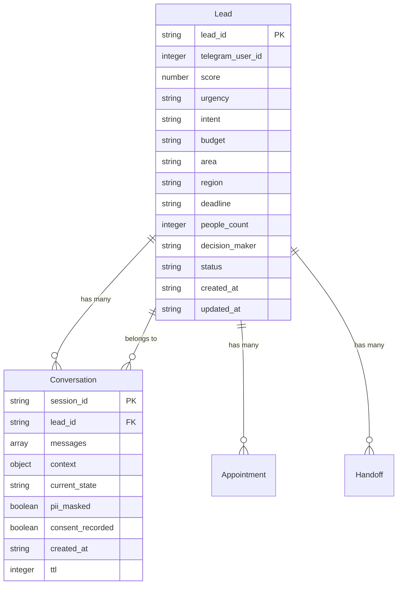

# Entities — U1: Core Conversation

> Unidade U1 (Core Conversation). Fonte: components.md, functional-design-questions, PRD §7.1-7.3.

---

## Entity Source of Truth

```yaml
entities:
  - name: Lead
    identifier: lead_id
    attributes:
      - name: lead_id
        type: string
        required: true
        description: Identificador único do lead
      - name: telegram_user_id
        type: integer
        required: true
        description: ID do usuário no Telegram
      - name: score
        type: number
        required: false
        description: Score de prontidão (0-100)
      - name: urgency
        type: string
        required: false
        description: Urgência (low/medium/high)
      - name: intent
        type: string
        required: false
        description: Intenção (purchase/rent/investment)
      - name: budget
        type: string
        required: false
        description: Orçamento
      - name: area
        type: string
        required: false
        description: Metragem desejada
      - name: region
        type: string
        required: false
        description: Região desejada
      - name: deadline
        type: string
        required: false
        description: Prazo de mudança
      - name: people_count
        type: integer
        required: false
        description: Número de pessoas
      - name: decision_maker
        type: string
        required: false
        description: Decisor (yes/no/unknown)
      - name: status
        type: string
        required: true
        description: Status (new/qualified/converted/lost)
      - name: created_at
        type: string
        required: true
        description: Timestamp de criação (ISO8601)
      - name: updated_at
        type: string
        required: true
        description: Timestamp de atualização (ISO8601)
    relationships:
      - to: Conversation
        cardinality: one-to-many
        description: Lead tem muitas Conversations
      - to: Appointment
        cardinality: one-to-many
        description: Lead tem muitos Appointments
      - to: Handoff
        cardinality: one-to-many
        description: Lead tem muitos Handoffs

  - name: Conversation
    identifier: session_id
    attributes:
      - name: session_id
        type: string
        required: true
        description: Identificador único da sessão
      - name: lead_id
        type: string
        required: true
        description: ID do lead associado
      - name: messages
        type: array
        required: false
        description: Histórico de mensagens
      - name: context
        type: object
        required: false
        description: Contexto conversacional
      - name: current_state
        type: string
        required: false
        description: Estado atual no LangGraph
      - name: pii_masked
        type: boolean
        required: true
        description: PII foi mascarado
      - name: consent_recorded
        type: boolean
        required: true
        description: Consentimento LGPD foi registrado
      - name: created_at
        type: string
        required: true
        description: Timestamp de criação (ISO8601)
      - name: ttl
        type: integer
        required: true
        description: TTL em segundos (90 dias = 7776000)
    relationships:
      - to: Lead
        cardinality: many-to-one
        description: Conversation pertence a um Lead
```

---

## Entity Relationships Diagram



---

## Entity Descriptions

### Lead

**Purpose**: Representa um lead B2B qualificado com dados de contato, score, urgência e intenção.

**Key Attributes**:
- `lead_id`: Identificador único (UUID)
- `telegram_user_id`: ID do usuário no Telegram para roteamento
- `score`: Score de prontidão (0-100) calculado por LeadQualifier
- `urgency`: Urgência (low/medium/high) baseada em deadline e budget
- `intent`: Intenção (purchase/rent/investment) classificada por LLM
- `status`: Status do lead (new/qualified/converted/lost)

**Lifecycle**:
- Criado quando lead envia `/start` ou primeira mensagem
- Atualizado durante qualificação (score, urgência, intent)
- Transiciona para `qualified` quando score ≥ threshold
- Transiciona para `converted` quando fechar negócio
- Transiciona para `lost` se não engajar por X dias

---

### Conversation

**Purpose**: Representa uma sessão conversacional com histórico de mensagens e contexto.

**Key Attributes**:
- `session_id`: Identificador único da sessão (UUID)
- `lead_id`: ID do lead associado
- `messages`: Array de mensagens (texto + metadata)
- `context`: Contexto conversacional (filtros, preferências)
- `current_state`: Estado atual no LangGraph (greeting/elicitation/intent/qualification/recommendation/scheduling/followup/handoff)
- `pii_masked`: Flag indicando se PII foi mascarado
- `consent_recorded`: Flag indicando se consentimento LGPD foi registrado
- `ttl`: TTL em segundos (90 dias = 7776000 segundos)

**Lifecycle**:
- Criada quando lead envia `/start` ou primeira mensagem
- Atualizada a cada mensagem (contexto, current_state)
- Expirada após TTL (90 dias) — DynamoDB TTL automático
- Recuperada em follow-up para manter contexto

---

## Data Flow

1. **Lead criação**: Telegram webhook → ConversationRouter → DynamoDB (Lead + Conversation)
2. **PII masking**: SecurityLayer extrai PII → DynamoDB criptografado (KMS) → placeholders no texto
3. **Atualização**: LLM classifica intenção → LeadQualifier atualiza Lead (score, urgency, intent)
4. **Contexto**: ConversationRouter atualiza Conversation (messages, context, current_state)
5. **Expiração**: DynamoDB TTL deleta Conversation após 90 dias