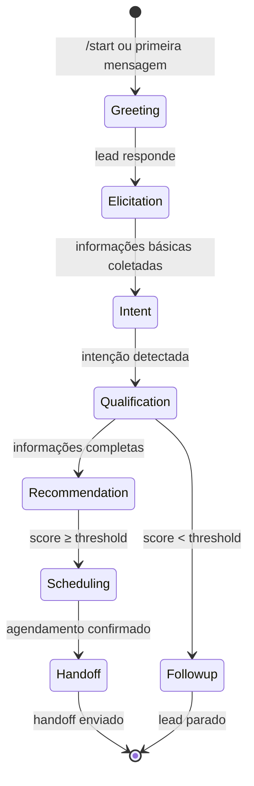

# Functional Spec — U1: Core Conversation

> Unidade U1 (Core Conversation). Fonte: entities.md, rules.md, bolt-plan.md, PRD §7.1-7.3.

---

## Workflow: SalesFlow (LangGraph)

### State Machine



### States Description

| State | Description | Entry Conditions | Exit Conditions |
|-------|-------------|------------------|-----------------|
| Greeting | Saudação inicial + consentimento LGPD | Lead envia `/start` ou primeira mensagem | Lead responde |
| Elicitation | Coleta informações básicas (metragem, região, orçamento) | Consentimento registrado | Informações básicas coletadas |
| Intent | Classificação de intenção (compra/locação/investimento) | Informações básicas coletadas | Intenção detectada com confiança ≥ 0.85 |
| Qualification | Coleta informações detalhadas + cálculo de score | Intenção detectada | Score calculado |
| Recommendation | RAG para buscar imóveis compatíveis | Score ≥ threshold OU lead pede | Top-k imóveis retornados |
| Scheduling | Agendamento de visita/reunião | Imóveis apresentados | Agendamento confirmado |
| Handoff | Geração de resumo para corretor | Agendamento confirmado OU lead solicita | Handoff enviado |
| Followup | Lead parado (recuperação via EventBridge) | Score < threshold OU sem engajamento | Lead retomado |

---

## Functional Flow

### 1. Lead Inicia Conversa

**Trigger**: Lead envia `/start` ou primeira mensagem no Telegram

**Flow**:
1. ConversationRouter valida webhook (secret token)
2. ConversationRouter cria sessão no DynamoDB (Lead + Conversation)
3. SalesFlow transiciona para `Greeting`
4. SDR Agent gera saudação + consentimento LGPD (R6)
5. Lead responde → SalesFlow transiciona para `Elicitation`

**Error Handling**:
- Secret inválido: 401
- Payload inválido: 400
- DynamoDB timeout: Retry automático

---

### 2. Coleta de Informações

**Trigger**: Lead responde à saudação

**Flow**:
1. SecurityLayer aplica PII masking (R1)
2. SalesFlow transiciona para `Elicitation`
3. SDR Agent pergunta informações básicas (metragem, região, orçamento)
4. Lead responde → SalesFlow transiciona para `Intent`

**Error Handling**:
- PII leakage: Bloquear resposta, log erro
- Guardrails violados: Bloquear, responder fallback

---

### 3. Detecção de Intenção

**Trigger**: Informações básicas coletadas

**Flow**:
1. LLM classifica intenção (compra/locação/investimento) (R2)
2. Se confiança ≥ 0.85, aceitar
3. Se confiança < 0.85, pedir confirmação
4. Gravar intenção no Lead
5. SalesFlow transiciona para `Qualification`

**Error Handling**:
- Baixa confiança: Perguntar confirmação
- Sem exceção — intenção é obrigatória

---

### 4. Qualificação e Scoring

**Trigger**: Intenção detectada

**Flow**:
1. SalesFlow transiciona para `Qualification`
2. SDR Agent pergunta informações detalhadas (prazo, nº pessoas, decisor)
3. Lead responde → LeadQualifier calcula score (R3)
4. LeadQualifier explica score em linguagem natural
5. Gravar score e fatores no Lead
6. Se score ≥ threshold, SalesFlow transiciona para `Recommendation`
7. Se score < threshold, SalesFlow transiciona para `Followup`

**Error Handling**:
- Informações incompletas: Perguntar faltantes
- Score < threshold: Não qualificar, transicionar para Followup

---

### 5. Recomendação (RAG)

**Trigger**: Score ≥ threshold OU lead pergunta por imóveis

**Flow**:
1. SalesFlow transiciona para `Recommendation`
2. SDR Agent chama PropertiesRAG como tool (R4)
3. PropertiesRAG busca top-k imóveis compatíveis (k=3)
4. SDR Agent apresenta até 3 opções ao lead
5. Se lead escolhe, SalesFlow transiciona para `Scheduling`

**Error Handling**:
- Nenhum imóvel encontrado: Explicar motivo, sugerir ajustar filtros
- RAG timeout: Retry com fallback

---

### 6. Agendamento

**Trigger**: Lead escolhe imóvel ou solicita agendamento

**Flow**:
1. SalesFlow transiciona para `Scheduling`
2. SDR Agent pergunta data/hora disponível
3. Lead responde → Scheduler valida data/hora (DynamoDB calendário simulado)
4. Scheduler grava compromisso e emite convite ICS
5. Scheduler notifica corretor
6. SalesFlow transiciona para `Handoff`

**Error Handling**:
- Data/hora indisponível: Sugerir alternativa
- ICS falha: Log erro, notificar corretor manualmente

---

### 7. Handoff

**Trigger**: Agendamento confirmado OU lead solicita

**Flow**:
1. SalesFlow transiciona para `Handoff`
2. LeadRouter aplica regras de distribuição (R5):
   - Até 500 m² → rodízio dos consultores
   - Acima → diretor/especialista
3. Handoff gera resumo Markdown (gap, score, intenção, urgência, próximos passos)
4. Handoff desmascara PII (uso criptografado)
5. Handoff envia resumo ao corretor via Telegram/e-mail
6. SalesFlow transiciona para `[*]`

**Error Handling**:
- Nenhum corretor disponível: Notificar gestor
- Handoff falha: Log erro, retry

---

## Pseudocode: ConversationRouter Handler

```python
def handler(event):
    # Valida webhook
    if not validate_secret(event['headers']):
        return 401

    # Recupera ou cria sessão
    session = get_or_create_session(event['telegram_user_id'])

    # Aplica SecurityLayer (PII masking)
    masked_message = security_layer.mask(event['message'])

    # Executa SalesFlow (LangGraph)
    result = sales_flow.invoke({
        'session_id': session['session_id'],
        'message': masked_message,
        'context': session['context']
    })

    # Atualiza sessão
    update_session(session['session_id'], result['context'])

    # Enfileira áudio se necessário
    if event['voice']:
        sqs.send_to_voice_queue(event['voice'])

    # Enfileira lead qualificado se necessário
    if result['lead_qualified']:
        sqs.send_to_crm_queue(result['lead_data'])

    # Envia resposta ao Telegram
    telegram.send_message(event['chat_id'], result['response'])

    return 200
```

---

## Pseudocode: SalesFlow LangGraph Node

```python
def intent_node(state):
    # Classifica intenção via LLM
    intent, confidence = llm_classify_intent(state['message'])

    # Se baixa confiança, pedir confirmação
    if confidence < 0.85:
        state['response'] = "Você está buscando compra, locação ou investimento?"
        return state

    # Gravar intenção no Lead
    update_lead(state['lead_id'], {'intent': intent})

    # Transicionar para Qualification
    state['current_state'] = 'qualification'
    return state
```

---

## Data Transformations

### PII Masking Transformation

**Input**: "Meu nome é João Silva, meu e-mail é joao@empresa.com"

**Transformation**:
1. Extrair PII: `{name: "João Silva", email: "joao@empresa.com"}`
2. Persistir criptografado: DynamoDB (KMS)
3. Mascarar: "Meu nome é [NOME], meu e-mail é [EMAIL]"

**Output**: "Meu nome é [NOME], meu e-mail é [EMAIL]"

---

### Score Calculation Transformation

**Input**: `{area: "1000 m²", region: "Berrini", budget: "R$ 50k/mês", deadline: "3 meses", people_count: 50, decision_maker: "yes"}`

**Transformation**:
1. Prontidão (40%): 40 (informações completas, decisor definido)
2. Urgência (30%): 30 (prazo curto, orçamento definido)
3. Ticket médio (30%): 30 (budget alto)
4. Score: 40 + 30 + 30 = 100

**Output**: `{score: 100, explanation: "Seu score é 100 porque você forneceu todas as informações, o prazo é curto e o orçamento é alto"}`