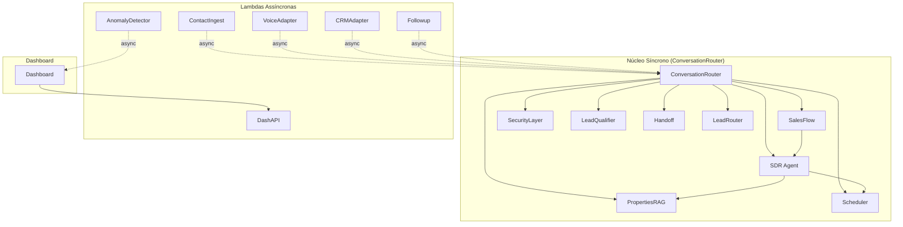

# Domain Design — Component Catalogue

> Estágio Domain Design (Inception). Fonte: requirements.md, PRD §7.1-7.3, domain-design-questions (Q1-Q8).

---

## Part A — Machine-Readable Catalogue

```yaml
components:
  - name: ConversationRouter
    summary: Núcleo síncrono do sistema — recebe webhook Telegram, gerencia sessão e orquestra fluxo conversacional
    behaviour: >
      Valida autenticação do webhook (secret), recupera estado da sessão do DynamoDB,
      chama SalesFlow (LangGraph) para gerenciar estados conversacionais,
      aplica SecurityLayer (PII masking, guardrails, prompt injection check),
      roteia mensagens para módulos internos (SDR Agent, LeadQualifier, PropertiesRAG, Scheduler, Handoff, LeadRouter),
      envia respostas ao Telegram, enfileira mensagens de áudio para SQS,
      enfileira leads qualificados para SQS CRM.
    responsibilities:
      - Gerenciar sessões de conversa (criação, recuperação, persistência)
      - Orquestrar SalesFlow (LangGraph)
      - Aplicar SecurityLayer (PII masking, guardrails)
      - Rotear mensagens para módulos internos
      - Enviar respostas ao Telegram
      - Enfileira áudio para transcrição (SQS)
      - Enfileira leads qualificados para CRM (SQS)
    depends_on:
      - component: SalesFlow
        interaction: Orquestra grafo de estados conversacionais
        style: sync
      - component: SecurityLayer
        interaction: Aplica antes de enviar ao LLM
        style: sync
      - component: SDR Agent
        interaction: Gera respostas via LLM
        style: sync
      - component: LeadQualifier
        interaction: Extrai estrutura e classifica intenção
        style: sync
      - component: PropertiesRAG
        interaction: Busca imóveis compatíveis
        style: sync
      - component: Scheduler
        interaction: Valida e grava agendamentos
        style: sync
      - component: Handoff
        interaction: Gera resumo para corretor
        style: sync
      - component: LeadRouter
        interaction: Aplica roleta de distribuição
        style: sync
    dependents: []
    external_dependencies:
      - name: Telegram Bot API
        kind: third-party-api
        purpose: Receber webhook e enviar mensagens
      - name: Amazon DynamoDB
        kind: database
        purpose: Persistir sessões e leads
      - name: Amazon SQS
        kind: queue
        purpose: Enfileira áudio e leads qualificados
      - name: OpenRouter API
        kind: third-party-api
        purpose: LLM (Claude 3.5 Haiku via LiteLLM)
      - name: Amazon S3
        kind: object-store
        purpose: Carregar índice FAISS de imóveis
      - name: AWS Secrets Manager
        kind: other
        purpose: Token do bot e chaves de API
    entities:
      - name: Lead
        identifier: lead_id
        attributes: [lead_id, telegram_user_id, score, urgency, intent, budget, area, region, deadline, people_count, decision_maker, status, created_at, updated_at]
        references: []
      - name: Conversation
        identifier: session_id
        attributes: [session_id, lead_id, messages, context, current_state, pii_masked, consent_recorded, created_at, ttl]
        references:
          - entity: Lead
            owned_by: ConversationRouter
            relationship: each Conversation belongs to one Lead

  - name: SalesFlow
    summary: Engine de fluxo conversacional (LangGraph) — gerencia estados de saudação, elicitação, intenção, qualificação, recomendação, agendamento, follow-up e handoff
    behaviour: >
      Grafo de estados com nós para saudação, elicitação, intenção, qualificação, recomendação, agendamento, follow-up e handoff.
      Transições de estado baseadas em respostas do lead e decisões do SDR Agent.
      Mantém contexto conversacional entre estados.
    responsibilities:
      - Gerenciar grafo de estados conversacionais
      - Transicionar entre estados baseado em inputs
      - Manter contexto conversacional
      - Integrar com SDR Agent para geração de respostas
    depends_on:
      - component: SDR Agent
        interaction: Gera respostas em cada estado
        style: sync
    dependents:
      - component: ConversationRouter
        interaction: Orquestra o grafo
        style: sync
    external_dependencies: []
    entities: []

  - name: SecurityLayer
    summary: Camada de segurança e privacidade — masking de PII, guardrails, validação de entrada
    behaviour: >
      Extrai e persiste PII real (nome, e-mail, telefone, CNPJ) no DynamoDB criptografado (KMS).
      Substitui PII por placeholders no texto enviado ao LLM.
      Aplica guardrails de tópicos negados.
      Valida entrada contra prompt injection.
      Valida saída contra vazamento de PII (regex).
    responsibilities:
      - Extrair e persistir PII real criptografado
      - Mascarar PII antes de enviar ao LLM
      - Aplicar guardrails de tópicos negados
      - Validar entrada contra prompt injection
      - Validar saída contra vazamento de PII
    depends_on: []
    dependents:
      - component: ConversationRouter
        interaction: Aplica antes de enviar ao LLM
        style: sync
    external_dependencies:
      - name: AWS KMS
        kind: other
        purpose: Criptografar PII at rest
    entities: []

  - name: SDR Agent
    summary: Agente de atendimento — gera respostas humanizadas via LLM (OpenRouter/Claude 3.5 Haiku)
    behaviour: >
      Gera respostas naturais via OpenRouter (Claude 3.5 Haiku) usando LiteLLM como cliente abstraído.
      Usa tools de RAG lookup e scheduling.
      Mantém tom humanizado de SDR corporativo BR.
      Nunca inventa imóveis que não estão na base (constraint via RAG).
    responsibilities:
      - Gerar respostas humanizadas via LLM
      - Usar tools de RAG lookup
      - Usar tools de scheduling
      - Manter tom humanizado de SDR corporativo
    depends_on:
      - component: PropertiesRAG
        interaction: Busca imóveis como tool
        style: sync
      - component: Scheduler
        interaction: Agenda visitas como tool
        style: sync
    dependents:
      - component: ConversationRouter
        interaction: Chama para gerar respostas
        style: sync
      - component: SalesFlow
        interaction: Chama em cada estado
        style: sync
    external_dependencies:
      - name: OpenRouter API
        kind: third-party-api
        purpose: LLM (Claude 3.5 Haiku via LiteLLM)
    entities: []

  - name: LeadQualifier
    summary: Qualificador de leads — extrai estrutura (JSON) e classifica intenção + urgência + budget
    behaviour: >
      Extrai informações estruturadas da conversa (metragem, região, orçamento, prazo, nº pessoas, decisor).
      Classifica intenção (compra/locação/investimento).
      Calcula score de prontidão e urgência.
      Identifica ticket médio e expectativa de retorno (para investidores).
      Grava na ficha do lead no DynamoDB.
    responsibilities:
      - Extrair informações estruturadas da conversa
      - Classificar intenção (compra/locação/investimento)
      - Calcular score de prontidão e urgência
      - Gravar na ficha do lead
    depends_on: []
    dependents:
      - component: ConversationRouter
        interaction: Chama para qualificar lead
        style: sync
    external_dependencies: []
    entities: []

  - name: PropertiesRAG
    summary: RAG sobre base de imóveis — vetoriza base sintética, carrega índice FAISS em memória, busca top-k imóveis
    behaviour: >
      Vetoriza base sintética de imóveis (S3) + embeddings.
      Na POC usa FAISS local (índice ~200 docs carrega em memória lambda) para custo zero.
      Busca top-k imóveis compatíveis com filtros do lead.
      Nunca inventa imóveis que não estão na base (constraint via prompting).
    responsibilities:
      - Vetorizar base de imóveis
      - Carregar índice FAISS em memória
      - Buscar top-k imóveis compatíveis
      - Aplicar constraint via prompting
    depends_on: []
    dependents:
      - component: ConversationRouter
        interaction: Chama para buscar imóveis
        style: sync
      - component: SDR Agent
        interaction: Usa como tool
        style: sync
    external_dependencies:
      - name: Amazon S3
        kind: object-store
        purpose: Armazenar base de imóveis e índice FAISS
    entities:
      - name: Property
        identifier: property_id
        attributes: [property_id, area_useful, area_gross, condominium, floor, vacancies, delivery, class_a, neighborhood, location, price_sale, price_rent, availability]
        references: []

  - name: Scheduler
    summary: Agendamento — valida data/hora, grava compromisso, emite convite ICS, notifica corretor
    behaviour: >
      Valida data/hora disponível no calendário simulado.
      Grava compromisso no calendário simulado.
      Emite convite ICS para o lead.
      Notifica corretor via canal interno (Telegram/e-mail).
    responsibilities:
      - Validar data/hora disponível
      - Gravar compromisso no calendário
      - Emitir convite ICS
      - Notificar corretor
    depends_on: []
    dependents:
      - component: ConversationRouter
        interaction: Chama para agendar
        style: sync
      - component: SDR Agent
        interaction: Usa como tool
        style: sync
    external_dependencies: []
    entities:
      - name: Appointment
        identifier: appointment_id
        attributes: [appointment_id, lead_id, property_id, date, time, ics_generated, broker_notified, status, created_at]
        references:
          - entity: Lead
            owned_by: ConversationRouter
            relationship: each Appointment belongs to one Lead
          - entity: Property
            owned_by: PropertiesRAG
            relationship: each Appointment is for one Property

  - name: Handoff
    summary: Handoff inteligente — gera resumo Markdown para corretor, envia mensagem interna + arquivo
    behaviour: >
      Gera resumo em Markdown com gap, score, intenção, urgência, próximos passos.
      Envia mensagem interna + arquivo de resumo ao corretor.
      Desmascara PII apenas no handoff interno (uso criptografado).
    responsibilities:
      - Gerar resumo Markdown
      - Enviar mensagem interna ao corretor
      - Enviar arquivo de resumo
      - Desmascarar PII apenas no destino
    depends_on: []
    dependents:
      - component: ConversationRouter
        interaction: Chama para gerar handoff
        style: sync
    external_dependencies: []
    entities:
      - name: Handoff
        identifier: handoff_id
        attributes: [handoff_id, lead_id, broker_id, summary_markdown, pii_unmasked, sent_at, acknowledged_at, status]
        references:
          - entity: Lead
            owned_by: ConversationRouter
            relationship: each Handoff is for one Lead

  - name: LeadRouter
    summary: Roleta de distribuição — distribui leads qualificados para corretores via regras configuráveis
    behaviour: >
      Aplica regras configuráveis (ex.: até 500 m² → rodízio dos consultores; acima → diretor/especialista).
      Registra a rota no DynamoDB para auditoria.
    responsibilities:
      - Aplicar regras de distribuição
      - Rotear lead para corretor apropriado
      - Registrar rota para auditoria
    depends_on: []
    dependents:
      - component: ConversationRouter
        interaction: Chama para rotear lead
        style: sync
    external_dependencies: []
    entities: []

  - name: VoiceAdapter
    summary: Adaptador de voz — baixa arquivo de áudio, converte para WAV, transcreve com faster-whisper PT-BR
    behaviour: >
      Recebe voice message do Telegram via SQS.
      Baixa arquivo via getFile do Telegram.
      Converte para WAV (ffmpeg).
      Transcreve com faster-whisper (modelo PT-BR).
      Envia texto transcrito de volta para ConversationRouter.
    responsibilities:
      - Baixar arquivo de áudio
      - Converter para WAV
      - Transcrever áudio para texto
      - Enviar texto transcrito
    depends_on: []
    dependents: []
    external_dependencies:
      - name: Telegram Bot API
        kind: third-party-api
        purpose: Baixar arquivo de áudio
      - name: Amazon SQS
        kind: queue
        purpose: Receber mensagens de áudio
    entities: []

  - name: CRMAdapter
    summary: Adaptador CRM via MCP — lê/grava leads no CRM (HubSpot/Kenlo/Facilita) sem acoplar fluxo
    behaviour: >
      Camada MCP genérica para ler/gravar leads no CRM.
      Na POC roda contra CRM simulado (CSV/Excel).
      Sincroniza lead qualificado e status da esteira Kanban.
      Devolve status da esteira para o fluxo.
    responsibilities:
      - Ler leads do CRM
      - Gravar leads no CRM
      - Sincronizar status da esteira Kanban
      - Devolver status para o fluxo
    depends_on: []
    dependents: []
    external_dependencies:
      - name: Amazon SQS
        kind: queue
        purpose: Receber leads qualificados
      - name: MCP Server (HubSpot/Kenlo/Facilita)
        kind: third-party-api
        purpose: Integração CRM
    entities: []

  - name: ContactIngest
    summary: Ingestão de contato — captura dados de e-mail/portal e abre sessão no bot automaticamente
    behaviour: >
      Recebe e-mails dos portais via SES.
      Extrai nome, e-mail, telefone.
      Abre sessão no bot enviando primeira mensagem como o lead.
    responsibilities:
      - Receber e-mails dos portais
      - Extrair dados de contato
      - Abrir sessão no bot
      - Enviar primeira mensagem como o lead
    depends_on:
      - component: ConversationRouter
        interaction: Abre sessão
        style: async
    dependents: []
    external_dependencies:
      - name: Amazon SES
        kind: third-party-api
        purpose: Receber e-mails dos portais
      - name: Telegram Bot API
        kind: third-party-api
        purpose: Enviar primeira mensagem
    entities: []

  - name: AnomalyDetector
    summary: Detecção de anomalias — job diário extrai features por conversa, aplica Isolation Forest + PCA + Autoencoder
    behaviour: >
      Job diário (EventBridge) que extrai features por conversa (volume, comprimento, sentimento, horários atípicos).
      Aplica Isolation Forest + PCA + Autoencoder.
      Emite alerta no dashboard.
      Restringe agendamento para leads suspeitos.
    responsibilities:
      - Extrair features por conversa
      - Aplicar Isolation Forest + PCA + Autoencoder
      - Emitir alerta no dashboard
      - Restringir agendamento para leads suspeitos
    depends_on: []
    dependents: []
    external_dependencies:
      - name: Amazon EventBridge
        kind: other
        purpose: Agenda job diário
      - name: Amazon DynamoDB
        kind: database
        purpose: Lê conversas para análise
    entities:
      - name: Anomaly
        identifier: anomaly_id
        attributes: [anomaly_id, lead_id, features, confidence, type, detected_at, status, action_taken]
        references:
          - entity: Lead
            owned_by: ConversationRouter
            relationship: each Anomaly is for one Lead

  - name: Followup
    summary: Follow-up automático — regras de cadência via EventBridge + Step Functions, retoma com contexto
    behaviour: >
      Regras de cadência via EventBridge + Step Functions (espera silêncio de X dias).
      Retoma lead parado com contexto da última conversa.
      Respeita janela de silêncio para evitar spam.
    responsibilities:
      - Aplicar regras de cadência
      - Retomar lead parado com contexto
      - Respeitar janela de silêncio
    depends_on:
      - component: ConversationRouter
        interaction: Retoma conversa
        style: async
    dependents: []
    external_dependencies:
      - name: Amazon EventBridge
        kind: other
        purpose: Agenda cadências
      - name: AWS Step Functions
        kind: other
        purpose: Wait states do follow-up
      - name: Amazon DynamoDB
        kind: database
        purpose: Lê contexto da conversa
      - name: Telegram Bot API
        kind: third-party-api
        purpose: Envia mensagem de follow-up
    entities: []

  - name: DashAPI
    summary: API de dashboard — agrega KPIs (DynamoDB + CloudWatch) para o Streamlit
    behaviour: >
      Agrega métricas de negócio do DynamoDB (leads, qualificados, agendamentos).
      Agrega métricas de operação do CloudWatch (tempo de resposta, custo).
      Expõe GET /api/kpis para o Streamlit.
    responsibilities:
      - Agregar métricas de negócio
      - Agregar métricas de operação
      - Expor API para dashboard
    depends_on: []
    dependents: []
    external_dependencies:
      - name: Amazon DynamoDB
        kind: database
        purpose: Lê métricas de negócio
      - name: Amazon CloudWatch
        kind: other
        purpose: Lê métricas de operação
    entities: []

  - name: Dashboard
    summary: Dashboard Streamlit — UI de 1 página com KPIs, esteira Kanban, alertas de anomalia
    behaviour: >
      App Streamlit (1 página) no Community Cloud.
      Consome GET /api/kpis.
      Exibe linha de métricas, esteira Kanban, gráficos, alertas de anomalia.
      Login via Cognito.
    responsibilities:
      - Exibir KPIs de negócio
      - Exibir esteira Kanban
      - Exibir gráficos
      - Exibir alertas de anomalia
      - Autenticar via Cognito
    depends_on:
      - component: DashAPI
        interaction: Consome API
        style: sync
    dependents: []
    external_dependencies:
      - name: Amazon Cognito
        kind: other
        purpose: Login do time
      - name: API Gateway
        kind: third-party-api
        purpose: Chama DashAPI
    entities: []
```

---

## Part B — Human-Readable View

### Component Diagram



---

### Component Summary

| Component | Purpose | Depends On | Dependents | Entities Owned |
|-----------|---------|------------|------------|----------------|
| ConversationRouter | Núcleo síncrono — webhook, sessão, orquestração | SalesFlow, SecurityLayer, SDR Agent, LeadQualifier, PropertiesRAG, Scheduler, Handoff, LeadRouter | - | Lead, Conversation |
| SalesFlow | Engine de fluxo conversacional (LangGraph) | SDR Agent | ConversationRouter | - |
| SecurityLayer | Camada de segurança — PII masking, guardrails | - | ConversationRouter | - |
| SDR Agent | Agente de atendimento — LLM (OpenRouter) | PropertiesRAG, Scheduler | ConversationRouter, SalesFlow | - |
| LeadQualifier | Qualificador — extrai estrutura, classifica intenção | - | ConversationRouter | - |
| PropertiesRAG | RAG sobre base de imóveis — FAISS local | - | ConversationRouter, SDR Agent | Property |
| Scheduler | Agendamento — valida, grava, emite ICS | - | ConversationRouter, SDR Agent | Appointment |
| Handoff | Handoff inteligente — resumo Markdown | - | ConversationRouter | Handoff |
| LeadRouter | Roleta de distribuição — regras configuráveis | - | ConversationRouter | - |
| VoiceAdapter | Adaptador de voz — transcrição faster-whisper | - | - | - |
| CRMAdapter | Adaptador CRM via MCP — HubSpot/Kenlo/Facilita | - | - | - |
| ContactIngest | Ingestão de contato — e-mail/portal | ConversationRouter | - | - |
| AnomalyDetector | Detecção de anomalias — job diário Isolation Forest | - | - | Anomaly |
| Followup | Follow-up automático — cadências EventBridge | ConversationRouter | - | - |
| DashAPI | API de dashboard — agrega KPIs | - | - | - |
| Dashboard | Dashboard Streamlit — UI de 1 página | DashAPI | - | - |

---

### Entity Ownership

| Entity | Owning Component | Identifier | Attributes | References |
|--------|------------------|------------|------------|-----------|
| Lead | ConversationRouter | lead_id | lead_id, telegram_user_id, score, urgency, intent, budget, area, region, deadline, people_count, decision_maker, status, created_at, updated_at | - |
| Conversation | ConversationRouter | session_id | session_id, lead_id, messages, context, current_state, pii_masked, consent_recorded, created_at, ttl | Lead (Conversation belongs to Lead) |
| Property | PropertiesRAG | property_id | property_id, area_useful, area_gross, condominium, floor, vacancies, delivery, class_a, neighborhood, location, price_sale, price_rent, availability | - |
| Appointment | Scheduler | appointment_id | appointment_id, lead_id, property_id, date, time, ics_generated, broker_notified, status, created_at | Lead (Appointment belongs to Lead), Property (Appointment is for Property) |
| Handoff | Handoff | handoff_id | handoff_id, lead_id, broker_id, summary_markdown, pii_unmasked, sent_at, acknowledged_at, status | Lead (Handoff is for Lead) |
| Anomaly | AnomalyDetector | anomaly_id | anomaly_id, lead_id, features, confidence, type, detected_at, status, action_taken | Lead (Anomaly is for Lead) |

---

### External Dependencies

| Component | Dependency | Kind | Purpose |
|-----------|------------|------|---------|
| ConversationRouter | Telegram Bot API | third-party-api | Receber webhook e enviar mensagens |
| ConversationRouter | Amazon DynamoDB | database | Persistir sessões e leads |
| ConversationRouter | Amazon SQS | queue | Enfileira áudio e leads qualificados |
| ConversationRouter | OpenRouter API | third-party-api | LLM (Claude 3.5 Haiku via LiteLLM) |
| ConversationRouter | Amazon S3 | object-store | Carregar índice FAISS de imóveis |
| ConversationRouter | AWS Secrets Manager | other | Token do bot e chaves de API |
| SecurityLayer | AWS KMS | other | Criptografar PII at rest |
| SDR Agent | OpenRouter API | third-party-api | LLM (Claude 3.5 Haiku via LiteLLM) |
| PropertiesRAG | Amazon S3 | object-store | Armazenar base de imóveis e índice FAISS |
| VoiceAdapter | Telegram Bot API | third-party-api | Baixar arquivo de áudio |
| VoiceAdapter | Amazon SQS | queue | Receber mensagens de áudio |
| CRMAdapter | Amazon SQS | queue | Receber leads qualificados |
| CRMAdapter | MCP Server (HubSpot/Kenlo/Facilita) | third-party-api | Integração CRM |
| ContactIngest | Amazon SES | third-party-api | Receber e-mails dos portais |
| ContactIngest | Telegram Bot API | third-party-api | Enviar primeira mensagem |
| AnomalyDetector | Amazon EventBridge | other | Agenda job diário |
| AnomalyDetector | Amazon DynamoDB | database | Lê conversas para análise |
| Followup | Amazon EventBridge | other | Agenda cadências |
| Followup | AWS Step Functions | other | Wait states do follow-up |
| Followup | Amazon DynamoDB | database | Lê contexto da conversa |
| Followup | Telegram Bot API | third-party-api | Envia mensagem de follow-up |
| DashAPI | Amazon DynamoDB | database | Lê métricas de negócio |
| DashAPI | Amazon CloudWatch | other | Lê métricas de operação |
| Dashboard | Amazon Cognito | other | Login do time |
| Dashboard | API Gateway | third-party-api | Chama DashAPI |

---

### Rationale

| Component | Justification |
|-----------|---------------|
| ConversationRouter | Distinct lifecycle — é o entrypoint síncrono do sistema, deve ser uma Lambda separada para receber webhook do Telegram. Gerencia estado de sessão, que é uma responsabilidade distinta. |
| SalesFlow | Distinct concern — orquestração de estados conversacionais é complexa e merece componente separado. Usa LangGraph, que é uma tecnologia específica. |
| SecurityLayer | Distinct concern — segurança e privacidade são requisitos críticos (LGPD) e devem ser isolados. PII masking e guardrails são responsabilidades de segurança. |
| SDR Agent | Distinct concern — geração de respostas via LLM é uma responsabilidade distinta. Usa OpenRouter/LiteLLM, que é uma tecnologia específica. |
| LeadQualifier | Distinct concern — qualificação de leads (extração estruturada + classificação) é uma regra de negócio específica. |
| PropertiesRAG | Distinct concern — RAG sobre base de imóveis é uma tecnologia específica (FAISS, embeddings). Usa S3 para armazenar índice. |
| Scheduler | Distinct concern — agendamento é uma regra de negócio específica (validação de disponibilidade, emissão ICS). |
| Handoff | Distinct concern — geração de resumo inteligente é uma responsabilidade específica. Inclui desmascaramento de PII, que é sensível. |
| LeadRouter | Distinct concern — roleta de distribuição é uma regra de negócio específica (insight da mentoria). |
| VoiceAdapter | Distinct lifecycle — transcrição de áudio é lenta e deve ser assíncrona (SQS). Usa faster-whisper, que é uma tecnologia específica. |
| CRMAdapter | Distinct lifecycle — sincronização com CRM é assíncrona (SQS). Usa MCP, que é uma tecnologia específica. |
| ContactIngest | Distinct lifecycle — ingestão de e-mail/portal é assíncrona (SES). Usa SES, que é uma tecnologia específica. |
| AnomalyDetector | Distinct lifecycle — job diário é assíncrono (EventBridge). Usa Isolation Forest + PCA + Autoencoder, que são tecnologias específicas. |
| Followup | Distinct lifecycle — follow-up é assíncrono (EventBridge + Step Functions). Reagrupa após silêncio, que é um comportamento específico. |
| DashAPI | Distinct concern — agregação de KPIs é uma responsabilidade específica. Expõe API para dashboard. |
| Dashboard | Distinct concern — UI Streamlit é uma tecnologia específica. Hospedado no Community Cloud, fora da AWS. |

---

### Alternatives Rejected

- **Alternativa A (Monolith)**: Todo o código em uma única Lambda. Rejeitado porque transcrição de áudio e sincronização CRM são lentas e devem ser assíncronas. Lambda→Lambda síncrono é antipattern (custo dobrado, timeout em cascata).
- **Alternativa B (Microservices)**: Cada módulo interno como Lambda separada. Rejeitado porque aumentaria complexidade e custo para POC. Módulos síncronos rodam internamente de uma Lambda para minimizar latência (just-in-time da mentoria).
- **Alternativa C (Event-driven total)**: Tudo assíncrono via SQS/EventBridge. Rejeitado porque chat exige latência mínima (just-in-time da mentoria). Resposta síncrona é necessária para experiência conversacional fluida.