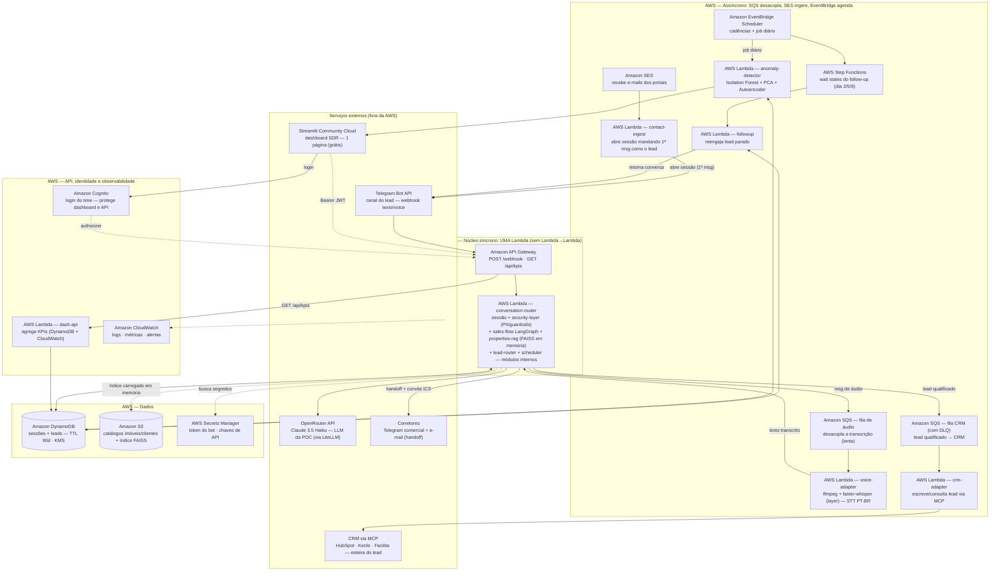
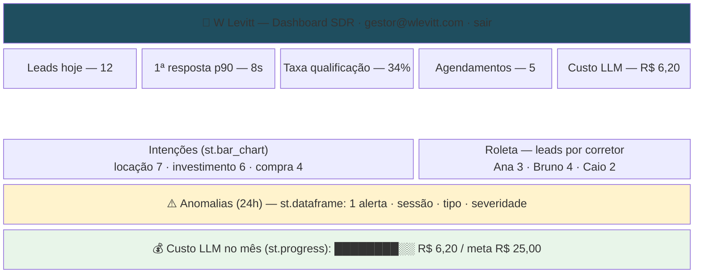

# PRD — Agente SDR Imobiliário B2B com IA Generativa (Hackathon FIAP · Fase 5)

| Campo | Valor |
|---|---|
| **Curso** | Pós Tech IA para Devs (8IADT) |
| **Disciplinas da Fase** | Privacidade e Segurança de Dados · Detecção de Anomalias |
| **Desafio** | Hackathon FIAP — Agente SDR Imobiliário com Inteligência Artificial |
| **Cliente** | [W Levitt Negócios Imobiliários](https://www.wlevitt.com.br/) — segmento corporativo/comercial B2B |
| **Referências de mercado (benchmark)** | [Lais.ai](https://lais.ai/), [Plaza Maya](https://useplaza.com.br/), [Squad](https://squad.com/) |
| **Prazo de entrega** | 12 de outubro |
| **Versão** | 1.10 — instalação AI-DLC (`aidlc` CLI + harness opencode) + ADRs de decisões no §16 |
| **Processo** | Metodologia **AI-DLC Workflows** (AWS Labs) para desenvolvimento assistido |

---

## 1. Sumário Executivo

A **W Levitt** atua em consultoria imobiliária e *real estate* no segmento **corporativo e comercial B2B** em São Paulo — lajes, andares corporativos, conjuntos e salas comerciais para locação e venda. Seu portfólio é composto por ativos de ticket alto, com ciclos de decisão longos e leads que chegam por WhatsApp, portal próprio (Vitrine Kenlo), indicações e redes sociais.

O desafio desta fase entrega uma **Prova de Conceito (POC)** de um **Agente SDR Imobiliário com IA Generativa**. Este PRD propõe o produto **"Levitt.AI"** — um SDR digital especializado em **espaços corporativos**, que:

1. Atende e **qualifica leads B2B** em conversa humanizada;
2. Identifica intenção (**compra vs. locação vs. investimento**), ticket e urgência;
3. Contextualiza com **RAG sobre a base simulada de imóveis**;
4. Faz **follow-up automático** com memória conversacional;
5. Agenda reuniões/visitas com **corretores especialistas**;
6. Gera **resumo inteligente (handoff)** para o corretor;
7. Entrega **dashboard mínimo** com KPIs e **detecção de anomalias** (módulo da fase);
8. Nasce com **privacidade e segurança (LGPD)** como projeto — PII mascarada, guardrails e trilha de auditoria.

**Diferenciais competitivos vs. Lais/Maya/Squad:**

| Eixo | Lais.ai | Maya (PLAZA) | **Levitt.AI (POC)** |
|---|---|---|---|
| Foco | Residencial | Residencial + adm | **B2B corporativo (lajes/andares/salas)** |
| Canal | WhatsApp | WhatsApp omnichannel | **Telegram (custo zero)** + WhatsApp no roadmap |
| Qualificação | Via fluxos | Via fluxos | **Proprietária + RAG + score explicável** |
| Segurança/Anomalia | Não divulgado | Não divulgado | **LGPD + detecção de anomalias** (fase 5) |
| Custo de operação | Licença produto | Licença (ou módulos) | **Fully serverless, ~R$ 15/mês (OpenRouter) em POC** |

**Por que não WhatsApp na POC:** a API do WhatsApp Business (Meta Cloud) cobra por mensagem e demanda aprovação de número. O **Telegram** oferece bot, webhook e texto/áudio **100% gratuitos**, com gestão de grupos para triagem dos corretores — ideal para demonstração em escala com custo zero, mantendo a arquitetura de canal agnóstica para plugar WhatsApp depois.

---

## 2. Contexto do Cliente

### 2.1 Quem é o cliente

A **W Levitt** negocia imóveis **corporativos e comerciais** em São Paulo (venda e locação): lajes corporativas, andares, conjuntos, salas e terrenos/edifícios para investimento. Clientes são **empresas** (B2B) buscando espaço físico para operação — de PMEs a multinacionais.

### 2.2 Dor e oportunidades

| Dor observada | Oportunidade para o Agente SDR |
|---|---|
| Tempo de resposta alto no primeiro contato | Atendimento imediato (24×7) |
| Leads perdidos por falta de follow-up | Reengajamento automático com memória |
| Foco manual, sem triagem | Qualificação objetiva + score de prontidão |
| Corretores sobrecarregados | Handoff: resumo executivo + agenda preparada |
| Decisão longa (ciclo B2B semanas/meses) | Nutrição com contexto mantido da conversa |
| Dados sensíveis do contato | LGPD (mínimo, pseudonimizado, auditável) |

### 2.3 Benchmark (referências do cliente)

- **Lais (lais.ai):** pré-atendimento e qualificação, recomendação personalizada de imóveis, reengajamento automático, envio ao CRM, gestão de visitas e atendimento administrativo (2ª via de boleto, manutenção). Forte em **fluxo residencial**.
- **Maya (PLAZA/useplaza):** 5 módulos integrados — atendimento omnichannel, esteira de distribuição de leads para corretores no WhatsApp ("lead qualificado com nome, histórico e contexto"), 60+ integrações com CRMs, análise de ficha via bureaus de crédito, reengajamento. Uso de **IA + humano no mesmo número**.
- **Squad (squad.com):** plataforma de múltiplos agentes de IA (defesa, atendimento e backoffice) para empresas — modelo de *várias IAs conversando com o setor humano*.

**Gap que justifica a POC:** nenhuma das referências é **especializada em imóveis corporativos B2B**, o que permite um agente com vocabulário técnico (área útil × privativa, laudo ABIQ, condomínio, entrega, documentação, multa rescisória em locações de longo prazo) e um **playbook de qualificação B2B** — um discurso direto com a banca e com o cliente real.

### 2.4 Insights da mentoria com o cliente (transcrição real)

Insights extraídos da mentoria com o Leonardo (diretor comercial da W Levitt) e do chat da turma — usados para calibrar o PRD:

- **Perfil do cliente**: ~18 anos de mercado, ex-CBRE (multinacional B2B de imóveis comerciais), base própria com **~2.000 contatos** de carteira.
- **Números reais de conversão**: a cada 100 leads de portal, fecha **3–4**; a cada 30 clientes, fecha 1; **carteira/indicação ≈ 85% de certeza de fechamento**. Lead de portal **queima rápido** (vários corretores disputam o mesmo contato) → reforça o requisito de **just-in-time** (primeira resposta em segundos).
- **Canais de entrada**: portais (Zap, VivaReal, OLX, Chaves na Mão), Google Meu Negócio, site e redes sociais — **tudo caindo no WhatsApp**. Cenário 2: em alguns portais os dados (nome, e-mail, telefone) caem **no e-mail do corretor**, não no WhatsApp — hoje é captura manual. A POC cobre esse cenário com o **Telegram** e o fluxo de ingestão de contato.
- **Roleta/rodízio de leads**: distribuição automática por corretor, **configurável por regra** (ex.: até 500 m² cai no rodízio dos consultores; acima disso, lead prioritário vai para o diretor). → componente novo no PRD.
- **Esteira Kanban**: pipeline visual de status do lead (pré-atendimento → visita → proposta → fechamento → pós-venda) — base do dashboard e do CRM simulado.
- **Duas bases para RAG**: **catálogo de imóveis** + **catálogo de clientes** (histórico e status) — o professor sugeriu montar o catálogo de imóveis com **dados randomizados/sintéticos** para o MVP (ver §8.2).
- **Orçamento como chave de segmentação**: "até R$ 40 mil/mês" vs. "alto padrão sem orçamento definido" → produtos e abordagens diferentes.
- **WhatsApp**: API oficial é **paga** e exige validação; API não oficial **bloqueia o número**; **Telegram é grátis** — confirmado pelo professor na mentoria.
- **Social BDR (outbound)**: desejo de reativar a base antiga (~2.000 contatos) com mensagens automáticas — roadmap pós-POC.
- **Score/pesos**: estratégia de somar pontos durante a conversa até o lead "desaguar" para o corretor — implementada no `lead-qualifier` (código) com explicação no prompt.

---

## 3. Objetivos

### 3.1 Objetivo de negócio (cliente)
Reduzir o tempo de primeira resposta, dobrar a taxa de atendimento qualificado e eliminar a perda de leads por falta de follow-up em **60 dias** de operação B2B.

### 3.2 Objetivo do Hackathon
Entregar uma **POC funcional** que demonstre todas as habilidades exigidas: atendimento conversacional humanizado, intenção de compra/aluguel/investimento, coleta de informações, follow-up automático, agendamento, resumo para corretores, dashboard mínimo, com RAG, memória conversacional, multiagentes, segurança, observabilidade e deploy em cloud (AWS).

### 3.3 Fora de escopo (POC)
- Integração nativa real com CRM (Kenlo/CS) — será simulada via API local.
- Pagamento online de propostas.
- Voice AI em produção (Somente demo futura).
- WhatsApp nativo (roadmap pós-POC).

---

## 4. Personas

| Persona | Descrição | Necessidade principal |
|---|---|---|
| **Lead B2B** (Diretor/Gerente de Facilities & Workplace, CFO, Dono PME) | Empresa buscando espaço corporativo para expandir/transferir/instalar | Atendimento rápido, respostas técnica precisas, agenda, sem fricção |
| **Corretor Especialista (humano)** | Responsável pelo fechamento, conhece o portfólio | Receber lead **qualificado e resumido**, não conversa bruta |
| **SDR humano** | Faz triagem e primeiro atendimento hoje | Escala de atendimento, sem perder contexto |
| **Gestor / Proprietário (W Levitt)** | Monitora operação, decidindo onde investir em marketing | Dashboard: volume, prontidão, anomalias, custo |

---

## 5. Requisitos Funcionais (do enunciado → implementação)

| ID | Requisito (enunciado) | Implementação na POC |
|---|---|---|
| FR-01 | Atendimento conversacional | Bot Telegram + engine de orquestração |
| FR-02 | Conversa natural / fluxo humanizado | LLM (OpenRouter · Claude 3.5 Haiku, via LiteLLM) com system prompt consultivo, tom humanizado |
| FR-03 | Continuidade da conversa | Memória conversacional em Amazon DynamoDB (sessão+atributos) |
| FR-04 | Qualificação de leads | Questionário adaptativo + classificação (compra/aluguel/investimento) + score |
| FR-05 | Agendamento de reuniões | Integração com calendário simulado, geração de convite ICS |
| FR-06 | Resumo inteligente | Handoff em Markdown (gap, score, intenção, urgência, próximos passos) |
| FR-07 | Dashboard mínimo | Streamlit (1 página) no Community Cloud consumindo `GET /api/kpis` — KPIs, anomalias e custo |
| FR-08 | Identificar intenção (compra/aluguel/investimento) | Classificador de intenção (LLM + heurísticas) no início do fluxo |
| FR-09 | Coletar informações relevantes | Esquema de coleta (tipo de uso, metragem, região, orçamento, prazo, nº de pessoas, decisor) |
| FR-10 | Follow-up automático | Scheduler (EventBridge) com janela de silêncio e cadências configuráveis |
| FR-11 | Integrar base simulada de imóveis | Base JSON+S3 de imóveis corporativos sintéticos + RAG |
| FR-12 | Gerar resumos para corretores | Handoff automático — mensagem + arquivo de resumo no canal do SDR |

---

## 6. Requisitos Não Funcionais

| ID | Requisito | Critério |
|---|---|---|
| NF-01 | Segurança (LGPD) | PII mascarada antes do modelo; minimização; registro de consentimento; KMS; auditoria |
| NF-02 | Privacidade de dados | PII mascarada antes do envio ao provedor LLM (independente do provedor); consentimento registrado; retenção limitada (TTL) |
| NF-03 | Performance | Primeira resposta < 4s; atendimento simultâneo sem fila |
| NF-04 | Confiabilidade | Componentes serverless com DLQ; retries no webhook |
| NF-05 | Observabilidade | Logs estruturados (CloudWatch), traços, métricas de negócio |
| NF-06 | Custo | ~R$ 15/mês (OpenRouter · Claude 3.5 Haiku); acessível para demonstração |
| NF-07 | Segurança de modelo | Guardrails/denied topics; detecção de prompt injection; evasão de PII |
| NF-08 | Escalabilidade | Escala horizontal automática (Lambda/API GW/EventBridge) |
| NF-09 | Infra como código (IaC) | **Toda a infra da §7.1 em Terraform** (`infra/`, um `.tf` por serviço) — deploy e teardown em 1 comando cada (`start.sh` build → zip → `terraform apply`; `stop.sh` → `terraform destroy`); ambiente recriável de ponta a ponta (critério: `stop.sh` + `start.sh` recria tudo) |

---

## 7. Arquitetura da Solução

### 7.1 Visão macro — infraestrutura (100% serverless)

Cada caixa nomeia o **serviço AWS** (ou serviço externo), a **aplicação** e o que faz.



> Nota sobre o antipadrão resolvido: **nenhuma Lambda chama outra Lambda em modo síncrono**. A cadeia de resposta ao lead (security → fluxo → RAG → roleta) roda como **módulos internos de uma única Lambda** — chat exige latência mínima (just-in-time da mentoria) e chaining síncrono dobraria custo/latência e criaria timeout em cascata. O que é lento ou não bloqueia o lead vai **assíncrono**: transcrição de áudio e sincronização com CRM via **SQS** (com DLQ), cadência de follow-up via **Step Functions** (wait states), e-mail dos portais via **SES**. `telegram-adapter` e `sdr-agent` continuam sendo o contrato do webhook e a chamada LLM (LiteLLM → OpenRouter), não serviços próprios.

### 7.2 Componentes e responsabilidade (decomposição)

> Componentes são **módulos lógicos**, não necessariamente Lambdas separadas. Os síncronos (2–7, 10, 12–13) rodam como módulos/bibliotecas dentro da Lambda `conversation-router` — **sem chamada Lambda→Lambda síncrona** (antipattern: custo dobrado, timeout em cascata, acoplamento). Os assíncronos (8, 9, 14–16) são Lambdas próprias, acionadas por SQS/SES/EventBridge — nunca em cadeia direta.

1. **Canal (Telegram) — `telegram-adapter`**: webhook autenticado (secret), normaliza texto/áudio/envios de botão -> payload interno.
2. **Router / sessões — `conversation-router` (API Gateway + Lambda)**: valida, recupera estado da sessão (DynamoDB), chama a engine de fluxo.
3. **Engine de fluxo — `sales-flow` (LangGraph)**: grafo de estados com nós para saudação, elicitação, intenção, qualificação, recomendação, agendamento, follow-up e handoff.
4. **Agente de atendimento — `sdr-agent`**: geração de resposta via **OpenRouter (Claude 3.5 Haiku)** usando **LiteLLM** como cliente abstraído (`LLM_PROVIDER=openrouter|bedrock`); tools de RAG lookup e scheduling.
5. **RAG — `properties-rag`**: vetoriza a base sintética de imóveis (S3) + embeddings; na POC usa **FAISS local** (índice ~200 docs carrega em memória lambda) para custo zero; arquitetura permite troca por **Bedrock Knowledge Bases + OpenSearch Serverless** sem alterar contrato.
6. **Qualificador — `lead-qualifier`**: extrai estrutura (JSON) e classifica intenção + urgência + budget; grava na ficha do lead.
7. **Agendamento — `scheduler`**: valida data/hora, grava compromisso, emite convite `.ics` e notify corretor.
8. **Follow-up — `followup`**: regras de cadência via EventBridge + Step Functions (espera silêncio de X dias, retoma com contexto).
9. **Detecção de anomalias — `anomaly-detector`** (módulo da fase): job diário (EventBridge, chama Batch Lambda) que extrai features por conversa (volume, comprimento, sentimento, promessa de pagamento, horários atípicos, robô/texto fora do padrão, exigência fora das regras) e aplica **Isolation Forest + PCA** (e autoencoder para variação de comportamento). Emissão de alerta no dashboard e bloqueio de propostas suspeitas.
10. **Handoff — `handoff`**: resumo Markdown (+ mensagem interna) para corretor no canal do time.
11. **Dashboard — `dash`**: app Streamlit (1 página) no Community Cloud consumindo `GET /api/kpis` (métricas de negócio: novo lead, resposta < 10s, taxa qualificação, agendamentos, anomalias, custo mensal); login via Cognito. Sketch no §10.
12. **Segurança/Priv — `security-layer`**: máscara de PII antes do LLM (nomes, telefone, e-mail, CNPJ), registro de consentimento, guardrails de tópicos, validação de entrada (prompt-injection check).
13. **Roleta de distribuição — `lead-router`** (insight da mentoria): distribui o lead qualificado para o corretor certo por **regras configuráveis** (ex.: até 500 m² → rodízio dos consultores; acima → diretor/especialista); registra a rota no DynamoDB.
14. **Ingestão de contato — `contact-ingest`** (cenário 2 da mentoria): captura dados que chegam por e-mail/portais (nome, e-mail, telefone) e abre sessão no chatbot sem digitação manual.
15. **Áudio/STT — `voice-adapter`** (Telegram voice): baixa o `file_id` via `getFile`, converte para WAV (ffmpeg) e transcreve com **faster-whisper (PT-BR)** — reaproveita o projeto `transcribe_videos`; o texto entra no `sales-flow` como se fosse mensagem digitada.
16. **CRM via MCP — `crm-adapter`**: camada MCP genérica para ler/gravar leads no CRM (HubSpot, Kenlo, Facilita) sem acoplar o fluxo ao vendedor; na POC roda contra o CRM simulado (CSV/Excel) — ver §8.9.

### 7.3 Fluxo de dados (visão simplificada)

1. Lead envia `/start` ou primeira mensagem no Telegram.
2. `conversation-router` cria sessão em DynamoDB.
3. `sales-flow` pergunta intenção e itera perguntas filtradas pelo perfil (B2B: área, metragem, orçamento, região, prazo, nº colaboradores, decisor).
4. `security-layer` **extrai e persiste a PII real** (nome, e-mail, telefone, CNPJ) no DynamoDB criptografado (KMS) — o LLM recebe só o bloco mascarado (placeholders) + atributos estruturados, **sem o valor real em texto livre**.
5. `sdr-agent` gera resposta natural + `lead-scoring` atualiza a ficha; o valor real (quando mencionado na resposta do lead) é capturado pelo parser local e gravado no registro, não enviado ao provedor.
6. Quando score ≥ limite OU o lead pede, o agente propõe até 3 opções da base (RAG) e oferece agendamento.
7. `scheduler` agenda; `lead-router` aplica a **roleta** (regras por corretor); `handoff` envia resumo ao corretor (desencriptado localmente apenas no destino do time).
8. `anomaly-detector` roda diariamente sobre as conversas e emite alertas se houver padrão anômalo.
9. `followup` retoma leads paralisados por N dias (sem spam).
10. `contact-ingest` (cenário e-mail/portal) importa nome/e-mail/telefone e abre sessão no bot automaticamente.
11. **Áudio**: `telegram-adapter` recebe voice → `voice-adapter` baixa/transcreve (faster-whisper) → texto entra no `sales-flow` (mesmo fluxo do texto digitado).
12. **CRM**: `crm-adapter` (MCP) sincroniza o lead qualificado com o CRM (HubSpot/Kenlo/Facilita) e devolve o status da esteira Kanban.

### 7.4 Repositório e deploy (IaC — Terraform + `start.sh`)

**Requisito (NF-09): toda a infra descrita na §7.1 existe em Terraform — nada provisionado à mão.**

```text
agente-sdr-imobiliario/                ← raiz do repo
├── start.sh                           ← 1 comando: build das apps → zips → terraform apply
├── stop.sh                            ← teardown completo: terraform destroy (controle de custo)
├── apps/                              ← 1 pasta por Lambda — padrão único de código
│   ├── conversation-router/           ← núcleo síncrono (sessão + fluxo + RAG + roleta + scheduler)
│   │   ├── handler.py                 ← entrypoint (adapter) — só roteia, sem regra de negócio
│   │   ├── service/                   ← casos de uso: sales-flow (LangGraph), security-layer, properties-rag, lead-router, scheduler
│   │   ├── infra/                     ← adapters: DynamoDB, S3/FAISS, OpenRouter (LiteLLM), SQS
│   │   ├── tests/
│   │   └── requirements.txt
│   ├── voice-adapter/ · crm-adapter/ · contact-ingest/ · anomaly-detector/ · followup/ · dash-api/
│   └── streamlit-dashboard/           ← app do §10 (deploy no Community Cloud, fora do Terraform)
├── infra/                             ← Terraform — 1 arquivo por tipo de serviço
│   ├── providers.tf · variables.tf · kms.tf
│   ├── s3.tf · dynamodb.tf · sqs.tf · ses.tf
│   ├── lambda.tf · apigw.tf · apigw-openapi.yaml (contrato §7.5)
│   ├── eventbridge.tf · stepfunction.tf (ASL) · cognito.tf · cloudwatch.tf
│   ├── outputs.tf
│   └── envs/dev.tfvars · envs/prod.tfvars
└── docs/                              ← PRD, ADRs, enunciado, transcrições (atual)
```

**Fluxo do `start.sh`:**

```shell
#!/usr/bin/env bash
set -euo pipefail

# 1) Build: dependências + zip de cada Lambda
for app in apps/*/; do
  name=$(basename "$app")
  ( cd "apps/$name" \
    && pip install -r requirements.txt -t package/ \
    && cd package && zip -r "../../$name.zip" . )
done

# 2) Deploy IaC (lambda.tf referencia os zips de apps/*.zip)
terraform -chdir=infra init
terraform -chdir=infra apply -var-file=envs/dev.tfvars
```

**Teardown (`stop.sh`) — custo zero quando a POC está em uso:**

```shell
#!/usr/bin/env bash
set -euo pipefail
terraform -chdir=infra destroy -var-file=envs/dev.tfvars
```

> Os blocos usam `shell` (e não `bash`) para o preview de diagramas do VS Code não tentar interpretá-los como Mermaid — o resto do markdown fica intacto.

> O destroy apaga tudo (DynamoDB, S3, filas, funções) — seguro na POC porque os dados são sintéticos e regeneráveis pelo script de seed. Para recriar o ambiente inteiro: `./stop.sh && ./start.sh`. O `terraform.tfstate` fica no bucket do Terraform (versionado), nunca no repo.

**Ordem de criação e `depends_on`:** o Terraform resolve a maior parte do grafo sozinho por referência de atributos (ARNs em env vars, IAM roles, etc.). `depends_on` explícito onde não há referência direta: `kms` → `s3`/`dynamo` → `sqs`/`ses` → `lambda` (roles + permissões de fontes) → `apigw` → `eventbridge`/`stepfunction` → `outputs`. Notificações de fila/bucket exigem a permissão da Lambda pronta antes do trigger (`aws_lambda_permission` → `depends_on` do event source).

**Padrão de código das apps (todas iguais):** `handler.py` (adaptador de entrada, sem regra de negócio) → `service/` (casos de uso, testável sem AWS) → `infra/` (adapters de DynamoDB/S3/LLM/SQS). Mesmo padrão nas 7 Lambdas — banca audita um, entende todas.

### 7.5 Contrato de API — OpenAPI 3.0 (API Gateway)

O API Gateway REST **importa OpenAPI 3.0 nativamente** (extensões `x-amazon-apigateway-*`). O contrato completo vive em **[`apigw-openapi.yaml`](./apigw-openapi.yaml)** (mesma pasta deste PRD; no esqueleto do repo move para `infra/`) e o `apigw.tf` faz o deploy direto:

```hcl
resource "aws_api_gateway_rest_api" "sdr" {
  body = file("${path.module}/apigw-openapi.yaml")  # placeholder ${...} interpolado pelo Terraform
  name = "sdr-api"
}
```

**Resumo dos endpoints (detalhes e schemas no arquivo):**

| Endpoint | Método | Autenticação | Integração | Resposta |
|---|---|---|---|---|
| `/webhook` | POST | Header `X-Telegram-Bot-Api-Secret-Token` (apiKey) | `aws_proxy` → Lambda `conversation-router` | 200 imediato (trabalho lento → SQS) |
| `/api/kpis` | GET | JWT do Amazon Cognito (`cognito_user_pools` authorizer) | `aws_proxy` → Lambda `dash-api` | JSON de KPIs (exemplo no arquivo) |

> Notas: (1) CORS não é necessário — o Streamlit chama a API server-side (Python), não pelo navegador. (2) Os placeholders `${ROUTER_INVOKE_ARN}`, `${DASHAPI_INVOKE_ARN}` e `${COGNITO_POOL_ARN}` são interpolados pelo Terraform no `apigw.tf`. (3) Respostas assíncronas (áudio/CRM) não passam daqui — o webhook só confirma recebimento. (4) Para visualizar/validar o arquivo no VS Code: extensões **OpenAPI (Swagger) Editor** (42Crunch — syntax + validação) e **Swagger Viewer** (preview Swagger UI).

---

## 8. Modelagem de IA

### 8.1 Modelo conversacional
- **LLM**: **Claude 3.5 Haiku** (rota Anthropic via **OpenRouter**) — melhor custo/qualidade para chat de POC; alternativa de modelos menores (free tier) para testes.
- **Cliente**: **LiteLLM** — abstrai o provedor por configuração (`LLM_PROVIDER=openrouter|bedrock`); a demo roda no OpenRouter e a produção pode migrar para Bedrock sem trocar código.
- **Orquestração**: **LangGraph** (reaproveita o padrão de multiagentes da Fase 3 — Assistente Médico).
- **Prompt system**: persona de SDR corporativo BR, tom consultivo, permissões, sempre oferecer ações (menu inline do Telegram), nunca inventar imóveis que não estão na base (constraint via RAG).
- **Interface natural-first — nunca URA**: a mentoria deixou explícito ("não é digite 1/digite 2, é uma conversa muito fluida" — Leonardo, 1952s; "conversa humanizada", 1801s). Entrada livre sempre aceita; os **botões inline são só atalhos** (escolher entre 2–3 imóveis, confirmar data de visita, "falar com um corretor") — o fluxo funciona igualmente com texto livre. Consentimento LGPD contextualizado na primeira mensagem, sem checkbox. Primeira abordagem: **coletar dados + propor reunião**, não apresentar imóvel (decisão do cliente).
- **Guardrails aplicados em código (LiteLLM)**: masking de PII no pré-envio, validação de saída (regex de contato), denied topics e detecção de prompt injection — ver §8.8.

### 8.2 RAG — duas bases (imóveis + clientes)

A mentoria deixou explícito: o RAG precisa de **dois catálogos** — o de **imóveis** (ofertas) e o de **clientes** (histórico/status, simulando CRM).

**Base 1 — Catálogo de imóveis (100–200 ofertas corporativas sintéticas):**
- Campos de negócio: área útil, área bruta, condomínio R$/m², laje, vagas, entrega, classe A/B, andar, elevadores, CEP, preço venda/locação, disponibilidade, bairro/corredor.
- Geração com **parâmetros realistas** (ver fontes abaixo) via script + **Mockaroo** (ferramenta indicada na mentoria para gerar bases de MVP).

**Base 2 — Catálogo de clientes (CRM simulado):**
- CSV/XML/Excel com coluna **status** (pré-atendimento, visita, proposta, fechamento, pós-venda) simulando a esteira Kanban; produção trocaria pela API do CRM real (Kenlo/CS).

**Fontes de dados públicas de SP (para realismo de preços/geografia):**
| Fonte | O que fornece | Uso na POC |
|---|---|---|
| **FipeZAP** (Fipe + Zap) | Índice de preços de venda/locação por bairro de SP | Calibrar preço R$/m² por região |
| **Secovi-SP** | Relatórios de mercado (locação corporativa, absorção) | Tendência e faixas de condomínio |
| **GeoSampa (PMSP)** | Dados georreferenciados (bairros, zonas, eixos) | Geolocalização/região dos imóveis |
| **Portais públicos** (Zap, VivaReal, OLX, Chaves na Mão) | Anúncios reais (respeitando termos de uso) | Referência de oferta; scraping só se permitido |
| **CUB (SindusCon-SP)** | Custo unitário básico de construção | Referência de valor para lajes/entrega |
| **Mockaroo** | Geração de dados sintéticos | Preencher lacunas do catálogo |

> Nota: para a POC, os dados são **sintéticos mas calibrados** pelas fontes acima — evita custo/risco de scraping e mantém realismo para a banca.

- Chunking por imóvel/atributos; embeddings em PT-BR; busca top-k; prompting "responda SEMPRE de acordo com o contexto citado; se não, diga que vai verificar".

### 8.3 Memória conversacional
- Sessão contínua (DynamoDB): turnos, atributos extraídos (nomes, orçamento), flag de etapas do fluxo. Follow-up relê a memória para manter contexto (exigência do enunciado).

### 8.4 Multiagentes
| Agente | Responsabilidade |
|---|---|
| `reception` | saudação, tom, roteamento |
| `intent` | classificação compra/locação/investimento |
| `qualifier` | coleta/interrogação estruturada + score |
| `recommender` | RAG + filtros + sugestão |
| `visitation` | agendamento de reunião/visita |
| `followup` | reengajamento |
| `handoff` | resumo para corretor |
| `monitor` (observação) | anomalia + alertas |

### 8.5 Detecção de Anomalias (disciplina da fase)
- **Features por lead/sessão**: nº mensagens, tamanho médio, sentimento (vader-pt / análise local), presença de termos de urgência, parâmetros fora de padrão (orçamento 10× a média, área imensurável), padrão temporal (todas 3–5h), taxa de erro de OCR (se áudio), semelhança entre leads consecutivos (copy-paste / bot), promessa financeira off-platform.
- **Algoritmos**: **Isolation Forest** (detecção cross-sectional) + **PCA** (redução e plotagem de outliers) + **Autoencoder** (técnica da aula — reconstrução de sessões normais; erro alto = anomalia).
- **Output**: alerta no dashboard + gatilho de bloqueio (não oferecer agendamento e requalificação manual).

### 8.6 Segurança de dados (módulo da fase)
- **PII masking** via expressões regulares de contato (email, fone, CNPJ, nome completo) antes do envio ao LLM, com substituição por placeholders; anamnese reversa no resumo somente no handoff (para uso interno e criptografado).
- **Criptografia**: KMS at rest (DynamoDB, S3), TLS em trânsito.
- **Consentimento**: primeira mensagem contextualiza e registra o aceite do tratamento de dados (finalidade comercial) — requisito de base da LGPD.
- **Retenção**: TTL de 90 dias para conversas de leads frios.
- **Gestão de segredos**: Secrets Manager para token do bot e chaves de integração.
- **Responsible AI Policy (AWS)**: revisão das saídas antes de validar ambientes.

### 8.7 Privacidade, LGPD e provedores de LLM

**O ponto central:** para leads reais, os dados pessoais **precisam existir** no CRM — não é possível anonimizá-los para sempre. A estratégia é de **minimização + segmentação**: o valor real fica onde precisa (registro local criptografado) e o LLM recebe **apenas o necessário**, com PII mascarada.

#### Onde cada dado nasce e para onde vai

| Dado | Onde nasce/fique | Chega ao LLM? |
|---|---|---|
| Nome, e-mail, telefone, CNPJ | DynamoDB (KMS) e CRM/handoff | **Não** — substituído por placeholder no envio |
| Orçamento, metragem, região, intenção | DynamoDB (atributos estruturados) | **Sim** — como atributos/histórico, sem identificar o lead diretamente |
| Texto livre da conversa | DynamoDB (TTL 90 dias) | **Sim** — com PII mascarada em tempo real |
| Contexto RAG (imóveis sintéticos) | S3/FAISS | **Sim** — não contém PII |

**Fluxo real:** quando o lead informa um dado PII no meio do diálogo (ex.: "meu nome é Maria, CNPJ 12.345..."), a camada de parsing local:
1. detecta e **extrai** o valor → grava no DynamoDB criptografado;
2. **substitui** no texto que vai ao LLM por placeholder (`[CNPJ_01]`);
3. envia ao provedor apenas o bloco mascarado + atributos estruturados.

O LLM **nunca recebe** o valor real em texto livre — essa é a fronteira de segurança, independente do provedor (OpenRouter ou Bedrock).

### 8.8 Modo "anônimo" no OpenRouter e guardrails (guia de configuração)

Por serem leads **reais**, não existe anonimização total da operação; o objetivo aqui é **mínima retenção e dados mascarados no provedor**. Configuração da POC:

1. **OpenRouter — telemetria/logging off**: Settings → Privacy → desativar `logging` (não armazenar prompts/respostas nos logs analíticos do OpenRouter).
2. **Anthropic — zero data retention**: ativar a política de **retenção zero** do provedor (dados não guardados para treinamento/abuso por 30 dias). Contrato via painel/negociação; na POC, reduz o período padrão.
3. **LiteLLM — telemetria off + guardrails**:
   ```yaml
   litellm_settings:
     telemetry: false
   guardrails:
     - guardrail: mask-pii
       mode: pre_call
       callbacks: ["mask_pii"]      # Presidio/mask de PII determinístico
     - guardrail: custom-denied-topics
       mode: post_call
       callbacks: ["minimal"]       # validação de saída via prompt/regras
   ```
4. **Validação extra no código** (antes de enviar ao lead): regex/validador faz scan por e-mail, telefone e CPF/CNPJ no texto gerado — se encontrar, bloqueia/regenera.
5. **Logs**: CloudWatch com data masking (PII substituída mesmo nos logs latentes).

#### Comparativo de privacidade — OpenRouter (POC) × AWS Bedrock (produção)

| Aspecto | OpenRouter (POC) | Bedrock (produção) |
|---|---|---|
| Intermediários na chamada | 2 (OpenRouter + provedor do modelo) | 1 (AWS) |
| Residência do dado | Fora da AWS (depende do host do provedor) | Dentro da região AWS escolhida |
| Retenção padrão | Política própria (desligável) + retenção do provedor | Sem retenção sem opt-in |
| Guardrails | Construídos (LiteLLM + código) | Bedrock Guardrails nativos |
| Adequação LGPD/contrato | DPA disponível; residência "onde for" | Data Residency/DPA, transferência documentável |
| Treinamento com seus dados | Depende da política do provedor | AWS não usa para treino sem consentimento |

**Decisão da POC:** OpenRouter pela simplicidade/custo, **com masking e retenção mínima garantidos em código**. Migrar para **Bedrock em produção** quando a W Levitt precisar de residência formal de dados, guardrails nativos e integração contratual de privacidade (roadmap pós-POC).

### 8.9 CRM via MCP — "pronto para conectar"

**Pergunta do cliente:** existe um CRM imobiliário com servidor MCP para o projeto já estar pronto a conectar?

**Resposta (pesquisa):**
- **HubSpot** mantém um **servidor MCP oficial** (Node.js) que expõe contacts, deals, companies e tasks — é o CRM B2B mais "pronto para MCP" hoje. Não é específico de imobiliário, mas serve para leads corporativos.
- **Salesforce** também tem servidor MCP oficial (via Agentforce/API), mas é pesado para a POC.
- **CRMs imobiliários brasileiros** (Kenlo, Facilita, CS/Imóveis, Vendas, QuintoAndar B2B) **ainda não publicam servidor MCP nativo** — expõem API REST própria. A Kenlo tem API aberta; a Facilita tem API REST.
- **Conclusão:** não existe hoje um CRM **imobiliário BR** com MCP nativo. A alternativa robusta é uma **camada MCP genérica** (`crm-adapter`) que conecta a qualquer servidor MCP de CRM (HubSpot) **ou** envolve a API REST de um CRM imobiliário (Kenlo/Facilita) num servidor MCP próprio — o fluxo do agente fica desacoplado do vendedor.

**Decisão da POC:** manter o **CRM simulado (CSV/Excel)** como fonte da esteira Kanban, com o `crm-adapter` (MCP) já desenhado para plugar HubSpot/Kenlo/Facilita sem alterar o `sales-flow`. Isso demonstra a integração "pronta para conectar" sem depender de um CRM externo real.

### 8.10 Áudio no Telegram (voice)

**Pergunta do cliente:** se o usuário enviar um áudio no Telegram, o que acontece? Podemos usar o `transcribe_videos` para transcrever e enviar à LLM?

**Resposta:** sim — e o `transcribe_videos` é a base certa. Fluxo:
1. Usuário envia **voice message** → Telegram envia `update` com `voice.file_id`.
2. `telegram-adapter` chama `GET /bot<token>/getFile?file_id=…` → baixa o arquivo (S3 temporário).
3. `voice-adapter` converte para WAV (ffmpeg) e transcreve com **faster-whisper (modelo PT-BR)** — o mesmo motor do `transcribe_videos` — gerando o texto.
4. O texto entra no `sales-flow` como se fosse mensagem digitada (mesma pipeline: masking, intenção, RAG, resposta).

> Nota: o `transcribe_videos` roda **offline/local** hoje (faster-whisper ~150 MB). Na POC serverless, o modelo pode rodar num Lambda (camada com o modelo) para não inflar a função. O reaproveitamento é do **motor** (faster-whisper) e do código de extração de áudio (ffmpeg), não do script de vídeo em si.

---

## 9. Fluxos de Usuário (cenários do enunciado)

> Scripts completos de conversa vão com o repositório (arquivos `dialogs/*.md`).

### C1 — Compra (B2B, laje corporativa)
1. Lead: "Preciso de laje de ~1.000 m² na Berrini para nova operação."
2. `reception` + `intent`: detecta o tipo (compra ou locação?); registra "1.000 m², Berrini".
3. `qualifier`: prazo? orçamento? imóvel pronto ou entrega futura? decisão já definida ou em análise?
4. `rag`: retorna 2–3 ativos compatíveis (classe A/B, vagas, laje técnica).
5. Lead escolhe, agente agenda reunião com especialista de lajes.
6. `handoff`: resumo para corretor (painel interno) + convite.

### C2 — Locação corporativa
1. "Busco andares para alugar em Pinheiros, 300 m², para 30 pessoas."
2. Agente normaliza (300 m² úteis ≈ 7 m² por pessoa), filtra preço, régua de documentos exigidos, agenda visita.
3. Follow-up se não responder em 48h ("Segue o espaço que conversamos...").

### C3 — Investimento
1. "Quero investir em salas para renda."
2. `intent` = investimento; `qualifier` pede ticket, expectativa de retorno (% anual), período.
3. Agente qualifica "investidor" e direciona para especialista com ficha pronta (KYC simplificada B2B).

### C4 — Follow-up automático
1. Lead para em 48h → EventBridge dispara cadência (dia 2, dia 5, dia 9) com **contexto da última conversa**; se responder, continua do mesmo estado.

### C5 — Anomalia
1. Conversa com dados fora de padrão (promessa de pagamento off-platform, sem CNPJ, indício de bot) → `anomaly-detector` marca, restringe agendamento, alerta o gestor.

### C6 — Roleta de distribuição (insight da mentoria)
1. Lead qualificado (ex.: 300 m², Pinheiros, locação) → `lead-router` aplica regra "até 500 m² → rodízio dos consultores".
2. Lead de alto ticket (ex.: 1.500 m² laje Berrini) → regra "acima de 500 m² → diretor/especialista".
3. Corretor recebe o handoff com contexto completo; rota registrada no DynamoDB para auditoria.

### C7 — Contato via e-mail/portal (cenário 2 da mentoria)
1. Cliente preenche dados no portal (nome, e-mail, telefone) → dados caem no e-mail do corretor.
2. `contact-ingest` captura e abre sessão no bot automaticamente (sem digitação manual).
3. Bot retoma a pré-qualificação de onde parou, com memória da sessão.

---

## 10. Dashboard (mínimo obrigatório)

> O enunciado pede "dashboard mínimo de acompanhamento" (item obrigatório) — **uma única página atende**. Stack: **Streamlit** (1 página, código Python) hospedado no **Streamlit Community Cloud (grátis)** — única peça fora da AWS; alternativa 100% AWS (S3 estático + HTML/JS) exige muito mais front-end para o mesmo resultado. O dashboard não guarda dados locais: consome `GET /api/kpis` (Lambda `dash-api` + DynamoDB/CloudWatch).

### 10.1 Recursos previstos (1 página)

- **Linha de métricas** (st.metric): leads hoje/semana · tempo de 1ª resposta (p90) · taxa de qualificação · agendamentos;
- **Gráficos** (st.bar_chart): volume de intenções (locação/compra/investimento) · leads distribuídos pela roleta (por corretor);
- **Tabela de anomalias** (st.dataframe): nº alertas 24h, tipo (urgência artificial, bot, off-platform), severidade, sessão;
- **Custo LLM do mês** (st.progress contra meta de R$ 25) — chamadas OpenRouter.

**Acesso autenticado — Amazon Cognito:** login do time (~5–10 usuários) via **Hosted UI/OIDC (`st.login`)**; a API `GET /api/kpis` valida o JWT com **Cognito authorizer** no API Gateway. Custo **R$ 0** (free tier 50.000 MAUs). A API de leads continua protegida pelo secret do webhook (não passa por Cognito).

### 10.2 Sketch do layout (Mermaid `block-beta`)



> Renderiza em GitHub/VS Code com Mermaid ≥ 11. Layout espelha os widgets do §10.1 (`st.metric`, `st.bar_chart`, `st.dataframe`, `st.progress`).

### 10.3 Esboço do código (Streamlit, ~30 linhas)

```python
import streamlit as st
import requests

# Login do time: OIDC via Amazon Cognito (st.login) — Streamlit >= 1.40
if not st.user.is_logged_in:
    st.login()          # Hosted UI do Cognito
    st.stop()

k = requests.get(
    "https://api.wlevitt.app/api/kpis",
    headers={"Authorization": f"Bearer {st.user.id_token}"},  # JWT → Cognito authorizer
).json()

st.title("W Levitt — Dashboard SDR")
st.caption(f"{st.user.email} · dados em tempo quase real (DynamoDB/CloudWatch)")

c1, c2, c3, c4 = st.columns(4)
c1.metric("Leads hoje", k["leads_hoje"])
c2.metric("1ª resposta p90", f'{k["p90_first_reply"]:.0f}s')
c3.metric("Taxa qualificação", f'{k["taxa_qualificacao"]:.0%}')
c4.metric("Agendamentos", k["agendamentos"])

l, r = st.columns(2)
l.bar_chart(k["intencoes"], x="tipo", y="total", color="#2e7d32")
r.bar_chart(k["roleta"], x="corretor", y="leads")

st.subheader(f"⚠️ Anomalias (24h) — {len(k['anomalias'])} alerta(s)")
st.dataframe(k["anomalias"], use_container_width=True)

st.subheader("💰 Custo LLM no mês")
st.progress(k["custo"]["pct_meta"], text=f'R$ {k["custo"]["mes"]:.2f} / meta R$ 25,00')

if st.button("Sair"):
    st.logout()
```

> Custos: Streamlit Community Cloud **R$ 0**; `dash-api` e CloudWatch já contabilizados na tabela do §11.

---

## 11. Observabilidade, Logs, Segurança e Custos

### Observabilidade
- Logs estruturados JSON (sessão, intent, score, modelo, latência, custo) no **CloudWatch Logs** + alarmes (falhas de webhook, p95 > 3s).
- Métricas de negócio derivadas via filters do CloudWatch → dashboard.

### Estimativa de custo (POC mensal, us-east-1)

| Item | Estimativa |
|---|---|
| Telegram | R$ 0 |
| Lambda/API Gateway | ~R$ 0 (free tier; maioria dos casos) |
| **OpenRouter (Claude 3.5 Haiku, ~5k mensagens/mês com RAG)** | **~R$ 8–15** |
| DynamoDB (on-demand) | < R$ 5 |
| EventBridge Scheduler | < R$ 1 |
| CloudWatch/Logs | < R$ 5 |
| S3 + índices FAISS | < R$ 1 |
| SQS + SES (filas e ingestão de e-mail) | < R$ 1 |
| Amazon Cognito (login do dashboard) | R$ 0 (free tier, ~5–10 usuários) |
| **Total POC** | **~R$ 15–25/mês (~0,03x de um SDR humano)** |

> Controles de custo: modelos menores com free tier para testes; **AWS Budgets Alerts** (R$ 20) caso o Bedrock entre em produção; limite de tokens no código (máx. histórico e saída por turno); `terraform destroy` ao fim (toda a infra é IaC — §7.4) — **sem capacidade provisionada**.

> Estratégia de redução: embeddings locais (sentence-transformers), Haiku/Nova Lite (free tier no OpenRouter), cache de respostas de FAQ, RAG top-k pequeno e cold start reduzido.

---

## 12. Plano de Desenvolvimento (AI-DLC + cronograma)

O desenvolvimento será conduzido com a metodologia **AI-DLC (AWS)** — 5 fases / 33 etapas, fluxos com **human gates e trilha de auditoria**. Mapeamento para este desafio:

| Fase AI-DLC | Etapas-chave | Entrega desta POC |
|---|---|---|
| **1. Foundation** | Requisitos (este PRD), decisões, conhecimento | PRD aprovado |
| **2. Design** | Arquitetura, perfis de fluxo (Profile: `Proof of Concept` / `Express`), **ADR de decisões (AI-DLC)** | Diagrama de arquitetura + ADR |
| **3. Build** | Módulos (adapter, fluxo, RAG, scoring, anomalia, scheduler, dash) | Código no repo |
| **4. Test/Verify** | Evidências (testes de diálogo, LGPD, análise de custo) | Relatório de verificação |
| **5. Run/Operate** | Observabilidade, auditoria, trilha de decisões | Demonstração funcional |

**Cronograma até 12/out**

| Semana | Marco |
|---|---|
| S1 (09/set) | PRD + validação; repo com **esqueleto AI-DLC (`aidlc` CLI nativo, harness opencode)** + IaC Terraform + `start.sh`/`stop.sh`; bot Telegram; dados sintéticos calibrados; duas bases RAG |
| S2 | Engine de fluxo (LangGraph) + primeira conversa de ponta-a-ponta |
| S3 | RAG + qualificador + agendamento + handoff |
| S4 | Follow-up + dashboard + anomalia + segurança LGPD |
| S5 | Verificação, demo da POC, vídeo, pitch, entrega final |

---

## 13. KPIs de Sucesso

| KPI | Meta da POC |
|---|---|
| Tempo de 1ª resposta | < 10s |
| Taxa de leads qualificados | ≥ 60% das conversas |
| Intenção corretamente detectada | ≥ 85% (teste com 20 diálogos de cenário) |
| Agendamentos realizados | ≥ 3 por demonstração |
| Reativação via follow-up | ≥ 20% dos leads parados |
| Anomalias detectadas | ≥ 1 falso-positivo documentado |

---

## 14. Riscos e Mitigações

| Risco | Mitigação |
|---|---|
| LangGraph/frameworks evoluem | Feature flags; abstração fina da camada de canal |
| Parada do OpenRouter | Fallback para Bedrock via LiteLLM (troca por config) |
| Preocupação com custos elevados em serviços AWS (ex.: Bedrock) | POC roda no **OpenRouter** (execução barata/grátis); produção (se migrar): Budgets Alerts + token caps + serverless sob demanda + teardown `terraform destroy` |
| Custo acima do budget | Limite de tokens no código, monitor semanal de custo, alarme de limites no OpenRouter |
| Qualidade do PT-BR (OpenRouter) | Modelos com bom PT-BR; prompt tuning iterativo; testes de diálogo |
| Calibração da detecção de anomalias | Features mistas (semântica + temporal), threshold calibrado na demo |

---

## 15. Entregáveis do Hackathon

1. **Repositório** (GitHub) com código, `.env.example`, documentação e **IaC completa em Terraform** (`infra/*.tf` + `start.sh` — ver §7.4).
2. **README** — execução, instalação, arquitetura (mermaid) e custos.
3. **Arquitetura** — ADR de decisões (Telegram × WhatsApp, FAISS × KB, OpenRouter × Bedrock, serverless completo).
4. **Demonstração funcional** — vídeo (2–5 min) mostrando: atendimento humanizado, RAG, agendamento, follow-up, resumo, anomalia e dashboard.
5. **Pitch técnico** — 5 min explicando diferenciais B2B + custo + segurança LGPD.
6. **Explicação da IA utilizada** — modelo, RAG, memória, multiagentes, anomaly detector, e por que cada escolha.

---

## 16. Roadmap pós-POC (se a POC for aprovada)

- **ADRs** das decisões técnicas (docs/adr/): canal (Telegram), RAG (FAISS→KB), **provedor de LLM: OpenRouter na POC (custo/velocidade) → Bedrock em produção (guardrails nativos, residência de dados, integração CloudWatch)**.
- **Canal WhatsApp Business** (via provedor autorizado) no mesmo `conversation-router`.
- **Omnichannel real**: Instagram, LinkedIn, Facebook e site convergindo no mesmo fluxo (insight da mentoria).
- **Ingestão de e-mail/portais**: automatizar o cenário 2 (dados que caem no e-mail → sessão no bot).
- **Social BDR (outbound)**: reativar a base de ~2.000 contatos com mensagens automáticas e contexto do histórico.
- **CRM via MCP**: plugar HubSpot (servidor MCP oficial) ou envolver a API REST da Kenlo/Facilita num servidor MCP próprio — o `crm-adapter` já desacopla o fluxo (§8.9).
- **Voice AI**: transcrição/STT/TTS em Telegram voice + áudio (faster-whisper).
- **Multi-tenant** — onboarding para outras consultorias de real estate.
- **Modelo de precificação** (SaaS) vs. **implementação na WLevitt**.

---

## 17. Glossário

### Vendas & SDR
- **SDR (Sales Development Representative)** — profissional (ou IA) que faz o **primeiro contato, triagem e pré-qualificação** do lead; converte contatos frios em leads qualificados e agenda para o time de execução. É o papel que o Agente Levitt.AI automatiza.
- **Lead** — contato em potencial (empresa) com algum interesse. **Lead frio**: primeiro contato, ainda não qualificado. **Lead qualificado**: passou na triagem e atendeu critérios mínimos. **Lead quente**: demonstrou urgência e orçamento definido.
- **Handoff** — entrega do lead qualificado ao corretor especialista, com resumo, contexto da conversa e próximos passos.
- **Follow-up / cadência** — sequência de contatos automáticos, em intervalos crescentes, para reengajar um lead que parou de responder.
- **Funil de vendas** — etapas do processo comercial (topo, meio, fundo); o SDR alimenta as etapas iniciais.
- **Intenção** — classificação do lead entre **compra, locação ou investimento**; roteia o fluxo de qualificação.
- **Urgência** — prazo declarado (ou inferido) para tomada de decisão; usado no score de prontidão.
- **Ticket** — valor envolvido na operação (faixa de preço/retorno esperado).
- **Roleta de distribuição** — regra que direciona o lead qualificado ao corretor certo (ex.: por metragem/valor); insight da mentoria.
- **Esteira Kanban** — pipeline visual de status do lead (pré-atendimento → visita → proposta → fechamento → pós-venda).
- **Omnichannel** — atendimento unificado em vários canais (site, portais, redes sociais) convergindo para um só fluxo.
- **Outbound / Social BDR** — prospecção ativa: a IA retoma contatos antigos (base de ~2.000) com mensagens automáticas.
- **MCP (Model Context Protocol)** — protocolo aberto que dá ao agente acesso padronizado a ferramentas/dados externos (CRM, bancos); um servidor MCP expõe "tools" que a IA chama.
- **STT (Speech-to-Text)** — transcrição de áudio para texto (faster-whisper); habilita o lead falar no Telegram.
- **Voice message** — mensagem de áudio do Telegram; tratada pelo `voice-adapter` como texto transcrito.
- **Amazon Cognito** — serviço AWS de identidade (login/JWT); protege o dashboard e a API de KPIs (free tier).
- **Streamlit** — framework Python para apps web de dados; hospeda o dashboard no Community Cloud (grátis).
- **Terraform / IaC** — infraestrutura como código: a infra inteira é declarada em arquivos `.tf` (§7.4) e criada via `terraform apply`; destruição/recriação com um comando.
- **OpenAPI (Swagger)** — padrão de descrição de APIs REST (YAML/JSON); usado como contrato dos endpoints e importado pelo API Gateway (§7.5).

### Imobiliário corporativo
- **Laje corporativa** — pavimento inteiro de edifício comercial, dedicado a escritórios (open space ou salas) — típico alvo de empresas B2B.
- **Andar / conjunto / sala comercial** — frações menores de edifício corporativo, também demandas típicas de empresas.
- **Área útil × área privativa** — m² **útil** = efetivamente utilizável; m² **privativa** = útil + proporcional das áreas comuns.
- **Laudo ABIQ** — documento técnico de avaliação de empreendimento corporativo (base para condições de laje/escritórios).
- **Classe A / Classe B** — padrão de pé-direito, acabamento, eficiência e infraestrutura do edifício; comparado em lajes corporativas.
- **Condomínio (R$/m²)** — taxa mensal de manutenção das áreas comuns, cotada por m² e por nível de serviço.
- **Entrega imediata / na planta** — prontidão do ativo: pronto para ocupar ou em construção/entrega futura.
- **Corredor corporativo** — eixo de imóveis comerciais (Berrini, Faria Lima, Paulista, Pinheiros…) onde concentra a oferta demandada pela POC.
- **FipeZAP** — índice de preços de venda/locação por bairro (Fipe + Zap); usado para calibrar o catálogo de imóveis.
- **Secovi-SP** — sindicato do mercado imobiliário; relatórios de locação corporativa e absorção.

### IA e dados
- **LLM** — *Large Language Model*, modelo de linguagem que gera/interpreta texto; motor do agente.
- **RAG (Retrieval-Augmented Generation)** — resposta de LLM guiada por busca em base própria (aqui, imóveis); reduz alucinação e garante contexto.
- **Embeddings** — representação vetorial de texto para busca por similaridade semântica.
- **Índice FAISS** — biblioteca de busca vetorial (funciona em memória, baixa latência; índice local salvo no S3 na POC).
- **LangGraph** — framework de grafo de estados/agentes (nós e transições) que orquestra o `sales-flow`.
- **Memória conversacional** — histórico persistido (DynamoDB) da sessão, para manutenção de contexto no follow-up.
- **Prompt injection** — tentativa do usuário de redirecionar o modelo; mitigada por guardrails.
- **Guardrails** — política de restrição de entrada/saída (tópicos proibidos, masking de PII, validação).
- **PII** — *Personal Identifiable Information* — dados pessoais identificáveis (nome, contato, CNPJ) — alvo do masking e da LGPD.
- **LGPD** — lei brasileira de proteção de dados; obriga consentimento, minimização e base legal (arts. 7º/11º).
- **KMS** — *Key Management Service* da AWS, para criptografia dos dados em repouso (DynamoDB/S3).
- **Detecção de anomalias** — análise (Isolation Forest, PCA, Autoencoder) que isola sessões/leads fora do padrão comercial.
- **Score de prontidão (lead score)** — soma ponderada de atributos (intenção, urgência, orçamento, prazo) que prioriza os leads.

### AWS / infraestrutura
- **Serverless** — arquitetura sem servidor gerenciado (Lambda, API Gateway etc.); cobra apenas pelo uso.
- **Lambda** — função FaaS da AWS, usada nas etapas do fluxo (adapter, sales-flow, anomalia, handoff).
- **API Gateway** — entrada de webhooks do Telegram na aplicação.
- **DynamoDB** — banco NoSQL (fichas de lead, memória de sessão, TTL de retenção).
- **EventBridge** — agenda/eventos (follow-up, job de anomalia).
- **S3** — armazenamento do índice FAISS, da base sintética e do dashboard estático.
- **Webhook** — callback do Telegram entregando mensagens ao nosso endpoint.
- **LiteLLM** — cliente abstrato de multi-provedor (OpenRouter/Bedrock/OpenAI); troca de provedor por configuração.
- **OpenRouter** — roteador de APIs de modelos com preço por uso (usado como provedor padrão da POC).
- **Bedrock** — serviço gerenciado de modelos da AWS (provedor-alvo de produção).
- **Token (custo LLM)** — unidade básica de texto que define o custo da chamada (entrada + saída por sessão).
- **p90** — percentil 90: 90% das chamadas ficam abaixo desse valor de latência.
- **KPI** — indicador-chave de performance (ex.: tempo de 1ª resposta, taxa de qualificação, agendamentos).

---

*Documento gerado a partir de brainstorming/validação e servirá de guia para a pipeline AI-DLC (profile: POC) — revisão de aprovação do cliente/aluno antes da implementação.*

*Atualizado em 09/set/2026 — v1.9: contrato OpenAPI movido para arquivo próprio `apigw-openapi.yaml` (visualizável no VS Code com OpenAPI Editor/Swagger Viewer), linkado no §7.5.*