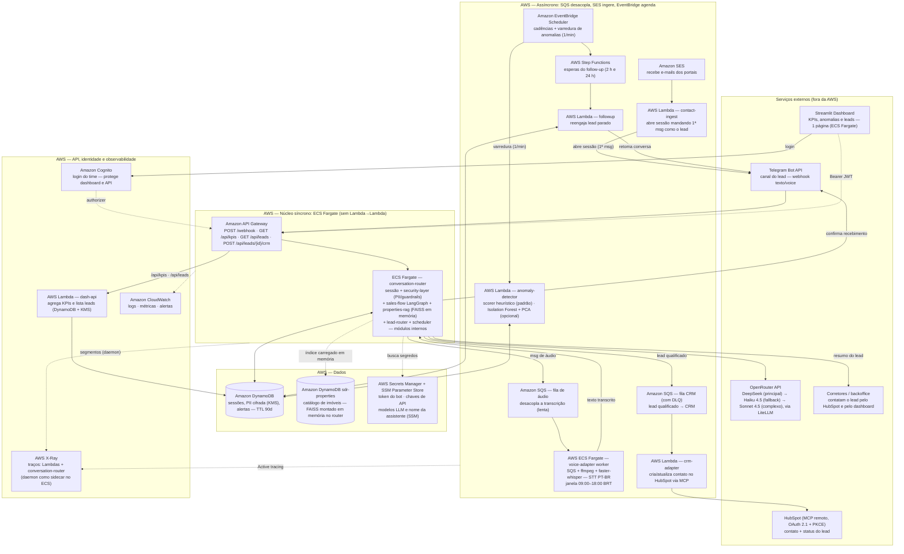
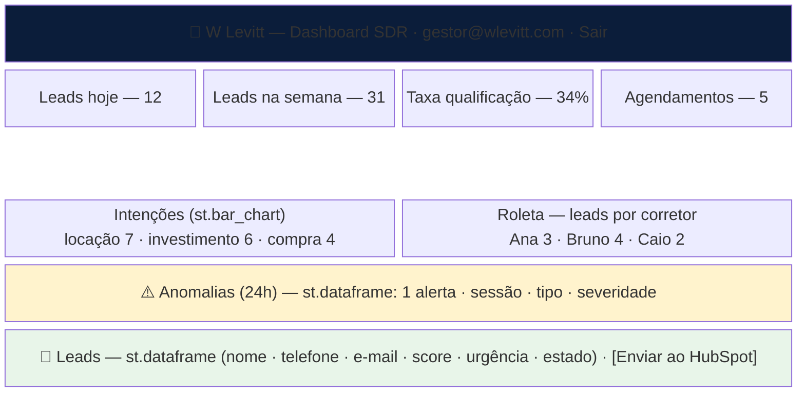

# PRD — Agente SDR Imobiliário B2B com IA Generativa (Hackathon FIAP · Fase 5)

| Campo | Valor |
|---|---|
| **Curso** | Pós Tech IA para Devs (8IADT) |
| **Disciplinas da Fase** | Privacidade e Segurança de Dados · Detecção de Anomalias |
| **Desafio** | Hackathon FIAP — Agente SDR Imobiliário com Inteligência Artificial |
| **Cliente** | [W Levitt Negócios Imobiliários](https://www.wlevitt.com.br/) — segmento corporativo/comercial B2B |
| **Referências de mercado (benchmark)** | [Lais.ai](https://lais.ai/), [Plaza Maya](https://useplaza.com.br/), [Squad](https://squad.com/) |
| **Prazo de entrega** | 12 de outubro |
| **Versão** | 1.10 — instalação AI-DLC (`aidlc` CLI + harness opencode) + ADRs de decisões no §16 |
| **Processo** | Metodologia **AI-DLC Workflows** (AWS Labs) para desenvolvimento assistido |

---

## 1. Sumário Executivo

A **W Levitt** atua em consultoria imobiliária e *real estate* no segmento **corporativo e comercial B2B** em São Paulo — lajes, andares corporativos, conjuntos e salas comerciais para locação e venda. Seu portfólio é composto por ativos de ticket alto, com ciclos de decisão longos e leads que chegam por WhatsApp, portal próprio (Vitrine Kenlo), indicações e redes sociais.

O desafio desta fase entrega uma **Prova de Conceito (POC)** de um **Agente SDR Imobiliário com IA Generativa**. Este PRD propõe o produto **"Levitt.AI"** — um SDR digital especializado em **espaços corporativos**, que:

1. Atende e **qualifica leads B2B** em conversa humanizada;
2. Identifica intenção (**compra vs. locação vs. investimento**), ticket e urgência;
3. Contextualiza com **RAG sobre a base simulada de imóveis**;
4. Faz **follow-up automático** com memória conversacional;
5. Agenda reuniões/visitas com **corretores especialistas**;
6. Gera **resumo inteligente (handoff)** para o corretor;
7. Entrega **dashboard mínimo** com KPIs e **detecção de anomalias** (módulo da fase);
8. Nasce com **privacidade e segurança (LGPD)** como projeto — e-mail/telefone/CNPJ mascarados antes da LLM, consentimento explícito, guardrails e logs estruturados sem PII.

**Diferenciais competitivos vs. Lais/Maya/Squad:**

| Eixo | Lais.ai | Maya (PLAZA) | **Levitt.AI (POC)** |
|---|---|---|---|
| Foco | Residencial | Residencial + adm | **B2B corporativo (lajes/andares/salas)** |
| Canal | WhatsApp | WhatsApp omnichannel | **Telegram (custo zero)** + WhatsApp no roadmap |
| Qualificação | Via fluxos | Via fluxos | **Proprietária + RAG + score explicável** |
| Segurança/Anomalia | Não divulgado | Não divulgado | **LGPD + detecção de anomalias** (fase 5) |
| Custo de operação | Licença produto | Licença (ou módulos) | **Lambdas + ECS Fargate em janela diária; LLM ~R$ 15–25/mês (ver §11)** |

**Por que não WhatsApp na POC:** a API do WhatsApp Business (Meta Cloud) cobra por mensagem e demanda aprovação de número. O **Telegram** oferece bot, webhook e texto/áudio **100% gratuitos**, com gestão de grupos para triagem dos corretores — ideal para demonstração em escala com custo zero, mantendo a arquitetura de canal agnóstica para plugar WhatsApp depois.

---

## 2. Contexto do Cliente

### 2.1 Quem é o cliente

A **W Levitt** negocia imóveis **corporativos e comerciais** em São Paulo (venda e locação): lajes corporativas, andares, conjuntos, salas e terrenos/edifícios para investimento. Clientes são **empresas** (B2B) buscando espaço físico para operação — de PMEs a multinacionais.

### 2.2 Dor e oportunidades

| Dor observada | Oportunidade para o Agente SDR |
|---|---|
| Tempo de resposta alto no primeiro contato | Atendimento imediato (24×7) |
| Leads perdidos por falta de follow-up | Reengajamento automático com memória |
| Foco manual, sem triagem | Qualificação objetiva + score de prontidão |
| Corretores sobrecarregados | Handoff: resumo executivo + agenda preparada |
| Decisão longa (ciclo B2B semanas/meses) | Nutrição com contexto mantido da conversa |
| Dados sensíveis do contato | LGPD (mínimo, pseudonimizado, auditável) |

### 2.3 Benchmark (referências do cliente)

- **Lais (lais.ai):** pré-atendimento e qualificação, recomendação personalizada de imóveis, reengajamento automático, envio ao CRM, gestão de visitas e atendimento administrativo (2ª via de boleto, manutenção). Forte em **fluxo residencial**.
- **Maya (PLAZA/useplaza):** 5 módulos integrados — atendimento omnichannel, esteira de distribuição de leads para corretores no WhatsApp ("lead qualificado com nome, histórico e contexto"), 60+ integrações com CRMs, análise de ficha via bureaus de crédito, reengajamento. Uso de **IA + humano no mesmo número**.
- **Squad (squad.com):** plataforma de múltiplos agentes de IA (defesa, atendimento e backoffice) para empresas — modelo de *várias IAs conversando com o setor humano*.

**Gap que justifica a POC:** nenhuma das referências é **especializada em imóveis corporativos B2B**, o que permite um agente com vocabulário técnico (área útil × privativa, laudo ABIQ, condomínio, entrega, documentação, multa rescisória em locações de longo prazo) e um **playbook de qualificação B2B** — um discurso direto com a banca e com o cliente real.

### 2.4 Insights da mentoria com o cliente (transcrição real)

Insights extraídos da mentoria com o Leonardo (diretor comercial da W Levitt) e do chat da turma — usados para calibrar o PRD:

- **Perfil do cliente**: ~18 anos de mercado, ex-CBRE (multinacional B2B de imóveis comerciais), base própria com **~2.000 contatos** de carteira.
- **Números reais de conversão**: a cada 100 leads de portal, fecha **3–4**; a cada 30 clientes, fecha 1; **carteira/indicação ≈ 85% de certeza de fechamento**. Lead de portal **queima rápido** (vários corretores disputam o mesmo contato) → reforça o requisito de **just-in-time** (primeira resposta em segundos).
- **Canais de entrada**: portais (Zap, VivaReal, OLX, Chaves na Mão), Google Meu Negócio, site e redes sociais — **tudo caindo no WhatsApp**. Cenário 2: em alguns portais os dados (nome, e-mail, telefone) caem **no e-mail do corretor**, não no WhatsApp — hoje é captura manual. A POC cobre esse cenário com o **Telegram** e o fluxo de ingestão de contato.
- **Roleta/rodízio de leads**: distribuição automática por corretor, **configurável por regra** (ex.: até 500 m² cai no rodízio dos consultores; acima disso, lead prioritário vai para o diretor). → componente novo no PRD.
- **Esteira Kanban**: pipeline visual de status do lead (pré-atendimento → visita → proposta → fechamento → pós-venda) — base do dashboard e do CRM simulado.
- **Duas bases para RAG**: **catálogo de imóveis** + **catálogo de clientes** (histórico e status) — o professor sugeriu montar o catálogo de imóveis com **dados randomizados/sintéticos** para o MVP (ver §8.2).
- **Orçamento como chave de segmentação**: "até R$ 40 mil/mês" vs. "alto padrão sem orçamento definido" → produtos e abordagens diferentes.
- **WhatsApp**: API oficial é **paga** e exige validação; API não oficial **bloqueia o número**; **Telegram é grátis** — confirmado pelo professor na mentoria.
- **Social BDR (outbound)**: desejo de reativar a base antiga (~2.000 contatos) com mensagens automáticas — roadmap pós-POC.
- **Score/pesos**: estratégia de somar pontos durante a conversa até o lead "desaguar" para o corretor — implementada no `lead-qualifier` (código) com explicação no prompt.

---

## 3. Objetivos

### 3.1 Objetivo de negócio (cliente)
Reduzir o tempo de primeira resposta, dobrar a taxa de atendimento qualificado e eliminar a perda de leads por falta de follow-up em **60 dias** de operação B2B.

### 3.2 Objetivo do Hackathon
Entregar uma **POC funcional** que demonstre todas as habilidades exigidas: atendimento conversacional humanizado, intenção de compra/aluguel/investimento, coleta de informações, follow-up automático, agendamento, resumo para corretores, dashboard mínimo, com RAG, memória conversacional, multiagentes, segurança, observabilidade e deploy em cloud (AWS).

### 3.3 Fora de escopo (POC)
- Integração nativa real com CRM (Kenlo/CS) — será simulada via API local.
- Pagamento online de propostas.
- Voice AI em produção (Somente demo futura).
- WhatsApp nativo (roadmap pós-POC).

---

## 4. Personas

| Persona | Descrição | Necessidade principal |
|---|---|---|
| **Lead B2B** (Diretor/Gerente de Facilities & Workplace, CFO, Dono PME) | Empresa buscando espaço corporativo para expandir/transferir/instalar | Atendimento rápido, respostas técnica precisas, agenda, sem fricção |
| **Corretor Especialista (humano)** | Responsável pelo fechamento, conhece o portfólio | Receber lead **qualificado e resumido**, não conversa bruta |
| **SDR humano** | Faz triagem e primeiro atendimento hoje | Escala de atendimento, sem perder contexto |
| **Gestor / Proprietário (W Levitt)** | Monitora operação, decidindo onde investir em marketing | Dashboard: volume, prontidão, anomalias, custo |

---

## 5. Requisitos Funcionais (do enunciado → implementação)

| ID | Requisito (enunciado) | Implementação na POC |
|---|---|---|
| FR-01 | Atendimento conversacional | Bot Telegram + engine de orquestração |
| FR-02 | Conversa natural / fluxo humanizado | LLM em 3 camadas via OpenRouter + LiteLLM (DeepSeek → Haiku 4.5 → Sonnet 4.5, ADR-010), prompt consultivo e camada de humanização |
| FR-03 | Continuidade da conversa | Memória conversacional em Amazon DynamoDB (sessão+atributos) |
| FR-04 | Qualificação de leads | A LLM extrai os dados da conversa (sem formulário fixo); o qualificador calcula score e urgência |
| FR-05 | Agendamento de reuniões | Validação de data/hora, compromisso em calendário simulado e convite `.ics` gerado (**envio ao corretor não implementado**); exige telefone ou e-mail do lead |
| FR-06 | Resumo inteligente | Handoff em Markdown (gap, score, intenção, urgência, próximos passos) |
| FR-07 | Dashboard mínimo | Streamlit (1 página) em **ECS Fargate**, login Cognito e sessão persistente; consome `GET /api/kpis` e `GET /api/leads` — KPIs, anomalias, lista de leads com contato e botão "Enviar ao HubSpot" |
| FR-08 | Identificar intenção (compra/aluguel/investimento) | A LLM interpreta a intenção a cada mensagem (roteador tool-agent, ADR-011/015); regex só no modo degradado sem chave |
| FR-09 | Coletar informações relevantes | Esquema de coleta (tipo de uso, metragem, região, orçamento, prazo, nº de pessoas, decisor) |
| FR-10 | Follow-up automático | EventBridge + Step Functions (esperas de 2 h e 24 h) com seleção por janela de silêncio |
| FR-11 | Integrar base simulada de imóveis | Catálogo no DynamoDB (`sdr-properties`, ADR-012), gerado pelo crawler (anúncios reais) ou sintético, + RAG (FAISS em memória) |
| FR-12 | Gerar resumos para corretores | Resumo do handoff gerado e lead no HubSpot/dashboard (**arquivo de resumo ao corretor não implementado**) |

---

## 6. Requisitos Não Funcionais

| ID | Requisito | Critério |
|---|---|---|
| NF-01 | Segurança (LGPD) | E-mail/telefone/CNPJ mascarados antes do modelo; minimização; consentimento explícito; KMS; logs estruturados sem PII |
| NF-02 | Privacidade de dados | PII mascarada antes do envio ao provedor LLM (independente do provedor); consentimento registrado; retenção limitada (TTL) |
| NF-03 | Performance | Meta: primeira resposta < 10 s e atendimento simultâneo sem fila. **Não verificada formalmente**; nos logs, 8–15 s por turno com LLM real (fallback em 429 aumenta a latência); o X-Ray (NF-05) mostra onde o tempo é gasto |
| NF-04 | Confiabilidade | DLQ nas filas SQS (áudio, CRM, ingestão); fallback automático de modelo de LLM |
| NF-05 | Observabilidade | Logs JSON estruturados (CloudWatch) e métricas de negócio no dashboard. Traços distribuídos com **AWS X-Ray** nas Lambdas e no router (ADR-021; só o `botocore` é instrumentado e o API Gateway HTTP não entra no trace; a validar numa subida real). Métricas de latência/custo no CloudWatch **não implementadas** |
| NF-06 | Custo | LLM ~R$ 15–25/mês (OpenRouter · DeepSeek, fallback Haiku 4.5); ECS Fargate à parte (§11) |
| NF-07 | Segurança de modelo | Guardrails/denied topics; detecção de prompt injection; evasão de PII |
| NF-08 | Escalabilidade | Lambdas escalam nativamente; ECS Fargate com escala agendada (liga 09:00, desliga 18:00 BRT) |
| NF-09 | Infra como código (IaC) | **Toda a infra da §7.1 em Terraform** (`infra/`, um `.tf` por serviço) — deploy e teardown em 1 comando cada (`start.sh` build → zip → `terraform apply`; `stop.sh` → `terraform destroy`); ambiente recriável de ponta a ponta (critério: `stop.sh` + `start.sh` recria tudo) |

---

## 7. Arquitetura da Solução

### 7.1 Visão macro — infraestrutura (serverless + ECS Fargate)

Cada caixa nomeia o **serviço AWS** (ou serviço externo), a **aplicação** e o que faz.


```mermaid
flowchart TD
    subgraph EXT["Serviços externos (fora da AWS)"]
        TG["Telegram Bot API<br/>canal do lead — webhook texto/voice"]
        OR["OpenRouter API<br/>DeepSeek (principal) → Haiku 4.5 (fallback) → Sonnet 4.5 (complexo), via LiteLLM"]
        CRM["HubSpot (MCP remoto, OAuth 2.1 + PKCE)<br/>contato + status do lead"]
        CORR["Corretores / backoffice<br/>contatam o lead pelo HubSpot e pelo dashboard"]
        DASHB["Streamlit Dashboard<br/>KPIs, anomalias e leads — 1 página (ECS Fargate)"]
    end

    subgraph CORE["AWS — Núcleo síncrono: ECS Fargate (sem Lambda→Lambda)"]
        GW["Amazon API Gateway<br/>POST /webhook · GET /api/kpis · GET /api/leads · POST /api/leads/{id}/crm"]
        ROUTER["ECS Fargate — conversation-router<br/>sessão + security-layer (PII/guardrails)<br/>+ sales-flow LangGraph + properties-rag (FAISS em memória)<br/>+ lead-router + scheduler — módulos internos"]
    end

    subgraph ASYNC["AWS — Assíncrono: SQS desacopla, SES ingere, EventBridge agenda"]
        SQSV["Amazon SQS — fila de áudio<br/>desacopla a transcrição (lenta)"]
        VOICE["AWS ECS Fargate — voice-adapter worker<br/>SQS + ffmpeg + faster-whisper — STT PT-BR<br/>janela 09:00–18:00 BRT"]
        SQSC["Amazon SQS — fila CRM (com DLQ)<br/>lead qualificado → CRM"]
        CRMAD["AWS Lambda — crm-adapter<br/>cria/atualiza contato no HubSpot via MCP"]
        EB["Amazon EventBridge Scheduler<br/>cadências + varredura de anomalias (1/min)"]
        SFN["AWS Step Functions<br/>esperas do follow-up (2 h e 24 h)"]
        FU["AWS Lambda — followup<br/>reengaja lead parado"]
        ANOM["AWS Lambda — anomaly-detector<br/>scorer heurístico (padrão) · Isolation Forest + PCA (opcional)"]
        SES["Amazon SES<br/>recebe e-mails dos portais"]
        CING["AWS Lambda — contact-ingest<br/>abre sessão mandando 1ª msg como o lead"]
    end

    subgraph DATA["AWS — Dados"]
        MEM[("Amazon DynamoDB<br/>sessões, PII cifrada (KMS), alertas — TTL 90d")]
        RAGS[("Amazon DynamoDB sdr-properties<br/>catálogo de imóveis — FAISS montado em memória no router")]
        SM["AWS Secrets Manager + SSM Parameter Store<br/>token do bot · chaves de API<br/>modelos LLM e nome da assistente (SSM)"]
    end

    subgraph OBS["AWS — API, identidade e observabilidade"]
        COG["Amazon Cognito<br/>login do time — protege dashboard e API"]
        KPI["AWS Lambda — dash-api<br/>agrega KPIs e lista leads (DynamoDB + KMS)"]
        CW["Amazon CloudWatch<br/>logs · métricas · alertas"]
        XR["AWS X-Ray<br/>traços: Lambdas + conversation-router<br/>(daemon como sidecar no ECS)"]
    end

    TG --> GW
    GW --> ROUTER
    ROUTER -->|"msg de áudio"| SQSV
    ROUTER -->|"confirma recebimento"| TG
    SQSV --> VOICE
    VOICE -->|"texto transcrito"| ROUTER
    ROUTER <--> MEM
    ROUTER -.->|"índice carregado em memória"| RAGS
    ROUTER --> OR
    ROUTER -.->|"busca segredos"| SM
    ROUTER -->|"resumo do lead"| CORR
    ROUTER -->|"lead qualificado"| SQSC
    SQSC --> CRMAD
    CRMAD --> CRM
    SES --> CING
    CING -->|"abre sessão (1ª msg)"| TG
    EB --> SFN
    SFN --> FU
    FU <--> MEM
    FU -->|"retoma conversa"| TG
    EB -->|"varredura (1/min)"| ANOM
    ANOM <--> MEM
    GW -->|"/api/kpis · /api/leads"| KPI
    KPI --> MEM
    DASHB -->|"login"| COG
    COG -.->|"authorizer"| GW
    DASHB -.->|"Bearer JWT"| GW
    CORE -.-> CW
    CORE -.->|"segmentos (daemon)"| XR
    ASYNC -.->|"Active tracing"| XR
```

> Nota sobre o antipadrão resolvido: **nenhuma Lambda chama outra Lambda em modo síncrono**. A cadeia de resposta ao lead (security → fluxo → RAG → roleta) roda como **módulos internos de um único serviço (ECS Fargate)** — chat exige latência mínima (just-in-time da mentoria) e chaining síncrono dobraria custo/latência e criaria timeout em cascata. O que é lento ou não bloqueia o lead vai **assíncrono**: transcrição de áudio e sincronização com CRM via **SQS** (com DLQ), cadência de follow-up via **Step Functions** (wait states), e-mail dos portais via **SES**. `telegram-adapter` e `sdr-agent` continuam sendo o contrato do webhook e a chamada LLM (LiteLLM → OpenRouter), não serviços próprios.

### 7.2 Componentes e responsabilidade (decomposição)

> Componentes são **módulos lógicos**, não necessariamente Lambdas separadas. Os síncronos (2–7, 10, 12–13) rodam como módulos/bibliotecas dentro do serviço ECS Fargate `conversation-router` — **sem chamada Lambda→Lambda síncrona** (antipattern: custo dobrado, timeout em cascata, acoplamento). Os assíncronos de voz (15) rodam no worker ECS Fargate, que consome SQS; 8, 9 e 14 são Lambdas acionadas por EventBridge/SES. Nenhum componente assíncrono chama outra Lambda em cadeia direta.

1. **Canal (Telegram) — `telegram-adapter`**: webhook autenticado (secret), normaliza texto/áudio/envios de botão -> payload interno.
2. **Router / sessões — `conversation-router` (API Gateway + ECS Fargate)**: valida, recupera estado da sessão (DynamoDB), chama a engine de fluxo.
3. **Engine de fluxo — `sales-flow` (LangGraph)**: grafo com os estados `greeting`, `elicitation` (consentimento), `conversation`, `scheduling`, `handoff` e `followup`, mais pré e pós-processamento; qualificação, recomendação e agendamento acontecem dentro de `conversation` por tool-calling (ADR-011).
4. **Agente de atendimento — `sdr-agent`**: o roteador LLM (tool-calling) interpreta cada mensagem e uma segunda chamada humaniza a resposta, via **OpenRouter** com **LiteLLM** (DeepSeek → Haiku 4.5 → Sonnet 4.5, ADR-010; modelos trocáveis por `LLM_MODEL_*`/SSM); tools de RAG lookup e scheduling.
5. **RAG — `properties-rag`**: carrega o catálogo de imóveis do DynamoDB (`sdr-properties`, ADR-012), vetoriza com TF-IDF; na POC usa **FAISS local** (índice montado em memória no router) para custo zero; arquitetura permite troca por **Bedrock Knowledge Bases + OpenSearch Serverless** sem alterar contrato.
6. **Qualificador — `lead-qualifier`**: extrai estrutura (JSON) e classifica intenção + urgência + budget; grava na ficha do lead.
7. **Agendamento — `scheduler`**: valida data/hora, grava compromisso e gera o convite `.ics` (envio ao corretor ainda não implementado); exige telefone ou e-mail do lead.
8. **Follow-up — `followup`**: regras de cadência via EventBridge + Step Functions (espera silêncio de X dias, retoma com contexto).
9. **Detecção de anomalias — `anomaly-detector`** (módulo da fase): Lambda agendada pelo EventBridge (`rate(1 minute)` na POC) que extrai 4 features por conversa (volume, tamanho médio, proporção de mensagens negativas e proporção fora do horário comercial) e pontua com scorer heurístico (padrão) ou **Isolation Forest + PCA** (opcional; o autoencoder não foi implementado). Emissão de alerta no dashboard e restrição de agendamento do lead suspeito.
10. **Handoff — `handoff`**: resumo Markdown no fluxo e lead enviado ao HubSpot; o backoffice vê nome, telefone e e-mail no dashboard.
11. **Dashboard — `dash`**: app Streamlit (1 página) em ECS Fargate consumindo `GET /api/kpis` e `GET /api/leads` (métricas de negócio: novo lead, resposta < 10s, taxa qualificação, agendamentos, anomalias; lista de leads com contato e botão "Enviar ao HubSpot"); login direto via Cognito (ADR-014/016). Sketch no §10.
12. **Segurança/Priv — `security-layer`**: máscara de PII antes do LLM (telefone, e-mail, CNPJ; o nome não é mascarado, ADR-017), consentimento explícito, guardrails de tópicos, validação de entrada (prompt-injection check).
13. **Roleta de distribuição — `lead-router`** (insight da mentoria): distribui o lead qualificado para o corretor certo por **regras configuráveis** (ex.: até 500 m² → rodízio dos consultores; acima → diretor/especialista); registra a rota no DynamoDB.
14. **Ingestão de contato — `contact-ingest`** (cenário 2 da mentoria): captura dados que chegam por e-mail/portais (nome, e-mail, telefone) e abre sessão no chatbot sem digitação manual.
15. **Áudio/STT — `voice-adapter`** (Telegram voice): o webhook coloca o `file_id` na SQS e confirma o recebimento ao lead; um worker **ECS Fargate**, ativo na janela configurada de 09:00–18:00 BRT, consome a fila, baixa o arquivo via `getFile`, converte para WAV (ffmpeg) e transcreve com **faster-whisper (PT-BR)**. Fora da janela, a mensagem permanece na fila até o worker voltar; o texto mascarado entra em `/internal/inbound-text` e segue o mesmo `sales-flow` das mensagens digitadas.
16. **CRM via MCP — `crm-adapter`**: camada MCP que grava o lead como contato no **HubSpot real** (MCP remoto, OAuth 2.1 + PKCE; refresh token de uso único mantido no Secrets Manager); sem credenciais, usa o CRM simulado (CSV) — ver §8.9 e ADR-016.
17. **Observabilidade — AWS X-Ray (ADR-021)**: `tracing_mode = Active` nas Lambdas e `aws-xray-sdk` no código; no `conversation-router` (ECS) um segmento por requisição e um subsegmento `llm:<modelo>` por chamada à LLM (falha e fallback marcados), com o daemon como contêiner auxiliar da task. Só o `botocore` é instrumentado, nunca `patch_all()`: ele grava a URL das chamadas HTTP de saída e a do Telegram carrega o token do bot (vazamento reproduzido com o SDK real); as anotações ficam em rota, status e modelo. O API Gateway HTTP não suporta X-Ray: o trace começa no router ou na Lambda `dashboard-api`.
18. **Persona — nome da assistente (ADR-022)**: o nome vem do parâmetro SSM `/sdr/bot-name` (padrão `Cecília`, variável Terraform `bot_name`), lido por `service/bot_identity.py` com cache de 5 min e fallback para a variável `BOT_NAME` e depois para o padrão. A primeira mensagem (texto fixo do consentimento, nunca reescrito pela LLM) começa com "Olá! Meu nome é <nome> e sou assistente virtual da W Levitt…"; o prompt de humanização recebe `SEU NOME` para não se reapresentar.

### 7.3 Fluxo de dados (visão simplificada)

1. Lead envia `/start` ou primeira mensagem no Telegram.
2. `conversation-router` cria sessão em DynamoDB.
3. `sales-flow` pergunta intenção e itera perguntas filtradas pelo perfil (B2B: área, metragem, orçamento, região, prazo, nº colaboradores, decisor).
4. `security-layer` **extrai e persiste a PII real** (nome, e-mail, telefone, CNPJ) no DynamoDB criptografado (KMS) — o LLM recebe só o bloco mascarado (placeholders) + atributos estruturados, **sem o valor real em texto livre**.
5. `sdr-agent` gera resposta natural + `lead-scoring` atualiza a ficha; o valor real (quando mencionado na resposta do lead) é capturado pelo parser local e gravado no registro, não enviado ao provedor.
6. Quando score ≥ limite OU o lead pede, o agente propõe até 3 opções da base (RAG) e oferece agendamento.
7. `scheduler` agenda; `lead-router` aplica a **roleta** (regras por corretor); `handoff` envia resumo ao corretor (desencriptado localmente apenas no destino do time).
8. `anomaly-detector` roda diariamente sobre as conversas e emite alertas se houver padrão anômalo.
9. `followup` retoma leads paralisados por N dias (sem spam).
10. `contact-ingest` (cenário e-mail/portal) importa nome/e-mail/telefone e abre sessão no bot automaticamente.
11. **Áudio**: `telegram-adapter` recebe voice → `conversation-router` enfileira o `file_id` na SQS e confirma o recebimento → worker ECS Fargate processa a fila na janela ativa → baixa/transcreve (faster-whisper), mascara o texto e o reinjeta no `sales-flow` (mesmo fluxo do texto digitado). Fora da janela, o áudio permanece na fila e o lead já recebeu confirmação de recebimento.
12. **CRM**: `crm-adapter` (MCP) sincroniza o lead qualificado com o CRM (HubSpot/Kenlo/Facilita) e devolve o status da esteira Kanban.

### 7.4 Repositório e deploy (IaC — Terraform + `start.sh`)

**Requisito (NF-09): toda a infra descrita na §7.1 existe em Terraform — nada provisionado à mão.**

```text
agente-sdr-imobiliario/                ← raiz do repo
├── start.sh · stop.sh                 ← deploy e teardown (cada um grava logs/<nome>-AAAAMMDD-HHMMSS.log)
├── secrets.local.env                  ← credenciais locais (gitignored)
├── apps/                              ← 1 pasta por componente
│   ├── conversation-router/           ← ECS Fargate: sessão + fluxo + RAG + roleta + scheduler (server.py, handler.py, service/, infra/)
│   ├── voice-adapter/                 ← ECS Fargate: worker SQS + ffmpeg + faster-whisper
│   ├── dashboard-ui/                  ← ECS Fargate: Streamlit (app.py, assets/logo.png, .streamlit/ com o tema)
│   └── crm-adapter/ · contact-ingest/ · anomaly-detector/ · followup/ · dashboard-api/   ← Lambdas
├── infra/                             ← Terraform: providers, variables, apigateway, cognito, dynamodb, ecs, iam,
│                                        lambda-*.tf (um por Lambda), s3, secrets (KMS + Secrets Manager + SSM),
│                                        ses, sqs, step_functions, cloudwatch-logs, outputs
├── scripts/                           ← seed_properties.py, seed_clients.py, load_properties_dynamodb.py, hubspot_authorize.py
├── documentos/ · docs/ · aidlc/       ← PRD, especificações de design, registro do AI-DLC (estado, ADRs)
└── logs/                              ← logs do start.sh/stop.sh (gitignored)
```

O catálogo real de imóveis vem da pasta irmã `../crawling-imobiliarias/` (crawler Scrapy); sem ela, o `start.sh` usa o catálogo sintético.

**Fluxo do `start.sh`** (a saída aparece na tela e é gravada em `logs/start-*.log`):

1. setup do `.venv` e `compileall`;
2. catálogo de imóveis (crawler limpo ou sintético);
3. testes unitários com cobertura ≥ 80% e **gate de qualidade com LLM real** (pulado sem chave; ~7 min);
4. build: zips das Lambdas (`pip install --platform manylinux2014_x86_64`) e imagens `podman` no ECR;
5. `terraform apply` em 2 passos (o 1º cria o ECR e a base; o 2º aponta as task definitions para as imagens) e liga os serviços ECS;
6. usuário de smoke no Cognito, webhook do Telegram e smoke checks da API.

**Teardown (`stop.sh`):** salva em `secrets.local.env` o refresh token vigente do HubSpot e executa `terraform destroy`, depois limpa log groups órfãos.

> O destroy apaga tudo (DynamoDB, S3, filas, funções), inclusive os leads. Para recriar o ambiente inteiro: `./stop.sh && ./start.sh`. Rodar só o `start.sh` atualiza a infra e mantém os dados. O estado do Terraform fica no diretório `infra/` local (não está no repo).

**Padrão de código das apps:** `handler.py` (adaptador de entrada, sem regra de negócio) → `service/` (casos de uso, testável sem AWS) → `infra/` (adapters de DynamoDB/LLM/SQS). O Terraform resolve a ordem de criação por referência de atributos. Cada Lambda tem ainda um `tracing.py` (liga o X-Ray no import) e o router tem `service/tracing.py`.

### 7.5 API Gateway (HTTP API) e rotas

O API Gateway é uma **HTTP API (v2)** declarada diretamente no Terraform (`infra/apigateway.tf`); a versão inicial previa uma REST API importada de OpenAPI, que não foi adotada. Rotas:

| Rota | Método | Autenticação | Integração | Uso |
|---|---|---|---|---|
| `/webhook/telegram` | POST | Header `X-Telegram-Bot-Api-Secret-Token`, validado pelo router | `HTTP_PROXY` → ECS `conversation-router` (porta 8080) | 200 imediato (trabalho lento → SQS) |
| `/internal/{proxy+}` | POST | Header `X-Internal-Secret` (secret `sdr/dashboard-api-token`) | `HTTP_PROXY` → `conversation-router` | texto transcrito, status do CRM, follow-up, ingestão |
| `/health` | GET | — | `HTTP_PROXY` → `conversation-router` | health check |
| `/api/{proxy+}` | GET, POST | JWT do Amazon Cognito (authorizer JWT) | `AWS_PROXY` → Lambda `dashboard-api` | `/api/kpis`, `/api/leads`, `/api/leads/{id}/crm` |

> Notas: (1) CORS não é necessário — o Streamlit chama a API server-side (Python). (2) O `router_endpoint` é o IP da task do router; o `start.sh` o atualiza depois de ligar o serviço, e a task ganha novo IP sempre que reinicia. (3) Respostas assíncronas (áudio/CRM) não passam por aqui — o webhook só confirma recebimento.

---

## 8. Modelagem de IA

### 8.1 Modelo conversacional
- **LLM em 3 camadas (ADR-010)**, via **OpenRouter**: Tier 1 `deepseek/deepseek-chat` (rotina, ~90% das chamadas); Tier 2 `anthropic/claude-haiku-4.5` (fallback em 429/timeout); Tier 3 `anthropic/claude-sonnet-4.5` (casos complexos). Os modelos Claude 3 / 3.5 do desenho inicial foram descontinuados no OpenRouter.
- **Cliente**: **LiteLLM** — os modelos mudam por variável de ambiente (`LLM_MODEL_PRIMARY|FALLBACK|COMPLEX`) ou SSM, sem trocar código; a chave fica no Secrets Manager (`sdr/llm-api-key`). A demo roda no OpenRouter; migrar para Bedrock exigiria trocar o prefixo do provedor no cliente.
- **Orquestração**: **LangGraph** (reaproveita o padrão de multiagentes da Fase 3 — Assistente Médico).
- **Prompt system**: persona de SDR corporativo BR, tom consultivo, permissões, sempre oferecer ações. A assistente se chama **Cecília**: o nome fica no SSM Parameter Store (`/sdr/bot-name`, lido pelo router com cache de 5 min, então trocar o nome não exige deploy) e ela se apresenta por ele na primeira mensagem, junto do pedido de consentimento; nas respostas seguintes não se reapresenta (menu inline do Telegram), nunca inventar imóveis que não estão na base (constraint via RAG).
- **Interface natural-first — nunca URA**: a mentoria deixou explícito ("não é digite 1/digite 2, é uma conversa muito fluida" — Leonardo, 1952s; "conversa humanizada", 1801s). Entrada livre sempre aceita; os **botões inline são só atalhos** (escolher entre 2–3 imóveis, confirmar data de visita, "falar com um corretor") — o fluxo funciona igualmente com texto livre. Consentimento LGPD contextualizado na primeira mensagem, sem checkbox. Primeira abordagem: **coletar dados + propor reunião**, não apresentar imóvel (decisão do cliente).
- **Guardrails aplicados em código (LiteLLM)**: masking de PII no pré-envio, validação de saída (regex de contato), denied topics e detecção de prompt injection — ver §8.8.

### 8.1.1 Roteamento conversacional tool-agent (evolução do ADR-011)

O `sales-flow` evoluiu do ADR-011 (enum de ações) para um **agente single-step com tool-calling** (spec `2026-09-23-tool-agent-sdr-design`): uma única chamada LLM classifica a intenção comercial e devolve um contrato estruturado; o **código** valida, executa a tool e decide o próximo estado.

- **Contrato single-step**: `{thought, tool, arguments, lead_info, memory_updates}`. `VALID_TOOLS` (10): `request_options, property_detail, compare_properties, refine_search, express_visit_interest, request_schedule, request_human, decline, provide_info, unclear`.
- **Validação em código** (`validate_router_output`): fuzzy de favorito apenas sobre imóveis já exibidos; gate de evidência de visita; drop de chaves de memória/lead desconhecidas; `thought` é só log.
- **Dados de busca e observabilidade do roteador (ADR-025/026)**: dados de busca que a LLM manda só em `arguments` (ex.: região) são promovidos ao `lead_info`; cada decisão do roteador (ferramenta, argumentos, raciocínio) vai para o log `roteador:`; nas fases de consentimento e de pergunta de intenção a humanização não recebe imóveis guardados de turnos anteriores (a LLM saía do roteiro e listava opções antes de perguntar compra, locação ou investimento)
- **Decisão de fechar (ADR-028)**: quando o lead quer fechar/comprar/alugar um imóvel exibido, a LLM o encaminha ao corretor e grava o imóvel escolhido; sem contato, o bot pede o WhatsApp ou e-mail DO LEAD e nunca oferece o contato do corretor. O roteador decide pela última mensagem (o histórico é contexto já atendido)
- **5 estados no grafo**: `greeting | conversation | scheduling | handoff | followup` (mais `elicitation`/`preprocess`/`postprocess` internos). O nó `conversation` despacha por tool; o path legado ADR-011 (`_router_action`) permanece como fallback de compatibilidade.
- **Gates 100% em código** (nunca no LLM): consentimento LGPD; `LeadQualifier` ≥70; restrição de agendamento; gate de visita sem exigir `favorite_property` (só `shown>=3` + interesse de visita + ready).
- **Fallback**: tool inválida / exceção do LLM → regex + FSM determinístico (red de segurança ADR-011 retida).
- **`generate_reply`**: kwargs `visit_interest`, `rejected_properties`, `last_tool` + cap de tokens (800 p/ lista longa, 280 caso contrário).

Decisão completa e alternativas rejeitadas em `aidlc/.../inception/domain-design/decisions.md` (ADR-011) + spec tool-agent.

### 8.2 RAG — duas bases (imóveis + clientes)

A mentoria deixou explícito: o RAG precisa de **dois catálogos** — o de **imóveis** (ofertas) e o de **clientes** (histórico/status, simulando CRM).

**Base 1 — Catálogo de imóveis (100–200 ofertas corporativas sintéticas):**
- Campos de negócio: área útil, área bruta, condomínio R$/m², laje, vagas, entrega, classe A/B, andar, elevadores, CEP, preço venda/locação, disponibilidade, bairro/corredor.
- Geração com **parâmetros realistas** (ver fontes abaixo) via script (`seed_properties.py`, catálogo sintético sem fotos); o catálogo real vem do crawler `crawling-imobiliarias` (anúncios reais com fotos), preferido pelo `start.sh` quando existe.

**Base 2 — Catálogo de clientes (CRM simulado):**
- CSV/XML/Excel com coluna **status** (pré-atendimento, visita, proposta, fechamento, pós-venda) simulando a esteira Kanban; produção trocaria pela API do CRM real (Kenlo/CS).

**Fontes de dados públicas de SP (para realismo de preços/geografia):**
| Fonte | O que fornece | Uso na POC |
|---|---|---|
| **FipeZAP** (Fipe + Zap) | Índice de preços de venda/locação por bairro de SP | Calibrar preço R$/m² por região |
| **Secovi-SP** | Relatórios de mercado (locação corporativa, absorção) | Tendência e faixas de condomínio |
| **GeoSampa (PMSP)** | Dados georreferenciados (bairros, zonas, eixos) | Geolocalização/região dos imóveis |
| **Portais públicos** (Zap, VivaReal, OLX, Chaves na Mão) | Anúncios reais (respeitando termos de uso) | Referência de oferta; scraping só se permitido |
| **CUB (SindusCon-SP)** | Custo unitário básico de construção | Referência de valor para lajes/entrega |
| **Mockaroo** | Geração de dados sintéticos | Citado na mentoria; **não usado** (catálogo vem do crawler ou do `seed_properties.py`) |

> Nota: para a POC, os dados são **sintéticos mas calibrados** pelas fontes acima — evita custo/risco de scraping e mantém realismo para a banca.

- Chunking por imóvel/atributos; embeddings em PT-BR; busca top-k; prompting "responda SEMPRE de acordo com o contexto citado; se não, diga que vai verificar".

### 8.3 Memória conversacional
- Sessão contínua (DynamoDB): turnos, atributos extraídos (nomes, orçamento), flag de etapas do fluxo. Follow-up relê a memória para manter contexto (exigência do enunciado).

### 8.4 Multiagentes
| Agente | Responsabilidade |
|---|---|
| `reception` | saudação, tom, roteamento |
| `intent` | classificação compra/locação/investimento |
| `qualifier` | coleta/interrogação estruturada + score |
| `recommender` | RAG + filtros + sugestão |
| `visitation` | agendamento de reunião/visita |
| `followup` | reengajamento |
| `handoff` | resumo para corretor |
| `monitor` (observação) | anomalia + alertas |

### 8.5 Detecção de Anomalias (disciplina da fase)
- **Features por conversa (implementadas, 4)**: nº de mensagens, tamanho médio, proporção de mensagens com palavras negativas (PT-BR) e proporção de mensagens fora do horário comercial (08:00–18:59, America/Sao_Paulo). As demais ideias do desenho original (termos de urgência, orçamento fora de padrão, erro de OCR, similaridade entre leads, promessa off-platform) não foram implementadas.
- **Algoritmos**: scorer **heurístico** ponderado (padrão em produção, `ANOMALY_SCORER=heuristic`; pesos 0,3/0,2/0,3/0,2 e limite `ANOMALY_THRESHOLD`=0,7) ou **Isolation Forest + PCA** (`ANOMALY_SCORER=sklearn`; erro de reconstrução do PCA como sinal residual). O **Autoencoder** não foi implementado (desvio aceito, FR9.2). Com o limite 0,7, só dispara à noite com muitas mensagens longas e negativas; o gate de qualidade (ADR-019) usa 0,4.
- **Output**: alerta no dashboard (sem o payload bruto) + restrição de agendamento do lead, liberada automaticamente quando uma varredura posterior o pontua como normal. Os alertas ficam em `sdr-alerts`, consultados por lead pelo GSI `lead-index` (ADR-024).

### 8.6 Segurança de dados (módulo da fase)
- **PII masking** determinístico de contato (e-mail, telefone — digitado ou falado por extenso — e CNPJ) antes do envio ao LLM, com substituição por placeholders; **o nome não é mascarado** (vem do perfil do Telegram, fica cifrado e respostas que o citem são barradas — ADR-017); anamnese reversa no resumo somente no handoff (para uso interno e criptografado).
- **Criptografia**: KMS at rest (DynamoDB, S3), TLS em trânsito.
- **Consentimento**: a primeira mensagem contextualiza o tratamento de dados (finalidade comercial): o nome vem do perfil do Telegram, só se pede WhatsApp ou e-mail, e não se pede CNPJ nem documentos; a LLM lê a conversa e decide se a resposta é aceite (em qualquer forma natural: "sim", "tô de acordo", "manda ver", 👍), recusa ou nenhum dos dois; na dúvida não conta como aceite e o pedido é refeito; ADR-027, requisito de base da LGPD.
- **Retenção**: TTL de 90 dias para conversas de leads frios.
- **Gestão de segredos**: Secrets Manager para token do bot e chaves de integração.
- **Responsible AI Policy (AWS)**: revisão das saídas antes de validar ambientes.

### 8.7 Privacidade, LGPD e provedores de LLM

**O ponto central:** para leads reais, os dados pessoais **precisam existir** no CRM — não é possível anonimizá-los para sempre. A estratégia é de **minimização + segmentação**: o valor real fica onde precisa (registro local criptografado) e o LLM recebe **apenas o necessário**, com PII mascarada.

#### Onde cada dado nasce e para onde vai

| Dado | Onde nasce/fique | Chega ao LLM? |
|---|---|---|
| E-mail, telefone, CNPJ | DynamoDB `sdr-pii` (KMS), HubSpot e dashboard (usuário autenticado) | **Não** — substituído por placeholder no envio |
| Nome | Perfil do Telegram → `sdr-pii` (KMS) e HubSpot | Não é enviado de propósito, mas **não é mascarado** se o lead o digitar; resposta que o cite é barrada |
| Orçamento, metragem, região, intenção | DynamoDB (atributos estruturados) | **Sim** — como atributos/histórico, sem identificar o lead diretamente |
| Texto livre da conversa | DynamoDB (TTL 90 dias) | **Sim** — com PII mascarada em tempo real |
| Contexto RAG (catálogo de imóveis) | DynamoDB `sdr-properties` / FAISS em memória | **Sim** — não contém PII |

**Fluxo real:** quando o lead informa um dado PII no meio do diálogo (ex.: "meu nome é Maria, CNPJ 12.345..."), a camada de parsing local:
1. detecta e **extrai** o valor → grava no DynamoDB criptografado;
2. **substitui** no texto que vai ao LLM por placeholder (`[CNPJ_01]`);
3. envia ao provedor apenas o bloco mascarado + atributos estruturados.

O LLM **nunca recebe** o valor real em texto livre — essa é a fronteira de segurança, independente do provedor (OpenRouter ou Bedrock).

### 8.8 Modo "anônimo" no OpenRouter e guardrails (guia de configuração)

Por serem leads **reais**, não existe anonimização total da operação; o objetivo aqui é **mínima retenção e dados mascarados no provedor**. Configuração da POC:

1. **OpenRouter — telemetria/logging off**: Settings → Privacy → desativar `logging` (não armazenar prompts/respostas nos logs analíticos do OpenRouter).
2. **Anthropic — zero data retention**: ativar a política de **retenção zero** do provedor (dados não guardados para treinamento/abuso por 30 dias). Contrato via painel/negociação; na POC, reduz o período padrão.
3. **LiteLLM — telemetria off + guardrails**:
   ```yaml
   litellm_settings:
     telemetry: false
   guardrails:
     - guardrail: mask-pii
       mode: pre_call
       callbacks: ["mask_pii"]      # Presidio/mask de PII determinístico
     - guardrail: custom-denied-topics
       mode: post_call
       callbacks: ["minimal"]       # validação de saída via prompt/regras
   ```
4. **Validação extra no código** (antes de enviar ao lead): regex/validador faz scan por e-mail, telefone e CPF/CNPJ no texto gerado — se encontrar, bloqueia/regenera.
5. **Logs**: CloudWatch com data masking (PII substituída mesmo nos logs latentes).

#### Comparativo de privacidade — OpenRouter (POC) × AWS Bedrock (produção)

| Aspecto | OpenRouter (POC) | Bedrock (produção) |
|---|---|---|
| Intermediários na chamada | 2 (OpenRouter + provedor do modelo) | 1 (AWS) |
| Residência do dado | Fora da AWS (depende do host do provedor) | Dentro da região AWS escolhida |
| Retenção padrão | Política própria (desligável) + retenção do provedor | Sem retenção sem opt-in |
| Guardrails | Construídos (LiteLLM + código) | Bedrock Guardrails nativos |
| Adequação LGPD/contrato | DPA disponível; residência "onde for" | Data Residency/DPA, transferência documentável |
| Treinamento com seus dados | Depende da política do provedor | AWS não usa para treino sem consentimento |

**Decisão da POC:** OpenRouter pela simplicidade/custo, **com masking e retenção mínima garantidos em código**. Migrar para **Bedrock em produção** quando a W Levitt precisar de residência formal de dados, guardrails nativos e integração contratual de privacidade (roadmap pós-POC).

### 8.9 CRM via MCP — "pronto para conectar"

**Pergunta do cliente:** existe um CRM imobiliário com servidor MCP para o projeto já estar pronto a conectar?

**Resposta (pesquisa):**
- **HubSpot** mantém um **servidor MCP oficial** (Node.js) que expõe contacts, deals, companies e tasks — é o CRM B2B mais "pronto para MCP" hoje. Não é específico de imobiliário, mas serve para leads corporativos.
- **Salesforce** também tem servidor MCP oficial (via Agentforce/API), mas é pesado para a POC.
- **CRMs imobiliários brasileiros** (Kenlo, Facilita, CS/Imóveis, Vendas, QuintoAndar B2B) **ainda não publicam servidor MCP nativo** — expõem API REST própria. A Kenlo tem API aberta; a Facilita tem API REST.
- **Conclusão:** não existe hoje um CRM **imobiliário BR** com MCP nativo. A alternativa robusta é uma **camada MCP genérica** (`crm-adapter`) que conecta a qualquer servidor MCP de CRM (HubSpot) **ou** envolve a API REST de um CRM imobiliário (Kenlo/Facilita) num servidor MCP próprio — o fluxo do agente fica desacoplado do vendedor.

**Decisão da POC:** manter o **CRM simulado (CSV/Excel)** como fonte da esteira Kanban, com o `crm-adapter` (MCP) já desenhado para plugar HubSpot/Kenlo/Facilita sem alterar o `sales-flow`. Isso demonstra a integração "pronta para conectar" sem depender de um CRM externo real.

> **Atualização (ADR-016):** o alvo passou a ser **HubSpot real via MCP remoto** (`https://mcp.hubspot.com`, OAuth 2.1 + PKCE; não aceita token de app privado). O CSV fica como fallback. Para ligar: criar um *MCP connector* na conta HubSpot, autorizar uma vez (ex.: MCP Inspector) e preencher `HUBSPOT_MCP_CLIENT_ID`, `HUBSPOT_MCP_CLIENT_SECRET` e `HUBSPOT_MCP_REFRESH_TOKEN` em `secrets.local.env`. O refresh token vem de `scripts/hubspot_authorize.py` (ver README §8.3). **Implementado**: `crm-adapter` cria/atualiza o contato via tools `search_crm_objects` e `manage_crm_objects`.

### 8.10 Áudio no Telegram (voice)

**Pergunta do cliente:** se o usuário enviar um áudio no Telegram, o que acontece? Podemos usar o `transcribe_videos` para transcrever e enviar à LLM?

**Resposta:** sim — e o `transcribe_videos` é a base certa. Fluxo:
1. Usuário envia **voice message** → Telegram envia `update` com `voice.file_id`.
2. `conversation-router` envia o `file_id` à SQS e confirma imediatamente ao lead que o áudio foi recebido e colocado na fila.
3. Durante a janela ativa configurada, o worker ECS Fargate chama `GET /bot<token>/getFile?file_id=…`, baixa o arquivo, converte para WAV (ffmpeg) e transcreve com **faster-whisper (modelo PT-BR)** — o mesmo motor do `transcribe_videos`.
4. O transcript é mascarado e reinjetado por `/internal/inbound-text`; entra no `sales-flow` como mensagem digitada (mesma pipeline: masking, intenção, RAG, resposta). Fora da janela do worker, a mensagem permanece na fila até a próxima execução.

**Critério operacional:** confirmação de recebimento pelo webhook em < 10s p90. Para áudio < 30s enfileirado durante a janela ativa, medir < 15s p90 entre o worker receber a mensagem e o transcript ser reinjetado; usar worker com 1 vCPU/4 GiB, modelo `small` e fila sem backlog prévio. O p90 real ainda precisa ser demonstrado com uma amostra operacional; cobertura de testes unitários não comprova essa métrica.

> Nota: o `transcribe_videos` roda **offline/local** hoje (faster-whisper ~150 MB). Na POC, o worker ECS Fargate suporta o tamanho das dependências de áudio sem o limite de pacote de uma Lambda. O reaproveitamento é do **motor** (faster-whisper) e do código de extração de áudio (ffmpeg), não do script de vídeo em si.

---

## 9. Fluxos de Usuário (cenários do enunciado)

> Scripts completos de conversa vão com o repositório (arquivos `dialogs/*.md`).

### C1 — Compra (B2B, laje corporativa)
1. Lead: "Preciso de laje de ~1.000 m² na Berrini para nova operação."
2. `reception` + `intent`: detecta o tipo (compra ou locação?); registra "1.000 m², Berrini".
3. `qualifier`: prazo? orçamento? imóvel pronto ou entrega futura? decisão já definida ou em análise?
4. `rag`: retorna 2–3 ativos compatíveis (classe A/B, vagas, laje técnica).
5. Lead escolhe, agente agenda reunião com especialista de lajes.
6. `handoff`: resumo para corretor (painel interno) + convite.

### C2 — Locação corporativa
1. "Busco andares para alugar em Pinheiros, 300 m², para 30 pessoas."
2. Agente normaliza (300 m² úteis ≈ 7 m² por pessoa), filtra preço, régua de documentos exigidos, agenda visita.
3. Follow-up se não responder em 48h ("Segue o espaço que conversamos...").

### C3 — Investimento
1. "Quero investir em salas para renda."
2. `intent` = investimento; `qualifier` pede ticket, expectativa de retorno (% anual), período.
3. Agente qualifica "investidor" e direciona para especialista com ficha pronta (KYC simplificada B2B).

### C4 — Follow-up automático
1. Lead para em 48h → EventBridge dispara cadência (dia 2, dia 5, dia 9) com **contexto da última conversa**; se responder, continua do mesmo estado.

### C5 — Anomalia
1. Conversa com dados fora de padrão (promessa de pagamento off-platform, sem CNPJ, indício de bot) → `anomaly-detector` marca, restringe agendamento, alerta o gestor.

### C6 — Roleta de distribuição (insight da mentoria)
1. Lead qualificado (ex.: 300 m², Pinheiros, locação) → `lead-router` aplica regra "até 500 m² → rodízio dos consultores".
2. Lead de alto ticket (ex.: 1.500 m² laje Berrini) → regra "acima de 500 m² → diretor/especialista".
3. Corretor recebe o handoff com contexto completo; rota registrada no DynamoDB para auditoria.

### C7 — Contato via e-mail/portal (cenário 2 da mentoria)
1. Cliente preenche dados no portal (nome, e-mail, telefone) → dados caem no e-mail do corretor.
2. `contact-ingest` captura e abre sessão no bot automaticamente (sem digitação manual).
3. Bot retoma a pré-qualificação de onde parou, com memória da sessão.

---

## 10. Dashboard (mínimo obrigatório)

> O enunciado pede "dashboard mínimo de acompanhamento" (item obrigatório) — **uma única página atende**. Stack: **Streamlit** (1 página, código Python) hospedado em **ECS Fargate** (container, janela 09:00–18:00 BRT, sem domínio/ALB — ADR-005/014); alternativa 100% AWS (S3 estático + HTML/JS) exigiria muito mais front-end para o mesmo resultado. O dashboard não guarda dados de negócio: consome `GET /api/kpis` e `GET /api/leads` (Lambda `dash-api` + DynamoDB/KMS).

### 10.1 Recursos previstos (1 página)

- **Linha de métricas** (st.metric): leads hoje/semana · tempo de 1ª resposta (p90) · taxa de qualificação · agendamentos;
- **Gráficos** (st.bar_chart): volume de intenções (locação/compra/investimento) · leads distribuídos pela roleta (por corretor);
- **Tabela de anomalias** (st.dataframe): nº alertas 24h, tipo (urgência artificial, bot, off-platform), severidade, sessão;
- **Tabela de leads** (st.dataframe): nome, telefone, e-mail, score, urgência, intenção, orçamento, área, região, prazo, **imóvel escolhido**, estado e data (campos que o perfil ainda não tem vêm da conversa; ADR-028) — o backoffice precisa do contato para falar com o lead. Botão **Enviar ao HubSpot** (reenvia o lead à fila do CRM; o handoff já envia automaticamente);
- **Cabeçalho**: título, e-mail do usuário logado e botão **Sair**; a sessão sobrevive ao F5 (ADR-016).
- **Rótulos em português (ADR-023)**: estados da conversa, intenção, urgência e alertas aparecem em português (ex.: `handoff` → "Encaminhado ao corretor", `rent` → "Locação", `atypical_hours` → "Fora do horário comercial"); os códigos em inglês ficam só na API e no banco, e um valor desconhecido aparece como veio.

> O widget de custo LLM (`st.progress` contra meta) foi **removido** da POC: a métrica nunca era emitida e mostrava sempre R$ 0,00. Custo continua acompanhado no painel do OpenRouter.

**Acesso autenticado — Amazon Cognito:** login do time (~5–10 usuários) por **usuário e senha (`InitiateAuth`/`USER_PASSWORD_AUTH`, sem Hosted UI; ADR-014)**, com sessão persistente por cookie (12 h); a API (`/api/kpis`, `/api/leads`) valida o JWT com **Cognito authorizer** no API Gateway. Custo **R$ 0** (free tier 50.000 MAUs). Os endpoints internos do router continuam protegidos por secret próprio.

### 10.2 Sketch do layout (Mermaid `block-beta`)


```mermaid
block-beta
    columns 4
    hd["🏢 W Levitt — Dashboard SDR · gestor@wlevitt.com · Sair"]:4
    m1["Leads hoje — 12"] m2["Leads na semana — 31"] m3["Taxa qualificação — 34%"] m4["Agendamentos — 5"]
    space:4
    g1["Intenções (st.bar_chart)<br/>locação 7 · investimento 6 · compra 4"]:2
    g2["Roleta — leads por corretor<br/>Ana 3 · Bruno 4 · Caio 2"]:2
    an["⚠️ Anomalias (24h) — st.dataframe: 1 alerta · sessão · tipo · severidade"]:4
    ld["👥 Leads — st.dataframe (nome · telefone · e-mail · score · urgência · estado) · [Enviar ao HubSpot]"]:4
    style hd fill:#0B1D3A,color:#D8A858
    style an fill:#fff3cd
    style ld fill:#e8f5e9
```

> Renderiza em GitHub/VS Code com Mermaid ≥ 11. Layout espelha os widgets do §10.1 (`st.metric`, `st.bar_chart`, `st.dataframe`).

### 10.4 Identidade visual (logo e paleta)

O dashboard usa a identidade do logo da W Levitt (prédios dourados + balão de chat sobre fundo azul-marinho):

| Papel | Cor | Onde entra |
|---|---|---|
| Fundo | `#0B1D3A` (azul-marinho) | `backgroundColor` do tema; cabeçalho do sketch |
| Superfícies/cartões | `#13294F` | `secondaryBackgroundColor` (métricas, tabelas) |
| Destaque / primária | `#D8A858` (dourado) | `primaryColor` (botões, foco) e barras dos gráficos |
| Texto | `#F4EBD6` (creme) | `textColor` |

O tema fica em `apps/dashboard-ui/.streamlit/config.toml` (tema nativo do Streamlit, sem CSS injetado) e o logo em `apps/dashboard-ui/assets/logo.png` (cópia idêntica do `Designer.png` da raiz do repo, sem redimensionar), exibido no cabeçalho ao lado do título. O mesmo logo é o **favicon** da aba do navegador (miniatura gerada em memória). Os dois arquivos são copiados para a imagem do container no `Dockerfile`. As cores dos gráficos usam a mesma constante dourada (`BRAND_GOLD`) para não divergir do tema.

### 10.3 Esboço do código (Streamlit, ~30 linhas)

```python
import streamlit as st
import requests

# Login do time: OIDC via Amazon Cognito (st.login) — Streamlit >= 1.40
if not st.user.is_logged_in:
    st.login()          # Hosted UI do Cognito
    st.stop()

k = requests.get(
    "https://api.wlevitt.app/api/kpis",
    headers={"Authorization": f"Bearer {st.user.id_token}"},  # JWT → Cognito authorizer
).json()

st.title("W Levitt — Dashboard SDR")
st.caption(f"{st.user.email} · dados em tempo quase real (DynamoDB/CloudWatch)")

c1, c2, c3, c4 = st.columns(4)
c1.metric("Leads hoje", k["leads_hoje"])
c2.metric("1ª resposta p90", f'{k["p90_first_reply"]:.0f}s')
c3.metric("Taxa qualificação", f'{k["taxa_qualificacao"]:.0%}')
c4.metric("Agendamentos", k["agendamentos"])

l, r = st.columns(2)
l.bar_chart(k["intencoes"], x="tipo", y="total", color="#2e7d32")
r.bar_chart(k["roleta"], x="corretor", y="leads")

st.subheader(f"⚠️ Anomalias (24h) — {len(k['anomalias'])} alerta(s)")
st.dataframe(k["anomalias"], use_container_width=True)

st.subheader("👥 Leads")
st.dataframe(leads, use_container_width=True)
if st.button("Enviar ao HubSpot"):
    enviar_ao_crm(lead_selecionado)

if st.button("Sair"):
    st.logout()
```

> Custos: o container do dashboard (ECS Fargate) entra na estimativa do §11; `dash-api` e CloudWatch já estão contabilizados na tabela do §11.

> **Divergência real (ADR-014, §11 item 7)**: este esboço é o desenho original; a implementação real roda em ECS Fargate (não Community Cloud) sem domínio/ALB, então não há `callback_url` estável para `st.login()`/Hosted UI. O login real usa `cognito-idp:InitiateAuth` (`USER_PASSWORD_AUTH`) com formulário usuário/senha direto no Streamlit — ver `apps/dashboard-ui/app.py` e o passo a passo de registro de usuários em §11 item 7.

---

## 11. Observabilidade, Logs, Segurança e Custos

### Observabilidade
- Logs estruturados JSON (sessão, intent, score, modelo, latência, custo) no **CloudWatch Logs** + alarmes (falhas de webhook, p95 > 3s).
- **Traços distribuídos (AWS X-Ray, ADR-021)**: Lambdas em modo `Active` e `conversation-router` com segmento por requisição e subsegmento por chamada à LLM; permite decompor os 8–15 s de cada turno (LLM, fallback de modelo, DynamoDB). Só o `botocore` é instrumentado, nunca `patch_all()`: ele grava a URL das chamadas HTTP de saída e a do Telegram carrega o token do bot (vazamento reproduzido com o SDK real); as anotações ficam em rota, status e modelo. Não cobre o API Gateway HTTP nem o HTTP de saída (Telegram, OpenRouter, HubSpot). Implementado e testado com o SDK real e daemon simulado; **a validar numa subida na AWS**.
- Métricas de negócio derivadas via filters do CloudWatch → dashboard.

### Estimativa de custo (POC mensal, us-east-1)

| Item | Estimativa |
|---|---|
| Telegram | R$ 0 |
| Lambda/API Gateway | ~R$ 0 (free tier; maioria dos casos) |
| **OpenRouter (DeepSeek; fallback Haiku 4.5; ~5k mensagens/mês com RAG)** | **~R$ 8–15** (estimativa, não medida) |
| **ECS Fargate** — router 0,5 vCPU/1 GB, voice-adapter 1 vCPU/4 GB, dashboard 0,25 vCPU/0,5 GB, 9 h/dia | **~US$ 26** de vCPU/memória + **~US$ 4** de IPv4 público por mês (tabela pública us-east-1; **estimativa a validar na calculadora AWS**) — fora do total abaixo |
| DynamoDB (on-demand) | < R$ 5 |
| EventBridge Scheduler | < R$ 1 |
| CloudWatch/Logs | < R$ 5 |
| S3 + índices FAISS | < R$ 1 |
| SQS + SES (filas e ingestão de e-mail) | < R$ 1 |
| Amazon Cognito (login do dashboard) | R$ 0 (free tier, ~5–10 usuários) |
| AWS X-Ray | R$ 0 (plano gratuito de 100 mil traces/mês; o `anomaly-detector`, a cada minuto, consome ~43 mil) |
| **Total POC (sem ECS Fargate)** | **~R$ 15–25/mês** — o ECS Fargate é o custo dominante e soma ≈ US$ 30/mês |

> Controles de custo: modelos menores com free tier para testes; **AWS Budgets Alerts** (R$ 20) caso o Bedrock entre em produção; limite de tokens no código (máx. histórico e saída por turno); `terraform destroy` ao fim (toda a infra é IaC — §7.4) — **sem capacidade provisionada**.

> Estratégia de redução: embeddings locais (sentence-transformers), Haiku/Nova Lite (free tier no OpenRouter), cache de respostas de FAQ, RAG top-k pequeno e cold start reduzido.

---

## 12. Plano de Desenvolvimento (AI-DLC + cronograma)

O desenvolvimento será conduzido com a metodologia **AI-DLC (AWS)** — 5 fases / 33 etapas, fluxos com **human gates e trilha de auditoria**. Mapeamento para este desafio:

| Fase AI-DLC | Etapas-chave | Entrega desta POC |
|---|---|---|
| **1. Foundation** | Requisitos (este PRD), decisões, conhecimento | PRD aprovado |
| **2. Design** | Arquitetura, perfis de fluxo (Profile: `Proof of Concept` / `Express`), **ADR de decisões (AI-DLC)** | Diagrama de arquitetura + ADR |
| **3. Build** | Módulos (adapter, fluxo, RAG, scoring, anomalia, scheduler, dash) | Código no repo |
| **4. Test/Verify** | Evidências (testes de diálogo, LGPD, análise de custo) | Relatório de verificação |
| **5. Run/Operate** | Observabilidade, auditoria, trilha de decisões | Demonstração funcional |

**Cronograma até 12/out**

| Semana | Marco |
|---|---|
| S1 (09/set) | PRD + validação; repo com **esqueleto AI-DLC (`aidlc` CLI nativo, harness opencode)** + IaC Terraform + `start.sh`/`stop.sh`; bot Telegram; dados sintéticos calibrados; duas bases RAG |
| S2 | Engine de fluxo (LangGraph) + primeira conversa de ponta-a-ponta |
| S3 | RAG + qualificador + agendamento + handoff |
| S4 | Follow-up + dashboard + anomalia + segurança LGPD |
| S5 | Verificação, demo da POC, vídeo, pitch, entrega final |

---

## 13. KPIs de Sucesso

| KPI | Meta da POC |
|---|---|
| Tempo de 1ª resposta | < 10s |
| Taxa de leads qualificados | ≥ 60% das conversas |
| Intenção corretamente detectada | ≥ 85% (teste com 20 diálogos de cenário) |
| Agendamentos realizados | ≥ 3 por demonstração |
| Reativação via follow-up | ≥ 20% dos leads parados |
| Anomalias detectadas | ≥ 1 falso-positivo documentado |

---

## 14. Riscos e Mitigações

| Risco | Mitigação |
|---|---|
| LangGraph/frameworks evoluem | Feature flags; abstração fina da camada de canal |
| Parada do OpenRouter | Fallback para Bedrock via LiteLLM (troca por config) |
| Preocupação com custos elevados em serviços AWS (ex.: Bedrock) | POC roda no **OpenRouter** (execução barata/grátis); produção (se migrar): Budgets Alerts + token caps + serverless sob demanda + teardown `terraform destroy` |
| Custo acima do budget | Limite de tokens no código, monitor semanal de custo, alarme de limites no OpenRouter |
| Qualidade do PT-BR (OpenRouter) | Modelos com bom PT-BR; prompt tuning iterativo; testes de diálogo |
| Calibração da detecção de anomalias | Features mistas (semântica + temporal), threshold calibrado na demo |
| Índice ou infra ausente que os testes (DynamoDB falso) não detectam | Guarda `tests/infra` compara os índices usados no código com o Terraform e roda no `start.sh` (ADR-024) |
| Segredo ou PII em traços do X-Ray | Instrumentar só o `botocore` (nunca `patch_all()`); anotações só de rota, status e modelo; teste de regressão em `test_tracing.py` (ADR-021) |

---

## 15. Entregáveis do Hackathon

1. **Repositório** (GitHub) com código, `.env.example`, documentação e **IaC completa em Terraform** (`infra/*.tf` + `start.sh` — ver §7.4).
2. **README** — execução, instalação, arquitetura (mermaid) e custos.
3. **Arquitetura** — ADR de decisões (Telegram × WhatsApp, FAISS × KB, OpenRouter × Bedrock, serverless completo).
4. **Demonstração funcional** — vídeo (2–5 min) mostrando: atendimento humanizado, RAG, agendamento, follow-up, resumo, anomalia e dashboard.
5. **Pitch técnico** — 5 min explicando diferenciais B2B + custo + segurança LGPD.
6. **Explicação da IA utilizada** — modelo, RAG, memória, multiagentes, anomaly detector, e por que cada escolha.

---

## 16. Roadmap pós-POC (se a POC for aprovada)

- **Loop agêntico multi-step (opção B)**: o contrato `ToolResult`/`execute_tool` já está estável e pronto para evoluir de single-step para um loop com N tools por turno; **não implementado nesta iteração**.
- **ADRs** das decisões técnicas (docs/adr/): canal (Telegram), RAG (FAISS→KB), **provedor de LLM: OpenRouter na POC (custo/velocidade) → Bedrock em produção (guardrails nativos, residência de dados, integração CloudWatch)**.
- **Canal WhatsApp Business** (via provedor autorizado) no mesmo `conversation-router`.
- **Omnichannel real**: Instagram, LinkedIn, Facebook e site convergindo no mesmo fluxo (insight da mentoria).
- **Ingestão de e-mail/portais**: automatizar o cenário 2 (dados que caem no e-mail → sessão no bot).
- **Social BDR (outbound)**: reativar a base de ~2.000 contatos com mensagens automáticas e contexto do histórico.
- **CRM via MCP**: plugar HubSpot (servidor MCP oficial) ou envolver a API REST da Kenlo/Facilita num servidor MCP próprio — o `crm-adapter` já desacopla o fluxo (§8.9).
- **Voice AI**: transcrição/STT/TTS em Telegram voice + áudio (faster-whisper).
- **Multi-tenant** — onboarding para outras consultorias de real estate.
- **Modelo de precificação** (SaaS) vs. **implementação na WLevitt**.

---

## 17. Glossário

### Vendas & SDR
- **SDR (Sales Development Representative)** — profissional (ou IA) que faz o **primeiro contato, triagem e pré-qualificação** do lead; converte contatos frios em leads qualificados e agenda para o time de execução. É o papel que o Agente Levitt.AI automatiza.
- **Lead** — contato em potencial (empresa) com algum interesse. **Lead frio**: primeiro contato, ainda não qualificado. **Lead qualificado**: passou na triagem e atendeu critérios mínimos. **Lead quente**: demonstrou urgência e orçamento definido.
- **Handoff** — entrega do lead qualificado ao corretor especialista, com resumo, contexto da conversa e próximos passos.
- **Follow-up / cadência** — sequência de contatos automáticos, em intervalos crescentes, para reengajar um lead que parou de responder.
- **Funil de vendas** — etapas do processo comercial (topo, meio, fundo); o SDR alimenta as etapas iniciais.
- **Intenção** — classificação do lead entre **compra, locação ou investimento**; roteia o fluxo de qualificação.
- **Urgência** — prazo declarado (ou inferido) para tomada de decisão; usado no score de prontidão.
- **Ticket** — valor envolvido na operação (faixa de preço/retorno esperado).
- **Roleta de distribuição** — regra que direciona o lead qualificado ao corretor certo (ex.: por metragem/valor); insight da mentoria.
- **Esteira Kanban** — pipeline visual de status do lead (pré-atendimento → visita → proposta → fechamento → pós-venda).
- **Omnichannel** — atendimento unificado em vários canais (site, portais, redes sociais) convergindo para um só fluxo.
- **Outbound / Social BDR** — prospecção ativa: a IA retoma contatos antigos (base de ~2.000) com mensagens automáticas.
- **MCP (Model Context Protocol)** — protocolo aberto que dá ao agente acesso padronizado a ferramentas/dados externos (CRM, bancos); um servidor MCP expõe "tools" que a IA chama.
- **STT (Speech-to-Text)** — transcrição de áudio para texto (faster-whisper); habilita o lead falar no Telegram.
- **Voice message** — mensagem de áudio do Telegram; tratada pelo `voice-adapter` como texto transcrito.
- **Amazon Cognito** — serviço AWS de identidade (login/JWT); protege o dashboard e a API de KPIs (free tier).
- **Streamlit** — framework Python para apps web de dados; o dashboard roda em um container no ECS Fargate.
- **Terraform / IaC** — infraestrutura como código: a infra inteira é declarada em arquivos `.tf` (§7.4) e criada via `terraform apply`; destruição/recriação com um comando.
- **OpenAPI (Swagger)** — padrão de descrição de APIs REST (YAML/JSON). Não é usado na implementação: as rotas do API Gateway estão declaradas no Terraform (§7.5).
- **AWS X-Ray** — serviço de tracing distribuído: mostra o caminho e o tempo de cada requisição entre serviços, em segmentos e subsegmentos.

### Imobiliário corporativo
- **Laje corporativa** — pavimento inteiro de edifício comercial, dedicado a escritórios (open space ou salas) — típico alvo de empresas B2B.
- **Andar / conjunto / sala comercial** — frações menores de edifício corporativo, também demandas típicas de empresas.
- **Área útil × área privativa** — m² **útil** = efetivamente utilizável; m² **privativa** = útil + proporcional das áreas comuns.
- **Laudo ABIQ** — documento técnico de avaliação de empreendimento corporativo (base para condições de laje/escritórios).
- **Classe A / Classe B** — padrão de pé-direito, acabamento, eficiência e infraestrutura do edifício; comparado em lajes corporativas.
- **Condomínio (R$/m²)** — taxa mensal de manutenção das áreas comuns, cotada por m² e por nível de serviço.
- **Entrega imediata / na planta** — prontidão do ativo: pronto para ocupar ou em construção/entrega futura.
- **Corredor corporativo** — eixo de imóveis comerciais (Berrini, Faria Lima, Paulista, Pinheiros…) onde concentra a oferta demandada pela POC.
- **FipeZAP** — índice de preços de venda/locação por bairro (Fipe + Zap); usado para calibrar o catálogo de imóveis.
- **Secovi-SP** — sindicato do mercado imobiliário; relatórios de locação corporativa e absorção.

### IA e dados
- **LLM** — *Large Language Model*, modelo de linguagem que gera/interpreta texto; motor do agente.
- **RAG (Retrieval-Augmented Generation)** — resposta de LLM guiada por busca em base própria (aqui, imóveis); reduz alucinação e garante contexto.
- **Embeddings** — representação vetorial de texto para busca por similaridade semântica.
- **Índice FAISS** — biblioteca de busca vetorial (funciona em memória, baixa latência; índice local salvo no S3 na POC).
- **LangGraph** — framework de grafo de estados/agentes (nós e transições) que orquestra o `sales-flow`.
- **Memória conversacional** — histórico persistido (DynamoDB) da sessão, para manutenção de contexto no follow-up.
- **Prompt injection** — tentativa do usuário de redirecionar o modelo; mitigada por guardrails.
- **Guardrails** — política de restrição de entrada/saída (tópicos proibidos, masking de PII, validação).
- **PII** — *Personal Identifiable Information* — dados pessoais identificáveis (nome, contato, CNPJ) — alvo do masking e da LGPD.
- **LGPD** — lei brasileira de proteção de dados; obriga consentimento, minimização e base legal (arts. 7º/11º).
- **KMS** — *Key Management Service* da AWS, para criptografia dos dados em repouso (DynamoDB/S3).
- **Detecção de anomalias** — análise (scorer heurístico; Isolation Forest e PCA opcionais; autoencoder não implementado) que isola sessões/leads fora do padrão comercial.
- **Score de prontidão (lead score)** — soma ponderada de atributos (intenção, urgência, orçamento, prazo) que prioriza os leads.

### AWS / infraestrutura
- **Serverless** — arquitetura sem servidor gerenciado (Lambda, API Gateway etc.); cobra apenas pelo uso.
- **Lambda** — função FaaS da AWS, usada nas etapas do fluxo (adapter, sales-flow, anomalia, handoff).
- **API Gateway** — entrada de webhooks do Telegram na aplicação.
- **DynamoDB** — banco NoSQL (fichas de lead, memória de sessão, TTL de retenção).
- **EventBridge** — agenda/eventos (follow-up, job de anomalia).
- **S3** — armazenamento do índice FAISS, da base sintética e do dashboard estático.
- **Webhook** — callback do Telegram entregando mensagens ao nosso endpoint.
- **LiteLLM** — cliente abstrato de multi-provedor (OpenRouter/Bedrock/OpenAI); troca de provedor por configuração.
- **OpenRouter** — roteador de APIs de modelos com preço por uso (usado como provedor padrão da POC).
- **Bedrock** — serviço gerenciado de modelos da AWS (provedor-alvo de produção).
- **Token (custo LLM)** — unidade básica de texto que define o custo da chamada (entrada + saída por sessão).
- **p90** — percentil 90: 90% das chamadas ficam abaixo desse valor de latência.
- **KPI** — indicador-chave de performance (ex.: tempo de 1ª resposta, taxa de qualificação, agendamentos).

---

## 11. Ajustes Técnicos de Infraestrutura e Execução (AI-DLC)

Resumo direto das adaptações feitas durante o deploy para estabilizar o bot:

1. **Migração do `conversation-router` para ECS Fargate**:
   - Movido de Lambda para ECS Fargate (porta 8080) devido ao consumo de memória/dependências (FAISS, PyTorch/SentenceTransformers) e cold starts.
   - Rotas no API Gateway HTTP API v2 mapeadas via `HTTP_PROXY` para a task Fargate.

2. **Validação de Webhook e Gestão de Segredos**:
   - `TELEGRAM_SECRET_TOKEN` alinhado com `INTERNAL_SECRET_TOKEN` gerado no Terraform (`sdr/dashboard-api-token`).
   - Webhook do Telegram registrado com parâmetro `secret_token`, garantindo header `X-Telegram-Bot-Api-Secret-Token` válido no recebimento.

3. **Correção de Schemas DynamoDB (Single Table Design)**:
   - `sdr-sessions`: atualizada para chave primária composta `PK` (String) e `SK` (String), com Global Secondary Indexes `telegram-user-index` (`telegram_user_id` [N]) e `lead-index` (`lead_id` [S]).
   - `sdr-pii`: atualizada para chave primária composta `PK` (String) e `SK` (String) para persistência segura via KMS.

4. **Roteamento Multi-Tier de Modelos LLM (ADR-010)**:
   - **Tier 1 (Primary, 90% do tráfego)**: `deepseek/deepseek-chat` — econômico e rápido — para classificação de intenção, triagem, qualificação e follow-up.
   - **Tier 2 (Fallback automático)**: `anthropic/claude-haiku-4.5` — contingência transparente via LiteLLM quando o primário retorna 429/timeout/indisponibilidade.
   - **Tier 3 (Complex)**: `anthropic/claude-sonnet-4.5` — acionado condicionalmente para negociação sofisticada ou handoff executivo.
   - Parâmetros gerenciados no AWS SSM Parameter Store: `/sdr/llm-model-primary`, `/sdr/llm-model-fallback`, `/sdr/llm-model-complex`. Troca dinâmica sem redeploy de imagem.
   - **Ganho**: redução de ~75% a 90% no consumo de tokens para o tráfego rotineiro. Resiliência total contra falhas de provedor.

5. **Catálogo de imóveis migrado de S3 para DynamoDB (ADR-012)**:
   - O armazenamento persistente do catálogo (`PropertiesRAG`), originalmente especificado como S3 (§7.2, §8.2, ADR-003), passa a ser a tabela `sdr-properties` (DynamoDB, `PAY_PER_REQUEST`, hash key `id`), populada após o deploy a partir do mesmo `properties.json` gerado no `start.sh` (`scripts/load_properties_dynamodb.py`, upsert idempotente por `id`).
   - O objeto S3 (`aws_s3_object.properties_catalog`) permanece provisionado, sem leitor na aplicação.
   - O mecanismo de busca (índice FAISS/TF-IDF construído em memória) não muda — só a origem dos dados carregados no cold start.

6. **Foto do imóvel na resposta do bot (ADR-013)**:
   - O crawler (`crawling-imobiliarias`) passa a extrair o campo `images` (URLs do CDN `cdn.imoview.com.br`, origem `fotos`/`urlfotoprincipal` do endpoint `/retornar-imoveis-codigo`) para cada imóvel; o catálogo sintético e o `sdr-properties` no DynamoDB armazenam apenas essas URLs (string), sem download/hospedagem de binário — o `List<String>` do DynamoDB já é suportado de forma genérica pelo loader e pelo catálogo (sem mudança de schema).
   - `SalesFlow.invoke` deriva `response_images` (até 3 fotos, 1ª de cada imóvel citado na resposta em texto deste turno) a cada resposta.
   - `TelegramApi` (conversation-router) ganha `send_photo`, que usa o `sendPhoto` da Bot API do Telegram passando a URL remota diretamente (o Telegram busca a imagem no CDN; não há proxy/arquivo intermediário). Após `send_message`, o handler chama `send_photo` para cada URL em `response_images`.
   - **Escopo**: webhook síncrono (`POST /webhook/telegram`) **e** fluxo de voz. Áudio: o worker mantém o aviso "coloquei na fila para transcrição" e re-injeta a transcrição em `/internal/inbound-text` **como texto cru, igual a uma mensagem digitada** (o router mascara contato antes da LLM e guarda telefone/e-mail cifrados); o `voice-adapter` envia as `response_images` devolvidas (`TelegramGateway.send_photo`). Antes, o adapter mascarava a transcrição e descartava as fotos: lead por voz nunca fechava e "Santo André" virava `[NOME]`.
   - **Correção (mesmo ADR)**: a primeira versão derivava `response_images` de `state["properties"][:3]`. Esse campo é cumulativo entre turnos em `_show_more_options` (pedidos de "mais opções"/refinamento concatenam os novos imóveis aos já mostrados, para suportar referências como "o segundo" mais adiante na conversa), então as 3 primeiras posições podiam ser de uma busca anterior — gerando fotos de imóveis diferentes dos citados no texto daquele turno (ex.: texto lista 2 opções em Santo André, mas seguem 3 fotos repetidas da busca geral anterior). Corrigido introduzindo `response_properties`, atribuído em cada nó/branch exatamente com os imóveis que entram no texto `listed` daquele turno (recomendação, "mais opções", comparação, detalhe de imóvel, tool-agent `request_options`/`refine_search`); `response_images` passou a ler só esse campo, nunca o acumulado de `properties`.

7. **Autenticação Cognito do dashboard conectada (ADR-014)**:
   - O User Pool, App Client e o JWT Authorizer (`infra/cognito.tf`) já existiam provisionados desde a unidade u7, mas nunca estavam de fato plugados: a rota `GET /api/{proxy+}` (`infra/apigateway.tf`) não tinha `authorizer_id`, e o handler do DashAPI só checava a *presença* de um header `Authorization: Bearer ...` — não validava assinatura, issuer, audience nem expiração. Corrigido anexando `authorizer_id`/`authorization_type = "JWT"` na rota: agora o próprio API Gateway valida o JWT na borda (contra o JWKS do User Pool) antes de a Lambda rodar; token inválido/expirado nunca chega no handler.
   - **Login direto (USER_PASSWORD_AUTH), não Hosted UI/OIDC**: o sketch original do PRD (§10.3, `st.login()`) pressupõe um redirect OAuth para a Hosted UI do Cognito, o que exige uma `callback_url` estável. O dashboard roda em ECS Fargate sem ALB/domínio (IP público efêmero, ligado só na janela comercial — ADR de custo already registrado em §11.1), então não há URL estável para esse callback. Em vez disso, `apps/dashboard-ui/app.py` chama `cognito-idp:InitiateAuth` (fluxo `USER_PASSWORD_AUTH`) direto do App Client, com um formulário usuário/senha no próprio Streamlit, e trata o desafio `NEW_PASSWORD_REQUIRED` (usuário criado via `admin-create-user` sempre nasce em `FORCE_CHANGE_PASSWORD`, exigindo troca de senha no 1º login). O `IdToken` fica só em `st.session_state` (memória da sessão Streamlit), nunca em env var ou arquivo.
   - IAM: nova task role `sdr-dashboard-ui-task` concede apenas `cognito-idp:InitiateAuth`/`RespondToAuthChallenge`, escopada ao ARN do User Pool.
   - Removido `DASHBOARD_API_TOKEN` (segredo estático) do task definition do dashboard-ui — ficou morto, já que o Bearer agora é um JWT real emitido pelo Cognito por usuário, não um segredo compartilhado.
   - **Como registrar os usuários do time depois do `terraform apply`**: o User Pool é `admin_create_user_only` (sem auto-cadastro — alguém precisa criar cada conta). Após o apply:
     ```bash
     POOL_ID=$(terraform -chdir=infra output -raw cognito_user_pool_id)
     aws cognito-idp admin-create-user \
       --user-pool-id "$POOL_ID" \
       --username "pessoa@empresa.com" \
       --user-attributes Name=email,Value="pessoa@empresa.com" Name=email_verified,Value=true \
       --desired-delivery-mediums EMAIL
     ```
     Isso envia uma senha temporária por e-mail (sem `--desired-delivery-mediums`, é preciso gerar com `--temporary-password` e repassar a senha por fora). No primeiro acesso ao dashboard, a pessoa loga com essa senha temporária e a tela pede para definir uma senha definitiva (desafio `NEW_PASSWORD_REQUIRED` tratado em `_render_login`); dali em diante o login normal funciona. Repetir o `admin-create-user` para cada uma das ~5–10 pessoas do time — segue dentro do free tier de 50.000 MAUs (R$0, conforme §11 estimativa de custo).

8. **Interpretação 100% pela LLM no caminho com roteador; filtro de foto no crawler (ADR-015)**:
   - **Problema real** (conversas de teste, texto e transcrição de áudio): regex e palavras-chave decidiam "entendi ou não" mesmo com a LLM ativa — `em qualquer momento`/`no terreno` viravam *região*; `mil metros quadrados` não virava metragem; `quero falar com o corretor sobre essa opção` cancelava o handoff por conter "opção"; visita só valia com frases da lista; `São Caetano` casava com `São João Clímaco` pelo token "são".
   - **Regra**: com o roteador LLM ativo, **só ele interpreta** metragem, bairro/cidade, orçamento, favorito, intenção de visita e pedido de humano. O regex de extração passa a ser plano B (sem `LLM_API_KEY` ou chamada falhou). O código só **valida e executa**.
   - **Lugar**: o roteador recebe o vocabulário do catálogo (cidades → bairros, ~1,8 mil caracteres) e grava o nome exato ("scs"/"sao caetano" → "São Caetano do Sul"); a busca compara texto normalizado, sem lista de palavras.
   - **Visita**: `visit_interest` = decisão da LLM + `visit_quote` (trecho literal da mensagem); o código só confere que o trecho existe (anti-alucinação).
   - **Detalhes**: para 1–2 imóveis em foco a LLM recebe a ficha completa do cadastro (andar, elevadores, entrega, condomínio...) + descrição do anúncio; o que não vier no cadastro ela diz que confirma com o corretor. Nenhum mapa pergunta→campo no código.
   - **Mantido em código (gates de negócio, ADR-011)**: consentimento LGPD, contato obrigatório (telefone ou e-mail) antes de agendar/encaminhar, mínimo de imóveis mostrados, captura/cifra de PII antes da LLM.
   - **Fotos genéricas da imobiliária**: o CMS anexa uma colagem das fachadas da Gonçalves (215 fotos, ~9 formatos) e um ícone "sem foto". O filtro vive no **crawler** (`scripts/drop_generic_images.py` + assinatura de conteúdo + spider), nunca no bot: a assinatura é específica do CMS de cada imobiliária. O `start.sh` usa sempre o catálogo do crawler já limpo; sem crawler, sobe o sintético (sem fotos).
   - **Correção pós-teste (mesmo ADR)**: (1) a máscara de telefone não pegava celular com o 9 separado por hífen/espaço (`(11) 9-7991-8262`): o número seguia em texto puro para o provedor de LLM, não era salvo no lead e o bot ainda respondia "encaminhei seu telefone" sem ter encaminhado nada; a regex de PII (camada determinística, nunca LLM) agora cobre esses formatos, a eco do número na saída é bloqueada e o prompt informa que nada foi encaminhado enquanto não houver contato. (2) "mostre foto desses três" atendia só o 1º imóvel; o roteador passou a devolver `property_refs` (até 3 números) e o bot envia 1 foto de cada.
   - **Máscara de PII só em canais de contato (decisão do dono do produto)**: e-mail, telefone/WhatsApp (digitado, com qualquer separador, ou ditado por extenso na transcrição de áudio) e CNPJ. O mascaramento de "nome" por palavras capitalizadas foi **removido**: tratava lugares ("Santo André"), empreendimentos e o texto colado do bot como pessoa, gravava como PII e o bloqueio de vazamento trocava a resposta por "Não posso ajudar com isso", impedindo o lead de fechar. O nome do lead vem do perfil do Telegram, gravado e cifrado após o consentimento; a resposta do bot continua barrada se repetir esse nome. Quando a reescrita da LLM é barrada por qualquer motivo, o bot envia o **texto oficial do turno** (`official_response`) antes de cair no fallback genérico.
   - **Verificação**: o quality gate (`tests/quality`, LLM real, mesmo tiering de produção) roda no deploy e cobre fala de transcrição, nomes abreviados, número por extenso e os casos que o regex errava.

---

*Documento gerado a partir de brainstorming/validação e servirá de guia para a pipeline AI-DLC (profile: POC) — revisão de aprovação do cliente/aluno antes da implementação.*

*Atualizado em 05/out/2026 — v1.14: interpretação 100% pela LLM no caminho com roteador (lugar via vocabulário do catálogo, visita por citação verificada, ficha completa nos detalhes) e filtro de fotos genéricas no crawler, ver §11 item 8 e ADR-015.*
