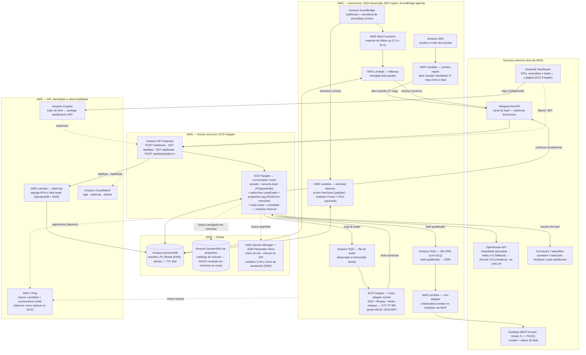

# Tech Challenge - Fase 5: Agente SDR Imobiliário com Inteligência Artificial

* Curso: Pós Tech IA para Devs
* Turma: 8IADT
* Funcional: RM369853
* Disciplinas: Privacidade e Segurança de Dados · Detecção de Anomalias
* Cliente: W Levitt Negócios Imobiliários
* Prazo de entrega: 12 de outubro
* Versão: 1.10 — instalação AI-DLC + ADRs de decisões
* Processo: Metodologia AI-DLC Workflows (AWS Labs)

## Fase 5

Hackathon FIAP — Agente SDR Imobiliário com Inteligência Artificial

## Geral

* [Repositório do GitHub: https://github.com/paulosobral/fiap-pos-tech-ia-para-devs/tree/main/01-aulas-gravadas/05-privacidade-seguranca-de-dados/04-deteccao-de-anomalias/05-tech-challenge/agente-sdr-imobiliario](https://github.com/paulosobral/fiap-pos-tech-ia-para-devs/tree/main/01-aulas-gravadas/05-privacidade-seguranca-de-dados/04-deteccao-de-anomalias/05-tech-challenge/agente-sdr-imobiliario "Repositório do GitHub")
* [Vídeo YouTube: https://youtu.be/kU_MkuLnJco](https://youtu.be/kU_MkuLnJco "Vídeo YouTube")
* [Link do Bot no Telegram (funcionamento das 09:00 até ás 18:00): https://telegram.me/RM369853_bot](https://telegram.me/RM369853_bot)
* [Cliente: W Levitt Negócios Imobiliários](https://www.wlevitt.com.br/)
* [Benchmark: Lais.ai](https://lais.ai/), [Plaza Maya](https://useplaza.com.br/), [Squad](https://squad.com/)

---

# 1. Enunciado e Objetivo do Desafio

## Visão Geral

O mercado imobiliário vem passando por uma transformação impulsionada por inteligência artificial, automação e experiências conversacionais. O desafio deste Hackathon é criar uma Prova de Conceito (POC) de um **Agente SDR Imobiliário utilizando IA Generativa**.

## Objetivo do Desafio

Construir um agente de IA capaz de:

- Atender leads automaticamente
- Realizar conversa humanizada
- Qualificar clientes
- Identificar intenção de compra, aluguel ou investimento
- Coletar informações relevantes
- Realizar follow-up automático
- Agendar reuniões ou visitas
- Integrar com uma base simulada de imóveis
- Gerar resumos para corretores

## Contexto de Negócio

Uma imobiliária deseja acelerar seu processo comercial utilizando IA. Hoje, muitos leads são perdidos devido a:

- Tempo de resposta elevado
- Falta de acompanhamento
- Atendimento manual
- Dificuldade em priorizar leads quentes
- Sobrecarga operacional dos corretores

## Cenários Esperados

### Exemplo 1 — Compra
Cliente: "Estou procurando apartamento na zona sul."

O agente deverá:
- Entender intenção
- Perguntar faixa de preço
- Perguntar quantidade de quartos
- Perguntar região de interesse
- Identificar urgência
- Encaminhar para reunião

### Exemplo 2 — Investimento
Cliente: "Quero investir em imóveis para renda."

O agente deverá:
- Entender perfil investidor
- Identificar ticket
- Identificar expectativa de retorno
- Direcionar para especialista

### Exemplo 3 — Follow-up
Cliente iniciou conversa e não respondeu.

O agente deverá:
- Retomar contato automaticamente
- Manter contexto da conversa
- Reengajar o lead

## Requisitos Funcionais

- Atendimento conversacional
- Conversa natural
- Fluxo humanizado
- Continuidade da conversa
- Qualificação de leads
- Agendamento de reuniões
- Resumo inteligente
- Dashboard mínimo de acompanhamento

## Diferenciais

- Uso de RAG
- Integração com WhatsApp
- Memória conversacional
- Multiagentes
- Voice AI
- Integração com CRM
- Observabilidade
- Segurança
- Deploy em cloud

## Critérios de Avaliação

### Arquitetura
- Organização da solução
- Escalabilidade
- Componentização

### Inteligência Artificial
- Qualidade das respostas
- Humanização
- Contexto conversacional

### Experiência do Usuário
- Interface
- Clareza
- Usabilidade

### Inovação
- Criatividade
- Diferenciais técnicos

## Entregáveis

- Repositório do projeto
- README
- Arquitetura da solução
- Demonstração funcional
- Pitch técnico
- Explicação da IA utilizada

## Visão Estratégica

Este desafio representa um cenário real do mercado atual. Empresas buscam profissionais capazes de unir:

- Inteligência Artificial
- Arquitetura de Software
- Automação
- Cloud
- Dados
- Escalabilidade

Construam algo que poderia realmente existir no mercado.

---

# 2. Solução Proposta: Levitt.AI

## 2.1 Sumário Executivo

A **W Levitt** atua em consultoria imobiliária e *real estate* no segmento **corporativo e comercial B2B** em São Paulo — lajes, andares corporativos, conjuntos e salas comerciais para locação e venda. Seu portfólio é composto por ativos de ticket alto, com ciclos de decisão longos e leads que chegam por WhatsApp, portal próprio (Vitrine Kenlo), indicações e redes sociais.

O desafio desta fase entrega uma **Prova de Conceito (POC)** de um **Agente SDR Imobiliário com IA Generativa**. Este projeto propõe o produto **"Levitt.AI"** — um SDR digital especializado em **espaços corporativos**, que:

1. Atende e **qualifica leads B2B** em conversa humanizada
2. Identifica intenção (**compra vs. locação vs. investimento**), ticket e urgência
3. Contextualiza com **RAG sobre a base simulada de imóveis**
4. Faz **follow-up automático** com memória conversacional
5. Agenda reuniões/visitas com **corretores especialistas**
6. Gera **resumo inteligente (handoff)** para o corretor
7. Entrega **dashboard** com KPIs, **lista de leads com contato** (e botão para enviar ao HubSpot) e **detecção de anomalias**
8. Nasce com **privacidade e segurança (LGPD)** como projeto — consentimento explícito, e-mail/telefone/CNPJ mascarados antes da LLM, guardrails e logs estruturados sem PII
9. Integra o **HubSpot real via MCP** (contato + status do lead)

## 2.2 Diferenciais Competitivos

| Eixo | Lais.ai | Maya (PLAZA) | **Levitt.AI (POC)** |
|---|---|---|---|
| Foco | Residencial | Residencial + adm | **B2B corporativo (lajes/andares/salas)** |
| Canal | WhatsApp | WhatsApp omnichannel | **Telegram (custo zero)** + WhatsApp no roadmap |
| Qualificação | Via fluxos | Via fluxos | **Proprietária + RAG + score explicável** |
| Segurança/Anomalia | Não divulgado | Não divulgado | **LGPD + detecção de anomalias** |
| Custo de operação | Licença produto | Licença (ou módulos) | **Lambdas + ECS Fargate em janela diária; LLM ~R$ 15–25/mês (ver §11)** |

**Por que não WhatsApp na POC:** a API do WhatsApp Business (Meta Cloud) cobra por mensagem e demanda aprovação de número. O **Telegram** oferece bot, webhook e texto/áudio **100% gratuitos**, com gestão de grupos para triagem dos corretores — ideal para demonstração em escala com custo zero, mantendo a arquitetura de canal agnóstica para plugar WhatsApp depois.

---

# 3. Contexto do Cliente

## 3.1 Quem é o cliente

A **W Levitt** negocia imóveis **corporativos e comerciais** em São Paulo (venda e locação): lajes corporativas, andares, conjuntos, salas e terrenos/edifícios para investimento. Clientes são **empresas** (B2B) buscando espaço físico para operação — de PMEs a multinacionais.

## 3.2 Dor e oportunidades

| Dor observada | Oportunidade para o Agente SDR |
|---|---|
| Tempo de resposta alto no primeiro contato | Atendimento imediato (24×7) |
| Leads perdidos por falta de follow-up | Reengajamento automático com memória |
| Foco manual, sem triagem | Qualificação objetiva + score de prontidão |
| Corretores sobrecarregados | Handoff: resumo executivo + agenda preparada |
| Decisão longa (ciclo B2B semanas/meses) | Nutrição com contexto mantido da conversa |
| Dados sensíveis do contato | LGPD (mínimo, pseudonimizado, auditável) |

## 3.3 Benchmark (referências do mercado)

- **Lais (lais.ai):** pré-atendimento e qualificação, recomendação personalizada de imóveis, reengajamento automático, envio ao CRM, gestão de visitas e atendimento administrativo. Forte em **fluxo residencial**.
- **Maya (PLAZA/useplaza):** 5 módulos integrados — atendimento omnichannel, esteira de distribuição de leads para corretores no WhatsApp, 60+ integrações com CRMs, análise de ficha via bureaus de crédito, reengajamento. Uso de **IA + humano no mesmo número**.
- **Squad (squad.com):** plataforma de múltiplos agentes de IA (defesa, atendimento e backoffice) para empresas — modelo de *várias IAs conversando com o setor humano*.

**Gap que justifica a POC:** nenhuma das referências é **especializada em imóveis corporativos B2B**, o que permite um agente com vocabulário técnico (área útil × privativa, laudo ABIQ, condomínio, entrega, documentação, multa rescisória em locações de longo prazo) e um **playbook de qualificação B2B**.

## 3.4 Insights da mentoria com o cliente

Insights extraídos da mentoria com o Leonardo (diretor comercial da W Levitt):

- **Perfil do cliente**: ~18 anos de mercado, ex-CBRE (multinacional B2B de imóveis comerciais), base própria com **~2.000 contatos** de carteira
- **Números reais de conversão**: a cada 100 leads de portal, fecha **3–4**; a cada 30 clientes, fecha 1; **carteira/indicação ≈ 85% de certeza de fechamento**
- Lead de portal **queima rápido** (vários corretores disputam o mesmo contato) → reforça o requisito de **just-in-time**
- **Canais de entrada**: portais (Zap, VivaReal, OLX, Chaves na Mão), Google Meu Negócio, site e redes sociais — **tudo caindo no WhatsApp**
- **Roleta/rodízio de leads**: distribuição automática por corretor, **configurável por regra** (ex.: até 500 m² cai no rodízio dos consultores; acima disso, lead prioritário vai para o diretor)
- **Esteira Kanban**: pipeline visual de status do lead (pré-atendimento → visita → proposta → fechamento → pós-venda)
- **Duas bases para RAG**: **catálogo de imóveis** + **catálogo de clientes** (histórico e status)
- **Orçamento como chave de segmentação**: "até R$ 40 mil/mês" vs. "alto padrão sem orçamento definido"
- **WhatsApp**: API oficial é **paga** e exige validação; API não oficial **bloqueia o número**; **Telegram é grátis**
- **Social BDR (outbound)**: desejo de reativar a base antiga (~2.000 contatos) com mensagens automáticas — roadmap pós-POC

---

# 4. Objetivos

## 4.1 Objetivo de negócio (cliente)

Reduzir o tempo de primeira resposta, dobrar a taxa de atendimento qualificado e eliminar a perda de leads por falta de follow-up em **60 dias** de operação B2B.

## 4.2 Objetivo do Hackathon

Entregar uma **POC funcional** que demonstre todas as habilidades exigidas: atendimento conversacional humanizado, intenção de compra/aluguel/investimento, coleta de informações, follow-up automático, agendamento, resumo para corretores, dashboard mínimo, com RAG, memória conversacional, multiagentes, segurança, observabilidade e deploy em cloud (AWS).

## 4.3 Fora de escopo (POC)

- Integração nativa com CRMs imobiliários brasileiros (Kenlo/Facilita/CS) — não têm MCP nativo; a POC integra o **HubSpot real via MCP remoto** e mantém um CRM simulado (CSV) como alternativa
- Pagamento online de propostas
- Agente de voz em ligações (Voice AI). A POC trata **mensagens de áudio** do Telegram: transcreve (faster-whisper) e a transcrição entra no fluxo como se tivesse sido digitada
- WhatsApp nativo (roadmap pós-POC)

---

# 5. Personas

| Persona | Descrição | Necessidade principal |
|---|---|---|
| **Lead B2B** (Diretor/Gerente de Facilities & Workplace, CFO, Dono PME) | Empresa buscando espaço corporativo para expandir/transferir/instalar | Atendimento rápido, respostas técnica precisas, agenda, sem fricção |
| **Corretor Especialista (humano)** | Responsável pelo fechamento, conhece o portfólio | Receber lead **qualificado e resumido**, não conversa bruta |
| **SDR humano** | Faz triagem e primeiro atendimento hoje | Escala de atendimento, sem perder contexto |
| **Gestor / Proprietário (W Levitt)** | Monitora operação, decidindo onde investir em marketing | Dashboard: volume, prontidão, anomalias e lista de leads com contato |

---

# 6. Requisitos Funcionais

| ID | Requisito (enunciado) | Implementação na POC |
|---|---|---|
| FR-01 | Atendimento conversacional | Bot Telegram + engine de orquestração |
| FR-02 | Conversa natural / fluxo humanizado | LLM em 3 camadas via OpenRouter + LiteLLM (DeepSeek → Haiku 4.5 → Sonnet 4.5, §9.1), prompt consultivo e camada de humanização |
| FR-03 | Continuidade da conversa | Memória conversacional em Amazon DynamoDB (sessão+atributos) |
| FR-04 | Qualificação de leads | A LLM extrai os dados da conversa (sem formulário fixo); o qualificador calcula score e urgência |
| FR-05 | Agendamento de reuniões | Validação de data/hora, compromisso em calendário simulado e convite `.ics` gerado (**envio ao corretor não implementado**); exige telefone ou e-mail do lead |
| FR-06 | Resumo inteligente | Handoff em Markdown (score, intenção, urgência, próximos passos) e lead enviado ao HubSpot (contato + status) |
| FR-07 | Dashboard mínimo | Streamlit (1 página, **rótulos em português**: ex. "Encaminhado ao corretor" em vez de `handoff`) em **ECS Fargate**, login Cognito e sessão persistente; consome `GET /api/kpis` e `GET /api/leads` — KPIs, anomalias, lista de leads com contato e botão "Enviar ao HubSpot" |
| FR-08 | Identificar intenção (compra/aluguel/investimento) | A LLM interpreta a intenção a cada mensagem (roteador tool-agent, §9.2); regex só no modo degradado sem chave |
| FR-09 | Coletar informações relevantes | Esquema de coleta extraído pela LLM (intenção, metragem, região, orçamento teto/piso, prazo, nº de pessoas, decisor) |
| FR-10 | Follow-up automático | EventBridge + Step Functions (esperas de 2 h e 24 h) com seleção por janela de silêncio |
| FR-11 | Integrar base simulada de imóveis | Catálogo no DynamoDB (`sdr-properties`), gerado pelo crawler (anúncios reais) ou sintético, + RAG (FAISS em memória) |
| FR-12 | Gerar resumos para corretores | Resumo do handoff gerado e lead no HubSpot/dashboard (**arquivo de resumo ao corretor não implementado**) |

---

# 7. Requisitos Não Funcionais

| ID | Requisito | Critério |
|---|---|---|
| NF-01 | Segurança (LGPD) | E-mail/telefone/CNPJ mascarados antes do modelo; minimização; consentimento explícito; KMS; logs estruturados sem PII |
| NF-02 | Privacidade de dados | PII de contato mascarada antes do provedor LLM; consentimento registrado só com concordância clara, interpretada pela LLM (ADR-027); retenção limitada (TTL 90 dias) |
| NF-03 | Performance | Meta: primeira resposta < 10 s e atendimento simultâneo sem fila. **Não verificada formalmente**; nos logs, 8–15 s por turno com LLM real (fallback em 429 aumenta a latência) |
| NF-04 | Confiabilidade | DLQ nas filas SQS (áudio, CRM, ingestão); fallback automático de modelo de LLM |
| NF-05 | Observabilidade | Logs JSON estruturados (CloudWatch) e métricas de negócio no dashboard. Traços distribuídos com **AWS X-Ray** nas Lambdas e no router (ADR-021; só o `botocore` é instrumentado e o API Gateway HTTP não entra no trace; a validar numa subida real). Métricas de latência/custo no CloudWatch **não implementadas** |
| NF-06 | Custo | LLM ~R$ 15–25/mês (OpenRouter · DeepSeek, fallback Haiku 4.5); custo de ECS Fargate à parte (§11) |
| NF-07 | Segurança de modelo | Guardrails/denied topics; detecção de prompt injection; evasão de PII |
| NF-08 | Escalabilidade | Lambdas escalam nativamente; ECS Fargate com escala agendada (liga 09:00, desliga 18:00 BRT) |
| NF-09 | Infra como código (IaC) | Toda a infra em Terraform (`infra/`, um `.tf` por serviço) — deploy e teardown em 1 comando cada |

---

# 8. Arquitetura da Solução

## 8.1 Visão macro — infraestrutura (serverless + ECS Fargate)



## 8.2 Componentes e responsabilidade

1. **Canal (Telegram)**: webhook autenticado, normaliza texto/áudio/envios de botão
2. **Router / sessões**: valida, recupera estado da sessão (DynamoDB), chama a engine de fluxo
3. **Engine de fluxo (LangGraph)**: grafo com os estados `greeting`, `elicitation` (consentimento), `conversation`, `scheduling`, `handoff` e `followup`, mais pré e pós-processamento; a qualificação, a recomendação e o agendamento acontecem dentro de `conversation` por tool-calling (§9.2)
4. **Agente de atendimento**: o roteador LLM interpreta cada mensagem e uma segunda chamada **humaniza** a resposta, via **OpenRouter** com **LiteLLM** (DeepSeek → Haiku 4.5 → Sonnet 4.5, §9.1)
5. **RAG**: carrega o catálogo de imóveis do DynamoDB (`sdr-properties`), vetoriza com TF-IDF e usa **FAISS local em memória** para custo zero
6. **Qualificador**: extrai estrutura e classifica intenção + urgência + budget
7. **Agendamento**: valida data/hora, grava compromisso e gera o convite `.ics` (o envio do convite ao corretor ainda não está implementado); exige telefone ou e-mail do lead
8. **Follow-up**: regras de cadência via EventBridge + Step Functions
9. **Detecção de anomalias**: Lambda agendada (1/min) que extrai 4 features por conversa e pontua com scorer heurístico (padrão) ou **Isolation Forest + PCA** (§9.6); alerta e restringe o agendamento do lead
10. **Handoff**: resumo Markdown no fluxo e lead enviado ao HubSpot; o backoffice vê nome, telefone e e-mail no dashboard
11. **Dashboard**: app Streamlit (1 página, ECS Fargate) com login Cognito e sessão persistente; consome `GET /api/kpis` e `GET /api/leads`; tema e logo da marca; botão "Enviar ao HubSpot"
12. **Segurança/Priv**: máscara de e-mail/telefone/CNPJ antes da LLM, consentimento explícito, guardrails e checagem de vazamento na saída
13. **Roleta de distribuição**: distribui o lead qualificado para o corretor certo por regras configuráveis
14. **Ingestão de contato**: captura dados que chegam por e-mail/portais e abre sessão no chatbot
15. **Áudio/STT**: worker ECS Fargate consome fila SQS, baixa/transcreve com **faster-whisper (PT-BR)**
16. **CRM via MCP — `crm-adapter`**: grava o lead como contato no **HubSpot** pelo MCP remoto (OAuth 2.1 + PKCE; refresh token de uso único mantido no Secrets Manager); sem credenciais, usa o CRM simulado (CSV)
17. **Observabilidade — AWS X-Ray (ADR-021)**: `tracing_mode = Active` nas Lambdas e `aws-xray-sdk` no código; no `conversation-router` (ECS) um segmento por requisição e um subsegmento `llm:<modelo>` por chamada à LLM (falha e fallback marcados), com o daemon como contêiner auxiliar da task. Só o `botocore` é instrumentado, nunca `patch_all()`: ele grava a URL das chamadas HTTP de saída e a do Telegram carrega o token do bot (vazamento reproduzido com o SDK real); as anotações ficam em rota, status e modelo. O API Gateway HTTP não suporta X-Ray: o trace começa no router ou na Lambda `dashboard-api`.
18. **Persona — nome da assistente (ADR-022)**: o nome vem do parâmetro SSM `/sdr/bot-name` (padrão `Cecília`, variável Terraform `bot_name`), lido por `service/bot_identity.py` com cache de 5 min e fallback para a variável `BOT_NAME` e depois para o padrão. A primeira mensagem (texto fixo do consentimento, nunca reescrito pela LLM) começa com "Olá! Meu nome é <nome> e sou assistente virtual da W Levitt…"; o prompt de humanização recebe `SEU NOME` para não se reapresentar.

## 8.3 Estrutura do Projeto

```
agente-sdr-imobiliario/
├── start.sh                    # Pipeline de deploy: build → testes → terraform apply
├── stop.sh                     # Teardown completo: terraform destroy
├── secrets.local.env           # Credenciais locais (gitignored)
├── pyproject.toml              # Configuração do projeto Python
├── requirements-dev.txt        # Dependências de desenvolvimento
├── apps/                       # Aplicações (1 por componente)
│   ├── conversation-router/    # Núcleo síncrono: sessão + fluxo + RAG + roleta + scheduler
│   ├── voice-adapter/           # Worker ECS Fargate: transcrição de áudio
│   ├── crm-adapter/            # Camada MCP para sincronização com CRM
│   ├── contact-ingest/         # Ingestão de contatos de e-mail/portais
│   ├── anomaly-detector/       # Detecção de anomalias (Isolation Forest + PCA)
│   ├── followup/               # Follow-up automático via EventBridge + Step Functions
│   ├── dashboard-api/          # API Lambda para KPIs do dashboard
│   └── dashboard-ui/           # Streamlit (ECS Fargate): app.py, assets/logo.png, .streamlit/ (tema)
├── infra/                      # Terraform — infraestrutura como código
│   ├── providers.tf            # Provedores AWS
│   ├── variables.tf            # Variáveis de entrada
│   ├── s3.tf                   # Bucket S3 de catálogos (provisionado; a app lê o catálogo do DynamoDB — ADR-012)
│   ├── dynamodb.tf             # Tabelas DynamoDB (sessions, pii, alerts, dedupe, followup, properties); GSI lead-index em sessions e alerts
│   ├── sqs.tf                  # Filas SQS (áudio, CRM, ingestão) e DLQs
│   ├── ses.tf                  # SES para ingestão de e-mail
│   ├── secrets.tf              # Chave KMS de PII e Secrets Manager (bot, LLM, HubSpot)
│   ├── iam.tf                  # Roles e políticas IAM
│   ├── ecs.tf                  # ECS Fargate (conversation-router, dashboard-ui, voice-adapter)
│   ├── apigateway.tf           # API Gateway HTTP
│   ├── cognito.tf              # Cognito User Pool (login do dashboard)
│   ├── cloudwatch-logs.tf      # CloudWatch Logs e grupos
│   ├── lambda-*.tf             # Lambdas assíncronas
│   ├── step_functions.tf       # Step Functions para follow-up
│   └── outputs.tf              # Saídas do Terraform
├── scripts/                    # Scripts utilitários
│   ├── seed_properties.py      # Gera catálogo sintético de imóveis
│   ├── seed_clients.py         # Gera catálogo sintético de clientes
│   ├── load_properties_dynamodb.py  # Popula a tabela de imóveis no DynamoDB
│   └── hubspot_authorize.py    # Autoriza o MCP do HubSpot (OAuth 2.1 + PKCE) e grava o refresh token
├── logs/                       # Logs do start.sh/stop.sh (gitignored)
├── docs/                       # Especificações de design
├── .aidlc/ e .claude/          # Framework AI-DLC (opencode e Claude Code)
├── aidlc/                      # Registro do AI-DLC: estado, ADRs (decisions.md) e artefatos por estágio
└── documentos/                 # PRD e documentos do projeto
```

O catálogo real de imóveis vem de uma pasta **irmã**, `../crawling-imobiliarias/` (crawler Scrapy de uma imobiliária parceira, com filtro de fotos genéricas). O `start.sh` usa a saída do crawler quando existe e, sem ele, o catálogo sintético (`seed_properties.py`, sem fotos). O último catálogo gerado tem 252 imóveis (167 venda, 85 locação), 220 com fotos.

---

# 9. Modelagem de IA

## 9.1 Modelo conversacional

- **LLM em 3 camadas (ADR-010)**, todas via **OpenRouter**: Tier 1 `deepseek/deepseek-chat` (rotina, ~90% das chamadas, barato); Tier 2 `anthropic/claude-haiku-4.5` (fallback automático em 429/timeout); Tier 3 `anthropic/claude-sonnet-4.5` (casos complexos). Os modelos mudam por variável de ambiente (`LLM_MODEL_PRIMARY`, `LLM_MODEL_FALLBACK`, `LLM_MODEL_COMPLEX`) sem alterar código; os modelos Claude 3 / 3.5 usados no desenho inicial foram descontinuados no OpenRouter
- **Cliente**: **LiteLLM** — chamada única, com fallback de modelo; a chave fica no Secrets Manager (`sdr/llm-api-key`)
- **A LLM interpreta, o código valida (ADR-015/020)**: metragem, bairro/cidade, orçamento (teto e piso), referências a imóveis ("o primeiro", "esse aí"), interesse em visita e pedido de humano vêm da LLM; regex só entra no modo degradado, sem chave
- **Áudio**: a transcrição entra no fluxo como se o lead tivesse digitado
- **Orquestração**: **LangGraph** (reaproveita o padrão de multiagentes)
- **Prompt system**: persona de SDR corporativo BR, tom consultivo, permissões, sempre oferecer ações. A assistente se chama **Cecília**: o nome fica no SSM Parameter Store (`/sdr/bot-name`, lido pelo router com cache de 5 min, então trocar o nome não exige deploy) e ela se apresenta por ele na primeira mensagem, junto do pedido de consentimento; nas respostas seguintes não se reapresenta
- **Interface natural-first**: entrada livre sempre aceita; botões inline **não foram implementados** na POC
- **Guardrails**: masking de PII no pré-envio, checagem de vazamento na saída, denied topics e detecção de prompt injection; a reescrita da LLM é descartada (vale o texto oficial) quando promete fotos que não vão, promete "um momento"/alertas que o bot não cumpre ou omite o pedido de contato

## 9.2 Roteamento conversacional tool-agent

O `sales-flow` evoluiu para um **agente single-step com tool-calling**: uma única chamada LLM classifica a intenção comercial e devolve um contrato estruturado.

- **Contrato single-step**: `{thought, tool, arguments, lead_info, memory_updates}`
- **10 VALID_TOOLS**: `request_options, property_detail, compare_properties, refine_search, express_visit_interest, request_schedule, request_human, decline, provide_info, unclear`
- **Validação em código**: fuzzy de favorito apenas sobre imóveis já exibidos; gate de evidência de visita
- **Dados de busca e observabilidade do roteador (ADR-025/026)**: dados de busca que a LLM manda só em `arguments` (ex.: região) são promovidos ao `lead_info`; cada decisão do roteador (ferramenta, argumentos, raciocínio) vai para o log `roteador:`; nas fases de consentimento e de pergunta de intenção a humanização não recebe imóveis guardados de turnos anteriores (a LLM saía do roteiro e listava opções antes de perguntar compra, locação ou investimento)
- **Decisão de fechar (ADR-028)**: quando o lead quer fechar/comprar/alugar um imóvel exibido, a LLM o encaminha ao corretor e grava o imóvel escolhido; sem contato, o bot pede o WhatsApp ou e-mail DO LEAD e nunca oferece o contato do corretor. O roteador decide pela última mensagem (o histórico é contexto já atendido)
- **Fotos e fatos (ADR-029)**: a humanização sabe quantas fotos o imóvel tem e quantas já foram enviadas; ao pedir "mais fotos" de um imóvel sem mais fotos, o bot diz que essas são as fotos disponíveis em vez de prometer. O preço ou aluguel nunca é apresentado como IPTU ou taxa. O bot não tem dados de financiamento ou condições de pagamento: não oferece o assunto e, se o lead perguntar, diz que o corretor explica.
- **Valor do imóvel escolhido (ADR-030)**: o orçamento só é preenchido com o que o lead informa; o preço do imóvel que ele escolheu vai em campo separado ("Valor do imóvel") no dashboard, na mensagem ao CRM e no HubSpot.
- **Encerramento e nova conversa (ADR-031)**: ao captar o contato e encaminhar ao corretor, o bot avisa que o atendimento foi encerrado e que, se o lead voltar, começa uma nova conversa; a mensagem seguinte ao handoff abre um lead e uma sessão novos (cada atendimento é um lead; o anterior permanece no dashboard e no HubSpot). No handoff o bot não faz perguntas nem oferece fotos ou imóveis.
- **6 estados no grafo**: `greeting | elicitation | conversation | scheduling | handoff | followup`
- **Gates 100% em código**: consentimento LGPD (o texto do pedido é fixo e o aceite só é gravado com concordância clara; quem interpreta a resposta é a LLM, lendo a conversa, ADR-027); telefone ou e-mail antes de agendar/falar com corretor; score ≥70 para qualificar; restrição de agendamento por anomalia; no máximo 1 pergunta de critério por conversa
- **Fallback**: tool inválida / exceção do LLM → regex + FSM determinístico

## 9.3 RAG — duas bases (imóveis + clientes)

**Base 1 — Catálogo de imóveis (252 imóveis no último catálogo gerado; 167 venda, 85 locação, 220 com fotos):**
- Origem: anúncios reais coletados pelo crawler `crawling-imobiliarias` (fotos genéricas, como a colagem de fachadas da imobiliária, são filtradas no próprio crawler); sem o crawler, o `start.sh` usa um catálogo **sintético** (`scripts/seed_properties.py`, sem fotos)
- Armazenamento: tabela DynamoDB `sdr-properties`, lida no cold start (ADR-012); o índice **FAISS** (TF-IDF) é montado em memória no router
- Campos: tipo, modalidade (venda/locação), região, área útil, preço, vagas, disponibilidade, descrição e fotos

**Base 2 — Catálogo de clientes (CRM simulado):**
- `clients.json` sintético (`scripts/seed_clients.py`) com **status** (pré-atendimento, visita, proposta, fechamento, pós-venda); em produção, o CRM real é o HubSpot (§8.2, item 16)

**Fontes de dados públicas de SP (referência de preços/geografia para o catálogo sintético):**
- **FipeZAP** (Fipe + Zap): Índice de preços de venda/locação por bairro de SP
- **Secovi-SP**: Relatórios de mercado (locação corporativa, absorção)
- **GeoSampa (PMSP)**: Dados georreferenciados (bairros, zonas, eixos)
- **Portais públicos** (Zap, VivaReal, OLX, Chaves na Mão): Anúncios reais
- **CUB (SindusCon-SP)**: Custo unitário básico de construção

## 9.4 Memória conversacional

Sessão contínua (DynamoDB): turnos, atributos extraídos pela LLM (região, metragem, orçamento teto/piso, prazo), imóveis já mostrados e fotos já enviadas, imóvel favorito, interesse de visita e estado do fluxo. O nome vem do perfil do Telegram e fica no registro de PII (cifrado). O follow-up relê a memória para manter contexto.

## 9.5 Multiagentes

Em tempo de execução há **um agente com tool-calling** (§9.2) e uma camada de humanização; os papéis abaixo são **responsabilidades distribuídas em nós do fluxo e em serviços**, não processos de agente separados. Os personas de agente do AI-DLC (quality, developer, architect etc.) atuam no **desenvolvimento**, não na conversa.

| Papel | Responsabilidade |
|---|---|
| `reception` | saudação, tom, roteamento |
| `intent` | classificação compra/locação/investimento |
| `qualifier` | coleta/interrogação estruturada + score |
| `recommender` | RAG + filtros + sugestão |
| `visitation` | agendamento de reunião/visita |
| `followup` | reengajamento |
| `handoff` | resumo para corretor |
| `monitor` | anomalia + alertas |

## 9.6 Detecção de Anomalias

- **Execução**: Lambda `anomaly-detector` disparada pelo EventBridge (`rate(1 minute)` na POC); idempotente (o `anomaly_id` é `sessão#data`, então reprocessar não duplica)
- **Features por conversa (4)**: volume de mensagens, tamanho médio das mensagens, proporção de mensagens com palavras negativas (PT-BR) e proporção de mensagens fora do horário comercial (08:00–18:59, America/Sao_Paulo). As respostas do bot entram na conta e diluem os valores
- **Scorer padrão (`ANOMALY_SCORER=heuristic`)**: combinação ponderada das features (volume 0,3 · tamanho 0,2 · negatividade 0,3 · horário 0,2); anomalia quando a nota chega a `ANOMALY_THRESHOLD` (0,7). Com esse limite, só dispara à noite e com muitas mensagens longas e negativas
- **Scorer opcional (`ANOMALY_SCORER=sklearn`)**: **Isolation Forest + PCA** (erro de reconstrução como sinal residual); lotes com menos de 5 conversas caem no heurístico. O **Autoencoder** do desenho original **não foi implementado** (desvio aceito no AI-DLC, FR9.2)
- **Saída**: alerta na tabela `sdr-alerts` (com o índice `lead-index` por lead, ADR-024), exibido no dashboard sem o payload bruto, e **restrição de agendamento** do lead (a restrição é liberada quando uma varredura posterior o pontua como normal)
- **Verificação**: gate de qualidade com LLM real que conversa pelo roteador, passa a conversa ao detector e confere o alerta no `/api/kpis` (ADR-019). O teste usa limite 0,4; o limite de produção continua 0,7

## 9.7 Segurança de dados (LGPD)

- **PII masking** determinístico de contato (e-mail, telefone — digitado, com hífen ou falado por extenso — e CNPJ) antes do envio à LLM. O **nome não é mascarado**: vem do perfil do Telegram, fica cifrado no registro de PII e qualquer resposta que o cite é barrada
- **Criptografia**: KMS at rest (DynamoDB, S3), TLS em trânsito
- **Consentimento**: a primeira mensagem apresenta a assistente pelo nome (Cecília) e é curta: usa o nome do Telegram e pede só WhatsApp ou e-mail para um corretor falar com o lead (ADR-028). A LLM lê a conversa e decide se a resposta é aceite (em qualquer forma natural: "sim", "tô de acordo", "manda ver", 👍), recusa ou nenhum dos dois; na dúvida não conta como aceite e o pedido é refeito (ADR-027). "Não" encerra.
- **Retenção**: TTL de 90 dias para conversas de leads frios
- **Gestão de segredos**: Secrets Manager para token do bot, chave da LLM e credenciais do HubSpot (o refresh token de uso único é regravado a cada renovação)
- **Traços sem segredos**: o X-Ray instrumenta só o `botocore` (nunca `patch_all()`, que gravaria a URL do Telegram com o token do bot); as anotações são rota, status e modelo, sem texto de conversa nem PII
- **Acesso ao contato dos leads**: o dashboard exige login Cognito (JWT validado no API Gateway); o contato é decifrado com KMS só na leitura autenticada (ADR-016)

## 9.8 Privacidade e provedores de LLM

**Onde cada dado nasce e para onde vai:**

| Dado | Onde nasce/fique | Chega ao LLM? |
|---|---|---|
| E-mail, telefone, CNPJ | DynamoDB `sdr-pii` (KMS), HubSpot e dashboard (usuário autenticado) | **Não** — substituído por placeholder |
| Nome | Perfil do Telegram → `sdr-pii` (KMS) e HubSpot | Não é enviado de propósito, mas **não é mascarado** se o lead o digitar; resposta que o cite é barrada |
| Orçamento, metragem, região, intenção | DynamoDB (atributos estruturados) | **Sim** — como atributos/histórico |
| Texto livre da conversa | DynamoDB (TTL 90 dias) | **Sim** — com PII mascarada |
| Contexto RAG (imóveis sintéticos) | S3/FAISS | **Sim** — não contém PII |

---

# 10. Como Subir Localmente

## Pré-requisitos

- **Python 3.11+**
- **AWS CLI** configurado com credenciais
- **Terraform** (>= 1.0)
- **Podman** ou Docker (para build de imagens container)
- **Conta AWS** com permissões para criar recursos

## 1. Criar Bot no Telegram

1. **Abra o Telegram** e procure pelo bot **@BotFather**
2. Envie o comando `/newbot`
3. Siga as instruções e escolha um nome e username único
4. O BotFather retornará o **token do bot**
5. **Guarde este token** — ele será usado no `secrets.local.env`

## 2. Configurar HubSpot via MCP (Opcional)

O projeto usa o **servidor MCP oficial do HubSpot** para integração com o CRM. Se não configurar, o projeto usa um **CRM simulado** (CSV/Excel).

### 2.1 Criar o MCP Connector no HubSpot

1. Na conta de desenvolvedor do HubSpot, crie um **MCP connector** (plataforma de desenvolvedor nova)
2. No campo **Redirect URL**, informe exatamente `http://localhost:6274/oauth/callback/debug`
3. Anote o **Client ID** e o **Client secret** gerados

> O MCP do HubSpot **não aceita** token de app privado: só OAuth 2.1 + PKCE

### 2.2 Autorizar o App e Obter o Refresh Token

O refresh token **só existe depois que você autoriza o app no navegador**. Faça isto **antes** do `./start.sh`:

```bash
.venv/bin/python scripts/hubspot_authorize.py
```

O script:
- Abre o navegador na tela de autorização do HubSpot
- Recebe o retorno em `localhost:6274`
- Troca o código pelos tokens
- Grava `HUBSPOT_MCP_REFRESH_TOKEN` no `secrets.local.env`
- Lista as tools do MCP em `hubspot_mcp_tools.json`

**Notas importantes:**
- A porta **6274** precisa estar livre durante a autorização
- O refresh token é de **uso único**: cada renovação devolve um novo e invalida o anterior
- O `start.sh` envia o token do arquivo para o Secrets Manager (`sdr/hubspot-mcp`)
- O `crm-adapter` mantém o token atualizado na secret
- O `stop.sh` salva o token vigente da secret no `secrets.local.env` antes de destruir a infra

## 3. Configurar Credenciais Locais

Crie o arquivo `secrets.local.env`:

```bash
TELEGRAM_BOT_TOKEN=<seu_token_bot_telegram>
LLM_API_KEY=<sua_chave_openrouter>
HUBSPOT_MCP_CLIENT_ID=<client_id_hubspot>
HUBSPOT_MCP_CLIENT_SECRET=<client_secret_hubspot>
HUBSPOT_MCP_REFRESH_TOKEN=<gerado pelo script acima>
```

## 4. Deploy Completo

```bash
./start.sh
```

O script executa, nesta ordem: setup → compileall → testes unitários (cobertura ≥ 80%) → **gate de qualidade com LLM real** (~7 min, consome créditos do OpenRouter; é pulado se não houver `LLM_API_KEY`) → build (zips das Lambdas e imagens por `podman`) → `terraform apply` (2 passos) → usuário de smoke no Cognito → webhook do Telegram → smoke checks.

- A saída aparece na tela e também é gravada em `logs/start-AAAAMMDD-HHMMSS.log` (atalho `logs/start-latest.log`).
- O **endereço do dashboard** (`http://<IP da task>`, porta 80, sem HTTPS) aparece no fim do log, na linha `Dashboard:`. O IP muda sempre que a task reinicia.
- Os serviços ECS (router, voice-adapter e dashboard) ligam às 09:00 e desligam às 18:00 (Brasília); fora da janela o bot não responde. O `start.sh` liga os serviços na hora, mas o desligamento agendado continua valendo.
- Rodar o `start.sh` de novo **sem** `stop.sh` atualiza a infra e **mantém os dados** (leads, sessões) do DynamoDB.
- **Nome da assistente:** fica no SSM `/sdr/bot-name` (padrão `Cecília`, variável Terraform `bot_name`) e é o nome com que ela se apresenta na primeira mensagem. Para trocar sem deploy: `aws ssm put-parameter --name /sdr/bot-name --value "Nome" --type String --overwrite` (vale em até 5 minutos); um novo `start.sh` volta ao valor da variável `bot_name`.
- **Verificação do X-Ray (ainda não validada numa subida real):** depois de uma conversa, em Console AWS → X-Ray → Traces deve aparecer o segmento `conversation-router` com subsegmentos `llm:<modelo>`; se não aparecer, veja o log do contêiner `xray-daemon` (mesmo log group do router).

## 5. Criar Usuário no AWS Cognito

O dashboard Streamlit é protegido pelo Amazon Cognito (login direto por usuário e senha, sem Hosted UI; a sessão sobrevive ao F5 por um cookie, 12 h). Você precisa criar usuários manualmente para acessá-lo.

### 5.1 Obter Cognito Pool ID e Client ID

Após o deploy, o Terraform imprime estas informações:

```bash
POOL_ID=$(terraform output -raw cognito_user_pool_id)
CLIENT_ID=$(terraform output -raw cognito_app_client_id)
```

Ou via AWS CLI:

```bash
aws cognito-idp list-user-pools --max-items 10
aws cognito-idp list-user-pool-clients --user-pool-id <POOL_ID>
```

### 5.2 Criar Usuário via AWS CLI

```bash
POOL_ID="<seu_pool_id>"
EMAIL="seu@email.com"
TEMP_PASSWORD="TempPass123!"
PERMANENT_PASSWORD="SuaSenha123!"

# Criar usuário com senha temporária
aws cognito-idp admin-create-user \
  --user-pool-id "$POOL_ID" \
  --username "$EMAIL" \
  --user-attributes \
    Name=email,Value="$EMAIL" \
    Name=email_verified,Value=true \
  --message-action SUPPRESS \
  --temporary-password "$TEMP_PASSWORD"

# Definir senha permanente (opcional - pula a tela de "first login")
aws cognito-idp admin-set-user-password \
  --user-pool-id "$POOL_ID" \
  --username "$EMAIL" \
  --password "$PERMANENT_PASSWORD" \
  --permanent
```

### 5.3 Criar Usuário via Console AWS

1. Acesse o console do Amazon Cognito
2. Clique no User Pool criado (nome começa com `sdr-`)
3. Vá em **User management** → **Users**
4. Clique em **Create user**
5. Preencha:
   - **Username:** e-mail do usuário
   - **Temporary password:** senha temporária
   - **Email address:** e-mail (verificado automaticamente)
   - **Email verified:** marcado como "Yes"
6. Clique em **Create user**

O usuário precisará trocar a senha no primeiro login no dashboard.

## 6. Teardown

```bash
./stop.sh
```

Isso executa `terraform destroy` e remove todos os recursos AWS (inclusive os dados do DynamoDB). Antes de destruir, o `stop.sh` salva em `secrets.local.env` o refresh token vigente do HubSpot (ele muda a cada renovação), e a saída é gravada em `logs/stop-AAAAMMDD-HHMMSS.log`. Use sempre o `stop.sh`, não `terraform destroy` direto.

---

# 11. Estimativa de Custo (POC Mensal)

| Item | Estimativa |
|------|------------|
| Telegram | R$ 0 |
| Lambda/API Gateway | ~R$ 0 (free tier) |
| OpenRouter (DeepSeek; fallback Haiku 4.5) | ~R$ 8-15 (estimativa do PRD, não medida) |
| ECS Fargate — router 0,5 vCPU/1 GB, voice-adapter 1 vCPU/4 GB, dashboard 0,25 vCPU/0,5 GB, 9 h/dia | ~US$ 26 de vCPU/memória + ~US$ 4 de IPv4 público por mês (tabela pública us-east-1; **estimativa a validar na calculadora AWS**) — não entra no total abaixo |
| DynamoDB (on-demand) | < R$ 5 |
| EventBridge Scheduler | < R$ 1 |
| CloudWatch/Logs | < R$ 5 |
| S3 + índices FAISS | < R$ 1 |
| SQS + SES | < R$ 1 |
| Amazon Cognito | R$ 0 (free tier) |
| AWS X-Ray | R$ 0 (plano gratuito de 100 mil traces/mês; o `anomaly-detector`, a cada minuto, consome ~43 mil) |
| **Total POC (sem ECS)** | **~R$ 15-25/mês** |

> O custo dominante da POC é o ECS Fargate, não a LLM. O gate de qualidade (62 testes com LLM real) gasta créditos do OpenRouter a cada deploy. A métrica de custo da LLM **não** é exibida no dashboard (nenhum componente a emitia); o acompanhamento é feito no painel do OpenRouter.

---

# 12. Dependências

## Dependências de Desenvolvimento

- `pytest>=8.0`: Framework de testes
- `pytest-cov>=5.0`: Cobertura de código
- `scikit-learn>=1.4`: Para testes do anomaly-detector
- `streamlit>=1.37`: Para testes do dashboard-ui
- `Pillow>=10`: Para scripts de processamento de imagens

## Dependências da Aplicação

- **conversation-router:** litellm, langgraph, faiss-cpu, boto3, aws-xray-sdk (o servidor HTTP é o da biblioteca padrão do Python)
- **voice-adapter:** faster-whisper, boto3, requests (o `ffmpeg` é instalado como binário na imagem)
- **crm-adapter:** mcp, boto3, requests
- **dashboard-ui:** streamlit (≥ 1.37, por causa dos cookies de sessão), boto3, requests
- **dashboard-api, anomaly-detector, followup, contact-ingest:** boto3 e aws-xray-sdk (e requests, quando precisam de HTTP); o **crm-adapter** também usa aws-xray-sdk

## Chaves de API Necessárias

| Chave | Origem | Uso | Obrigatório? |
|-------|--------|-----|--------------|
| `TELEGRAM_BOT_TOKEN` | [@BotFather](https://t.me/botfather) | Autenticação do bot | Sim |
| `LLM_API_KEY` | [OpenRouter](https://openrouter.ai/) | Chamadas LLM (DeepSeek, Haiku 4.5, Sonnet 4.5) | Sim (sem ela o bot cai no modo degradado por regex) |
| `HUBSPOT_MCP_CLIENT_ID` | HubSpot Developers | CRM via MCP | Opcional |
| `HUBSPOT_MCP_CLIENT_SECRET` | HubSpot Developers | CRM via MCP | Opcional |
| `HUBSPOT_MCP_REFRESH_TOKEN` | Fluxo OAuth HubSpot | CRM via MCP | Opcional |

---

# 13. Testes

Última execução completa: 2026-10-09. Os testes rodam **por aplicação** (cada app tem o seu `conftest.py`; rodar `apps/` inteiro de uma vez causa conflito de módulos):

```bash
source .venv/bin/activate
for a in conversation-router voice-adapter crm-adapter contact-ingest anomaly-detector followup dashboard-api dashboard-ui; do
  python -m pytest apps/$a/tests --ignore=apps/$a/tests/quality -q --cov=apps/$a --cov-fail-under=80
done

# Gate de qualidade com LLM real (~7 min, usa créditos do OpenRouter)
set -a; source secrets.local.env; set +a
python -m pytest apps/conversation-router/tests/quality -q
```

| Aplicação | Testes | Cobertura |
|---|---|---|
| conversation-router | 561 | 89,6% |
| voice-adapter | 76 | 99,4% |
| crm-adapter | 141 | 99,1% |
| contact-ingest | 77 | 99,9% |
| anomaly-detector | 93 | 99,0% |
| followup | 93 | 98,5% |
| dashboard-api | 86 | 97,9% |
| dashboard-ui | 49 | 83,3% |
| **Total** | **1176** | todos ≥ 80% |
| Guarda de infra (`tests/infra`, índices DynamoDB × Terraform) | 4 | — |

**Gate de qualidade com LLM real: 62 testes**, executados pelo `start.sh` antes do deploy: referências a imóveis ("o primeiro", "esse aí"), fotos, contato e telefone falado, piso e teto de orçamento, trava de promessas, fechamento de lead ponta a ponta e anomalias ponta a ponta (chat → detector → dashboard).

**Validado à mão contra serviços reais:** HubSpot via MCP (contato criado, localizado sem duplicar e atualizado; lead real do Telegram chegando ao CRM) e a infra AWS recriada várias vezes pelo `start.sh`/`stop.sh`.

**Limitações conhecidas (AI-DLC, estágio build-and-test):** botões inline (FR1.4), questionário B2B vs investidor PF (FR2.3), envio do convite `.ics` ao corretor (FR5.3), arquivo de resumo ao corretor (FR6.2), traços distribuídos de ponta a ponta (o X-Ray cobre Lambdas e router, mas ainda não foi validado numa subida real; NFR5.2), Autoencoder (FR9.2, desvio aceito), métricas de latência e custo no CloudWatch (nunca emitidas) e a verificação formal de desempenho (NFR1.1/1.2).

---

# 14. Processo de Desenvolvimento

Este projeto utiliza a metodologia **AI-DLC (AI-Driven Development Life Cycle)** para desenvolvimento assistido, com os harnesses **opencode** e **Claude Code**. As decisões de arquitetura ficam registradas como ADRs em `aidlc/spaces/default/intents/260911-agente-sdr-imobiliario/inception/domain-design/decisions.md`.

Comandos principais:
- `/aidlc` — inicia workflow com descrição do escopo
- `/aidlc --doctor` — valida setup
- `/aidlc --version` — versão do framework
- `/aidlc --stage <slug>` — pula para estágio específico
- `/aidlc compose "<task>"` — plano personalizado para tarefa

---

# 15. Licença

Projeto desenvolvido para fins acadêmicos no curso FIAP Pós Tech — IA para Devs, Fase 5. Cliente: W Levitt Negócios Imobiliários.
