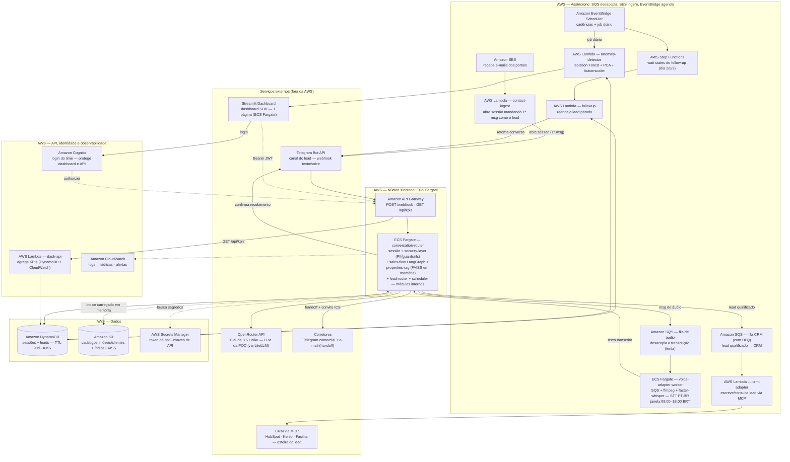

# Tech Challenge - Fase 5: Agente SDR Imobiliário com Inteligência Artificial

* Curso: Pós Tech IA para Devs
* Turma: 8IADT
* Funcional: RM369853
* Disciplinas: Privacidade e Segurança de Dados · Detecção de Anomalias
* Cliente: W Levitt Negócios Imobiliários
* Prazo de entrega: 12 de outubro
* Versão: 1.10 — instalação AI-DLC + ADRs de decisões
* Processo: Metodologia AI-DLC Workflows (AWS Labs)

## Fase 5

Hackathon FIAP — Agente SDR Imobiliário com Inteligência Artificial

## Geral

* [Repositório do GitHub: https://github.com/paulosobral/fiap-pos-tech-ia-para-devs](https://github.com/paulosobral/fiap-pos-tech-ia-para-devs "Repositório do GitHub")
* [Cliente: W Levitt Negócios Imobiliários](https://www.wlevitt.com.br/)
* [Benchmark: Lais.ai](https://lais.ai/), [Plaza Maya](https://useplaza.com.br/), [Squad](https://squad.com/)

---

# 1. Enunciado e Objetivo do Desafio

## Visão Geral

O mercado imobiliário vem passando por uma transformação impulsionada por inteligência artificial, automação e experiências conversacionais. O desafio deste Hackathon é criar uma Prova de Conceito (POC) de um **Agente SDR Imobiliário utilizando IA Generativa**.

## Objetivo do Desafio

Construir um agente de IA capaz de:

- Atender leads automaticamente
- Realizar conversa humanizada
- Qualificar clientes
- Identificar intenção de compra, aluguel ou investimento
- Coletar informações relevantes
- Realizar follow-up automático
- Agendar reuniões ou visitas
- Integrar com uma base simulada de imóveis
- Gerar resumos para corretores

## Contexto de Negócio

Uma imobiliária deseja acelerar seu processo comercial utilizando IA. Hoje, muitos leads são perdidos devido a:

- Tempo de resposta elevado
- Falta de acompanhamento
- Atendimento manual
- Dificuldade em priorizar leads quentes
- Sobrecarga operacional dos corretores

## Cenários Esperados

### Exemplo 1 — Compra
Cliente: "Estou procurando apartamento na zona sul."

O agente deverá:
- Entender intenção
- Perguntar faixa de preço
- Perguntar quantidade de quartos
- Perguntar região de interesse
- Identificar urgência
- Encaminhar para reunião

### Exemplo 2 — Investimento
Cliente: "Quero investir em imóveis para renda."

O agente deverá:
- Entender perfil investidor
- Identificar ticket
- Identificar expectativa de retorno
- Direcionar para especialista

### Exemplo 3 — Follow-up
Cliente iniciou conversa e não respondeu.

O agente deverá:
- Retomar contato automaticamente
- Manter contexto da conversa
- Reengajar o lead

## Requisitos Funcionais

- Atendimento conversacional
- Conversa natural
- Fluxo humanizado
- Continuidade da conversa
- Qualificação de leads
- Agendamento de reuniões
- Resumo inteligente
- Dashboard mínimo de acompanhamento

## Diferenciais

- Uso de RAG
- Integração com WhatsApp
- Memória conversacional
- Multiagentes
- Voice AI
- Integração com CRM
- Observabilidade
- Segurança
- Deploy em cloud

## Critérios de Avaliação

### Arquitetura
- Organização da solução
- Escalabilidade
- Componentização

### Inteligência Artificial
- Qualidade das respostas
- Humanização
- Contexto conversacional

### Experiência do Usuário
- Interface
- Clareza
- Usabilidade

### Inovação
- Criatividade
- Diferenciais técnicos

## Entregáveis

- Repositório do projeto
- README
- Arquitetura da solução
- Demonstração funcional
- Pitch técnico
- Explicação da IA utilizada

## Visão Estratégica

Este desafio representa um cenário real do mercado atual. Empresas buscam profissionais capazes de unir:

- Inteligência Artificial
- Arquitetura de Software
- Automação
- Cloud
- Dados
- Escalabilidade

Construam algo que poderia realmente existir no mercado.

---

# 2. Solução Proposta: Levitt.AI

## 2.1 Sumário Executivo

A **W Levitt** atua em consultoria imobiliária e *real estate* no segmento **corporativo e comercial B2B** em São Paulo — lajes, andares corporativos, conjuntos e salas comerciais para locação e venda. Seu portfólio é composto por ativos de ticket alto, com ciclos de decisão longos e leads que chegam por WhatsApp, portal próprio (Vitrine Kenlo), indicações e redes sociais.

O desafio desta fase entrega uma **Prova de Conceito (POC)** de um **Agente SDR Imobiliário com IA Generativa**. Este projeto propõe o produto **"Levitt.AI"** — um SDR digital especializado em **espaços corporativos**, que:

1. Atende e **qualifica leads B2B** em conversa humanizada
2. Identifica intenção (**compra vs. locação vs. investimento**), ticket e urgência
3. Contextualiza com **RAG sobre a base simulada de imóveis**
4. Faz **follow-up automático** com memória conversacional
5. Agenda reuniões/visitas com **corretores especialistas**
6. Gera **resumo inteligente (handoff)** para o corretor
7. Entrega **dashboard mínimo** com KPIs e **detecção de anomalias**
8. Nasce com **privacidade e segurança (LGPD)** como projeto — PII mascarada, guardrails e trilha de auditoria

## 2.2 Diferenciais Competitivos

| Eixo | Lais.ai | Maya (PLAZA) | **Levitt.AI (POC)** |
|---|---|---|---|
| Foco | Residencial | Residencial + adm | **B2B corporativo (lajes/andares/salas)** |
| Canal | WhatsApp | WhatsApp omnichannel | **Telegram (custo zero)** + WhatsApp no roadmap |
| Qualificação | Via fluxos | Via fluxos | **Proprietária + RAG + score explicável** |
| Segurança/Anomalia | Não divulgado | Não divulgado | **LGPD + detecção de anomalias** |
| Custo de operação | Licença produto | Licença (ou módulos) | **Fully serverless, ~R$ 15/mês em POC** |

**Por que não WhatsApp na POC:** a API do WhatsApp Business (Meta Cloud) cobra por mensagem e demanda aprovação de número. O **Telegram** oferece bot, webhook e texto/áudio **100% gratuitos**, com gestão de grupos para triagem dos corretores — ideal para demonstração em escala com custo zero, mantendo a arquitetura de canal agnóstica para plugar WhatsApp depois.

---

# 3. Contexto do Cliente

## 3.1 Quem é o cliente

A **W Levitt** negocia imóveis **corporativos e comerciais** em São Paulo (venda e locação): lajes corporativas, andares, conjuntos, salas e terrenos/edifícios para investimento. Clientes são **empresas** (B2B) buscando espaço físico para operação — de PMEs a multinacionais.

## 3.2 Dor e oportunidades

| Dor observada | Oportunidade para o Agente SDR |
|---|---|
| Tempo de resposta alto no primeiro contato | Atendimento imediato (24×7) |
| Leads perdidos por falta de follow-up | Reengajamento automático com memória |
| Foco manual, sem triagem | Qualificação objetiva + score de prontidão |
| Corretores sobrecarregados | Handoff: resumo executivo + agenda preparada |
| Decisão longa (ciclo B2B semanas/meses) | Nutrição com contexto mantido da conversa |
| Dados sensíveis do contato | LGPD (mínimo, pseudonimizado, auditável) |

## 3.3 Benchmark (referências do mercado)

- **Lais (lais.ai):** pré-atendimento e qualificação, recomendação personalizada de imóveis, reengajamento automático, envio ao CRM, gestão de visitas e atendimento administrativo. Forte em **fluxo residencial**.
- **Maya (PLAZA/useplaza):** 5 módulos integrados — atendimento omnichannel, esteira de distribuição de leads para corretores no WhatsApp, 60+ integrações com CRMs, análise de ficha via bureaus de crédito, reengajamento. Uso de **IA + humano no mesmo número**.
- **Squad (squad.com):** plataforma de múltiplos agentes de IA (defesa, atendimento e backoffice) para empresas — modelo de *várias IAs conversando com o setor humano*.

**Gap que justifica a POC:** nenhuma das referências é **especializada em imóveis corporativos B2B**, o que permite um agente com vocabulário técnico (área útil × privativa, laudo ABIQ, condomínio, entrega, documentação, multa rescisória em locações de longo prazo) e um **playbook de qualificação B2B**.

## 3.4 Insights da mentoria com o cliente

Insights extraídos da mentoria com o Leonardo (diretor comercial da W Levitt):

- **Perfil do cliente**: ~18 anos de mercado, ex-CBRE (multinacional B2B de imóveis comerciais), base própria com **~2.000 contatos** de carteira
- **Números reais de conversão**: a cada 100 leads de portal, fecha **3–4**; a cada 30 clientes, fecha 1; **carteira/indicação ≈ 85% de certeza de fechamento**
- Lead de portal **queima rápido** (vários corretores disputam o mesmo contato) → reforça o requisito de **just-in-time**
- **Canais de entrada**: portais (Zap, VivaReal, OLX, Chaves na Mão), Google Meu Negócio, site e redes sociais — **tudo caindo no WhatsApp**
- **Roleta/rodízio de leads**: distribuição automática por corretor, **configurável por regra** (ex.: até 500 m² cai no rodízio dos consultores; acima disso, lead prioritário vai para o diretor)
- **Esteira Kanban**: pipeline visual de status do lead (pré-atendimento → visita → proposta → fechamento → pós-venda)
- **Duas bases para RAG**: **catálogo de imóveis** + **catálogo de clientes** (histórico e status)
- **Orçamento como chave de segmentação**: "até R$ 40 mil/mês" vs. "alto padrão sem orçamento definido"
- **WhatsApp**: API oficial é **paga** e exige validação; API não oficial **bloqueia o número**; **Telegram é grátis**
- **Social BDR (outbound)**: desejo de reativar a base antiga (~2.000 contatos) com mensagens automáticas — roadmap pós-POC

---

# 4. Objetivos

## 4.1 Objetivo de negócio (cliente)

Reduzir o tempo de primeira resposta, dobrar a taxa de atendimento qualificado e eliminar a perda de leads por falta de follow-up em **60 dias** de operação B2B.

## 4.2 Objetivo do Hackathon

Entregar uma **POC funcional** que demonstre todas as habilidades exigidas: atendimento conversacional humanizado, intenção de compra/aluguel/investimento, coleta de informações, follow-up automático, agendamento, resumo para corretores, dashboard mínimo, com RAG, memória conversacional, multiagentes, segurança, observabilidade e deploy em cloud (AWS).

## 4.3 Fora de escopo (POC)

- Integração nativa real com CRM (Kenlo/CS) — será simulada via API local
- Pagamento online de propostas
- Voice AI em produção (Somente demo futura)
- WhatsApp nativo (roadmap pós-POC)

---

# 5. Personas

| Persona | Descrição | Necessidade principal |
|---|---|---|
| **Lead B2B** (Diretor/Gerente de Facilities & Workplace, CFO, Dono PME) | Empresa buscando espaço corporativo para expandir/transferir/instalar | Atendimento rápido, respostas técnica precisas, agenda, sem fricção |
| **Corretor Especialista (humano)** | Responsável pelo fechamento, conhece o portfólio | Receber lead **qualificado e resumido**, não conversa bruta |
| **SDR humano** | Faz triagem e primeiro atendimento hoje | Escala de atendimento, sem perder contexto |
| **Gestor / Proprietário (W Levitt)** | Monitora operação, decidindo onde investir em marketing | Dashboard: volume, prontidão, anomalias, custo |

---

# 6. Requisitos Funcionais

| ID | Requisito (enunciado) | Implementação na POC |
|---|---|---|
| FR-01 | Atendimento conversacional | Bot Telegram + engine de orquestração |
| FR-02 | Conversa natural / fluxo humanizado | LLM (OpenRouter · Claude 3.5 Haiku, via LiteLLM) com system prompt consultivo, tom humanizado |
| FR-03 | Continuidade da conversa | Memória conversacional em Amazon DynamoDB (sessão+atributos) |
| FR-04 | Qualificação de leads | Questionário adaptativo + classificação (compra/aluguel/investimento) + score |
| FR-05 | Agendamento de reuniões | Integração com calendário simulado, geração de convite ICS |
| FR-06 | Resumo inteligente | Handoff em Markdown (gap, score, intenção, urgência, próximos passos) |
| FR-07 | Dashboard mínimo | Streamlit (1 página) no Community Cloud consumindo `GET /api/kpis` — KPIs, anomalias e custo |
| FR-08 | Identificar intenção (compra/aluguel/investimento) | Classificador de intenção (LLM + heurísticas) no início do fluxo |
| FR-09 | Coletar informações relevantes | Esquema de coleta (tipo de uso, metragem, região, orçamento, prazo, nº de pessoas, decisor) |
| FR-10 | Follow-up automático | Scheduler (EventBridge) com janela de silêncio e cadências configuráveis |
| FR-11 | Integrar base simulada de imóveis | Base JSON+S3 de imóveis corporativos sintéticos + RAG |
| FR-12 | Gerar resumos para corretores | Handoff automático — mensagem + arquivo de resumo no canal do SDR |

---

# 7. Requisitos Não Funcionais

| ID | Requisito | Critério |
|---|---|---|
| NF-01 | Segurança (LGPD) | PII mascarada antes do modelo; minimização; registro de consentimento; KMS; auditoria |
| NF-02 | Privacidade de dados | PII mascarada antes do envio ao provedor LLM; consentimento registrado; retenção limitada (TTL) |
| NF-03 | Performance | Primeira resposta < 4s; atendimento simultâneo sem fila |
| NF-04 | Confiabilidade | Componentes serverless com DLQ; retries no webhook |
| NF-05 | Observabilidade | Logs estruturados (CloudWatch), traços, métricas de negócio |
| NF-06 | Custo | ~R$ 15/mês (OpenRouter · Claude 3.5 Haiku); acessível para demonstração |
| NF-07 | Segurança de modelo | Guardrails/denied topics; detecção de prompt injection; evasão de PII |
| NF-08 | Escalabilidade | Escala horizontal automática (Lambda/API GW/EventBridge) |
| NF-09 | Infra como código (IaC) | Toda a infra em Terraform (`infra/`, um `.tf` por serviço) — deploy e teardown em 1 comando cada |

---

# 8. Arquitetura da Solução

## 8.1 Visão macro — infraestrutura (100% serverless)



## 8.2 Componentes e responsabilidade

1. **Canal (Telegram)**: webhook autenticado, normaliza texto/áudio/envios de botão
2. **Router / sessões**: valida, recupera estado da sessão (DynamoDB), chama a engine de fluxo
3. **Engine de fluxo (LangGraph)**: grafo de estados com nós para saudação, elicitação, intenção, qualificação, recomendação, agendamento, follow-up e handoff
4. **Agente de atendimento**: geração de resposta via **OpenRouter (Claude 3.5 Haiku)** usando **LiteLLM**
5. **RAG**: vetoriza a base sintética de imóveis (S3) + embeddings; usa **FAISS local** para custo zero
6. **Qualificador**: extrai estrutura e classifica intenção + urgência + budget
7. **Agendamento**: valida data/hora, grava compromisso, emite convite `.ics` e notify corretor
8. **Follow-up**: regras de cadência via EventBridge + Step Functions
9. **Detecção de anomalias**: job diário que extrai features por conversa e aplica **Isolation Forest + PCA**
10. **Handoff**: resumo Markdown para corretor no canal do time
11. **Dashboard**: app Streamlit (1 página) consumindo `GET /api/kpis`
12. **Segurança/Priv**: máscara de PII antes do LLM, registro de consentimento, guardrails
13. **Roleta de distribuição**: distribui o lead qualificado para o corretor certo por regras configuráveis
14. **Ingestão de contato**: captura dados que chegam por e-mail/portais e abre sessão no chatbot
15. **Áudio/STT**: worker ECS Fargate consome fila SQS, baixa/transcreve com **faster-whisper (PT-BR)**
16. **CRM via MCP**: camada MCP genérica para ler/gravar leads no CRM

## 8.3 Estrutura do Projeto

```
agente-sdr-imobiliario/
├── start.sh                    # Pipeline de deploy: build → testes → terraform apply
├── stop.sh                     # Teardown completo: terraform destroy
├── secrets.local.env           # Credenciais locais (gitignored)
├── pyproject.toml              # Configuração do projeto Python
├── requirements-dev.txt        # Dependências de desenvolvimento
├── apps/                       # Aplicações (1 por componente)
│   ├── conversation-router/    # Núcleo síncrono: sessão + fluxo + RAG + roleta + scheduler
│   ├── voice-adapter/           # Worker ECS Fargate: transcrição de áudio
│   ├── crm-adapter/            # Camada MCP para sincronização com CRM
│   ├── contact-ingest/         # Ingestão de contatos de e-mail/portais
│   ├── anomaly-detector/       # Detecção de anomalias (Isolation Forest + PCA)
│   ├── followup/               # Follow-up automático via EventBridge + Step Functions
│   ├── dashboard-api/          # API Lambda para KPIs do dashboard
│   └── dashboard-ui/           # Streamlit dashboard (deploy em ECS Fargate)
├── infra/                      # Terraform — infraestrutura como código
│   ├── providers.tf            # Provedores AWS
│   ├── variables.tf            # Variáveis de entrada
│   ├── kms.tf                  # Chave KMS para criptografia de PII
│   ├── s3.tf                   # Bucket S3 (catálogos + índices FAISS)
│   ├── dynamodb.tf             # Tabelas DynamoDB (sessões, leads, properties)
│   ├── sqs.tf                  # Filas SQS (áudio, CRM)
│   ├── ses.tf                  # SES para ingestão de e-mail
│   ├── secrets.tf              # Secrets Manager (tokens, chaves API)
│   ├── iam.tf                  # Roles e políticas IAM
│   ├── ecs.tf                  # ECS Fargate (conversation-router, dashboard-ui, voice-adapter)
│   ├── apigateway.tf           # API Gateway HTTP
│   ├── cognito.tf              # Cognito User Pool (login do dashboard)
│   ├── cloudwatch-logs.tf      # CloudWatch Logs e grupos
│   ├── lambda-*.tf             # Lambdas assíncronas
│   ├── step_functions.tf       # Step Functions para follow-up
│   └── outputs.tf              # Saídas do Terraform
├── scripts/                    # Scripts utilitários
│   ├── seed_properties.py      # Gera catálogo sintético de imóveis
│   ├── seed_clients.py         # Gera catálogo sintético de clientes
│   └── load_properties_dynamodb.py  # Popula tabela DynamoDB
├── docs/                       # Documentação
│   └── POSTECH - Hacka PRD Agente_SDR_Imobiliario - Fase 5.md
├── .aidlc/                     # Framework AI-DLC (metodologia de desenvolvimento)
└── documentos/                 # Documentos do projeto (PRD, enunciados)
```

---

# 9. Modelagem de IA

## 9.1 Modelo conversacional

- **LLM**: **Claude 3.5 Haiku** (rota Anthropic via **OpenRouter**) — melhor custo/qualidade para chat de POC
- **Cliente**: **LiteLLM** — abstrai o provedor por configuração (`LLM_PROVIDER=openrouter|bedrock`)
- **Orquestração**: **LangGraph** (reaproveita o padrão de multiagentes)
- **Prompt system**: persona de SDR corporativo BR, tom consultivo, permissões, sempre oferecer ações
- **Interface natural-first**: entrada livre sempre aceita; os **botões inline são só atalhos**
- **Guardrails**: masking de PII no pré-envio, validação de saída, denied topics e detecção de prompt injection

## 9.2 Roteamento conversacional tool-agent

O `sales-flow` evoluiu para um **agente single-step com tool-calling**: uma única chamada LLM classifica a intenção comercial e devolve um contrato estruturado.

- **Contrato single-step**: `{thought, tool, arguments, lead_info, memory_updates}`
- **10 VALID_TOOLS**: `request_options, property_detail, compare_properties, refine_search, express_visit_interest, request_schedule, request_human, decline, provide_info, unclear`
- **Validação em código**: fuzzy de favorito apenas sobre imóveis já exibidos; gate de evidência de visita
- **5 estados no grafo**: `greeting | conversation | scheduling | handoff | followup`
- **Gates 100% em código**: consentimento LGPD; score ≥70; restrição de agendamento
- **Fallback**: tool inválida / exceção do LLM → regex + FSM determinístico

## 9.3 RAG — duas bases (imóveis + clientes)

**Base 1 — Catálogo de imóveis (100–200 ofertas corporativas sintéticas):**
- Campos: área útil, área bruta, condomínio R$/m², laje, vagas, entrega, classe A/B, andar, elevadores, CEP, preço venda/locação, disponibilidade, bairro/corredor
- Geração com parâmetros realistas via script + **Mockaroo**

**Base 2 — Catálogo de clientes (CRM simulado):**
- CSV/XML/Excel com coluna **status** (pré-atendimento, visita, proposta, fechamento, pós-venda)

**Fontes de dados públicas de SP (para realismo de preços/geografia):**
- **FipeZAP** (Fipe + Zap): Índice de preços de venda/locação por bairro de SP
- **Secovi-SP**: Relatórios de mercado (locação corporativa, absorção)
- **GeoSampa (PMSP)**: Dados georreferenciados (bairros, zonas, eixos)
- **Portais públicos** (Zap, VivaReal, OLX, Chaves na Mão): Anúncios reais
- **CUB (SindusCon-SP)**: Custo unitário básico de construção
- **Mockaroo**: Geração de dados sintéticos

## 9.4 Memória conversacional

Sessão contínua (DynamoDB): turnos, atributos extraídos (nomes, orçamento), flag de etapas do fluxo. Follow-up relê a memória para manter contexto.

## 9.5 Multiagentes

| Agente | Responsabilidade |
|---|---|
| `reception` | saudação, tom, roteamento |
| `intent` | classificação compra/locação/investimento |
| `qualifier` | coleta/interrogação estruturada + score |
| `recommender` | RAG + filtros + sugestão |
| `visitation` | agendamento de reunião/visita |
| `followup` | reengajamento |
| `handoff` | resumo para corretor |
| `monitor` | anomalia + alertas |

## 9.6 Detecção de Anomalias

- **Features por lead/sessão**: nº mensagens, tamanho médio, sentimento, presença de termos de urgência, parâmetros fora de padrão, padrão temporal, taxa de erro de OCR, semelhança entre leads consecutivos, promessa financeira off-platform
- **Algoritmos**: **Isolation Forest** (detecção cross-sectional) + **PCA** (redução e plotagem de outliers) + **Autoencoder** (reconstrução de sessões normais)
- **Output**: alerta no dashboard + gatilho de bloqueio

## 9.7 Segurança de dados (LGPD)

- **PII masking** via expressões regulares de contato (email, fone, CNPJ, nome completo) antes do envio ao LLM
- **Criptografia**: KMS at rest (DynamoDB, S3), TLS em trânsito
- **Consentimento**: primeira mensagem contextualiza e registra o aceite do tratamento de dados
- **Retenção**: TTL de 90 dias para conversas de leads frios
- **Gestão de segredos**: Secrets Manager para token do bot e chaves de integração

## 9.8 Privacidade e provedores de LLM

**Onde cada dado nasce e para onde vai:**

| Dado | Onde nasce/fique | Chega ao LLM? |
|---|---|---|
| Nome, e-mail, telefone, CNPJ | DynamoDB (KMS) e CRM/handoff | **Não** — substituído por placeholder |
| Orçamento, metragem, região, intenção | DynamoDB (atributos estruturados) | **Sim** — como atributos/histórico |
| Texto livre da conversa | DynamoDB (TTL 90 dias) | **Sim** — com PII mascarada |
| Contexto RAG (imóveis sintéticos) | S3/FAISS | **Sim** — não contém PII |

---

# 10. Como Subir Localmente

## Pré-requisitos

- **Python 3.11+**
- **AWS CLI** configurado com credenciais
- **Terraform** (>= 1.0)
- **Podman** ou Docker (para build de imagens container)
- **Conta AWS** com permissões para criar recursos

## 1. Criar Bot no Telegram

1. **Abra o Telegram** e procure pelo bot **@BotFather**
2. Envie o comando `/newbot`
3. Siga as instruções e escolha um nome e username único
4. O BotFather retornará o **token do bot**
5. **Guarde este token** — ele será usado no `secrets.local.env`

## 2. Configurar HubSpot via MCP (Opcional)

O projeto usa o **servidor MCP oficial do HubSpot** para integração com o CRM. Se não configurar, o projeto usa um **CRM simulado** (CSV/Excel).

### 2.1 Criar o MCP Connector no HubSpot

1. Na conta de desenvolvedor do HubSpot, crie um **MCP connector** (plataforma de desenvolvedor nova)
2. No campo **Redirect URL**, informe exatamente `http://localhost:6274/oauth/callback/debug`
3. Anote o **Client ID** e o **Client secret** gerados

> O MCP do HubSpot **não aceita** token de app privado: só OAuth 2.1 + PKCE

### 2.2 Autorizar o App e Obter o Refresh Token

O refresh token **só existe depois que você autoriza o app no navegador**. Faça isto **antes** do `./start.sh`:

```bash
.venv/bin/python scripts/hubspot_authorize.py
```

O script:
- Abre o navegador na tela de autorização do HubSpot
- Recebe o retorno em `localhost:6274`
- Troca o código pelos tokens
- Grava `HUBSPOT_MCP_REFRESH_TOKEN` no `secrets.local.env`
- Lista as tools do MCP em `hubspot_mcp_tools.json`

**Notas importantes:**
- A porta **6274** precisa estar livre durante a autorização
- O refresh token é de **uso único**: cada renovação devolve um novo e invalida o anterior
- O `start.sh` envia o token do arquivo para o Secrets Manager (`sdr/hubspot-mcp`)
- O `crm-adapter` mantém o token atualizado na secret
- O `stop.sh` salva o token vigente da secret no `secrets.local.env` antes de destruir a infra

## 3. Configurar Credenciais Locais

Crie o arquivo `secrets.local.env`:

```bash
TELEGRAM_BOT_TOKEN=<seu_token_bot_telegram>
LLM_API_KEY=<sua_chave_openrouter>
HUBSPOT_MCP_CLIENT_ID=<client_id_hubspot>
HUBSPOT_MCP_CLIENT_SECRET=<client_secret_hubspot>
HUBSPOT_MCP_REFRESH_TOKEN=<gerado pelo script acima>
```

## 4. Deploy Completo

```bash
./start.sh
```

O script executa: setup → build → testes → terraform apply → configuração → smoke checks

## 5. Criar Usuário no AWS Cognito

O dashboard Streamlit é protegido pelo Amazon Cognito. Você precisa criar usuários manualmente para acessá-lo.

### 5.1 Obter Cognito Pool ID e Client ID

Após o deploy, o Terraform imprime estas informações:

```bash
POOL_ID=$(terraform output -raw cognito_user_pool_id)
CLIENT_ID=$(terraform output -raw cognito_app_client_id)
```

Ou via AWS CLI:

```bash
aws cognito-idp list-user-pools --max-items 10
aws cognito-idp list-user-pool-clients --user-pool-id <POOL_ID>
```

### 5.2 Criar Usuário via AWS CLI

```bash
POOL_ID="<seu_pool_id>"
EMAIL="seu@email.com"
TEMP_PASSWORD="TempPass123!"
PERMANENT_PASSWORD="SuaSenha123!"

# Criar usuário com senha temporária
aws cognito-idp admin-create-user \
  --user-pool-id "$POOL_ID" \
  --username "$EMAIL" \
  --user-attributes \
    Name=email,Value="$EMAIL" \
    Name=email_verified,Value=true \
  --message-action SUPPRESS \
  --temporary-password "$TEMP_PASSWORD"

# Definir senha permanente (opcional - pula a tela de "first login")
aws cognito-idp admin-set-user-password \
  --user-pool-id "$POOL_ID" \
  --username "$EMAIL" \
  --password "$PERMANENT_PASSWORD" \
  --permanent
```

### 5.3 Criar Usuário via Console AWS

1. Acesse o console do Amazon Cognito
2. Clique no User Pool criado (nome começa com `sdr-`)
3. Vá em **User management** → **Users**
4. Clique em **Create user**
5. Preencha:
   - **Username:** e-mail do usuário
   - **Temporary password:** senha temporária
   - **Email address:** e-mail (verificado automaticamente)
   - **Email verified:** marcado como "Yes"
6. Clique em **Create user**

O usuário precisará trocar a senha no primeiro login no dashboard.

## 6. Teardown

```bash
./stop.sh
```

Isso executa `terraform destroy` e remove todos os recursos AWS.

---

# 11. Estimativa de Custo (POC Mensal)

| Item | Estimativa |
|------|------------|
| Telegram | R$ 0 |
| Lambda/API Gateway | ~R$ 0 (free tier) |
| OpenRouter (Claude 3.5 Haiku) | ~R$ 8-15 |
| DynamoDB (on-demand) | < R$ 5 |
| EventBridge Scheduler | < R$ 1 |
| CloudWatch/Logs | < R$ 5 |
| S3 + índices FAISS | < R$ 1 |
| SQS + SES | < R$ 1 |
| Amazon Cognito | R$ 0 (free tier) |
| **Total POC** | **~R$ 15-25/mês** |

---

# 12. Dependências

## Dependências de Desenvolvimento

- `pytest>=8.0`: Framework de testes
- `pytest-cov>=5.0`: Cobertura de código
- `scikit-learn>=1.4`: Para testes do anomaly-detector
- `streamlit>=1.37`: Para testes do dashboard-ui
- `Pillow>=10`: Para scripts de processamento de imagens

## Dependências da Aplicação

- **conversation-router:** litellm, langgraph, faiss-cpu, boto3, fastapi, uvicorn
- **voice-adapter:** faster-whisper, ffmpeg-python, boto3
- **crm-adapter:** mcp, boto3
- **dashboard-ui:** streamlit, boto3, requests
- **Outras:** boto3, requests (comum)

## Chaves de API Necessárias

| Chave | Origem | Uso | Obrigatório? |
|-------|--------|-----|--------------|
| `TELEGRAM_BOT_TOKEN` | [@BotFather](https://t.me/botfather) | Autenticação do bot | Sim |
| `LLM_API_KEY` | [OpenRouter](https://openrouter.ai/) | Chamadas LLM (Claude 3.5 Haiku) | Sim |
| `HUBSPOT_MCP_CLIENT_ID` | HubSpot Developers | CRM via MCP | Opcional |
| `HUBSPOT_MCP_CLIENT_SECRET` | HubSpot Developers | CRM via MCP | Opcional |
| `HUBSPOT_MCP_REFRESH_TOKEN` | Fluxo OAuth HubSpot | CRM via MCP | Opcional |

---

# 13. Testes

Rodar testes localmente:

```bash
source .venv/bin/activate
pytest apps/ --cov=apps/ --cov-report=term --cov-fail-under=80
pytest apps/conversation-router/tests/quality
```

A suíte tem **191 testes** e passa integralmente com cobertura >= 80%.

---

# 14. Processo de Desenvolvimento

Este projeto utiliza a metodologia **AI-DLC (AI-Driven Development Life Cycle)** para desenvolvimento assistido, com o harness **opencode**.

Comandos principais:
- `/aidlc` — inicia workflow com descrição do escopo
- `/aidlc --doctor` — valida setup
- `/aidlc --version` — versão do framework
- `/aidlc --stage <slug>` — pula para estágio específico
- `/aidlc compose "<task>"` — plano personalizado para tarefa

---

# 15. Licença

Projeto desenvolvido para fins acadêmicos no curso FIAP Pós Tech — IA para Devs, Fase 5. Cliente: W Levitt Negócios Imobiliários.
